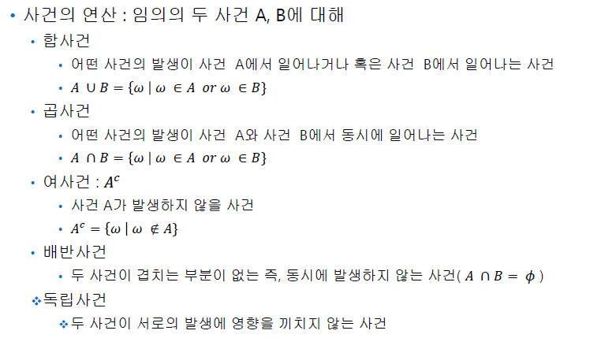

# 딥러닝 기반 빅데이터 분석과정 12일차

## 1. 확률(책 303p~, 강사님 pdf 및 txt 파일 읽기)

### (1) 개념

#### 1) 간단한 문제 및 정의(확률실험, 표본공간, 사건)

- 어떻게 나눠야 불만이 없을까요?
  - 서로 능력이 동일한 두 명의 게이머 A와 B가 있습니다.
  - 5판 3선승제의 게임을 통해 우승자를 가리는 게임이 시작되었습니다.
  - 우승자에게는 64개의 게임 캐릭터 배지를 상품으로 주는 이벤트 대결입니다.
  - 3판이 지난 지금 A가 두번을 이겼고 B가 한번을 이겼습니다.
  - 4번째 판이 시작되려는 순간 게임 서버의 이상으로 더 이상 게임을 진행할 수 없게 되었습니다.
  - A가 우승했다고 하기도 곤란하고, B가 우승했다고 하기도 곤란한 상황입니다.
    상품을 어떻게 나누는 것이 좋을까요?
    - 

- 
- 
- 
- 


#### 2) 확률의 정의

이하 pdf, txt 파일로 개념 이해


### (2) 정규분포 및 이항분포

- 동전의 확률을 한번 살펴보자

  - ```R
    > # 2개의 동전의 앞면이 나올 수 있는 확률
    > x <- c(0,1,2) # 동전 앞면이 나올 수 있는 가능 수
    > y <- c(1/4,2/4,1/4) # 가능 수의 확률 
    > barplot(y, names=x, xlab="앞면횟수(x)", ylab="확률(P[X=x])")
    > sum(x*y) # 1이 나와야 맞다. 모든 가능 수의 확률을 합한 것이므로.
    [1] 1
    ```

  - 


- 확률변수(random variable)
  표본공간의 각 원소에 실수 값을 대응시켜 주는 함수
- 이산형 확률변수(disrete variable)
  확률변수가 취할 수 있는 모든 값을 하나하나 셀수 있을때
  예) 가구원 조사결과

- 연속형 확률변수(continuous variable) ======> 정규분표로 나타남
  확률변수의 가능한 값들이 무한개이며 셀수 없을때

- 이산형 확률변수, 연속형 확률변수
   ==> 확률을 구하는 방법이 달라짐.


#### 1) 정규분포

- 정규분포는 연속형이다. 정규분포 함수는 dnorm(), pnorm(), rnorm() 등이 있다.

- 정규분포에 대해 이해를 해보자

  - ```R
    > # 정규분표에 대한 이해
    > x <- seq(-5, 5, length = 200)
    > x
      [1] -5.00000000 -4.94974874 -4.89949749 -4.84924623 -4.79899497 -4.74874372 -4.69849246 -4.64824121
      [9] -4.59798995 -4.54773869 -4.49748744 -4.44723618 -4.39698492 -4.34673367 -4.29648241 -4.24623116
    ...
    [185]  4.24623116  4.29648241  4.34673367  4.39698492  4.44723618  4.49748744  4.54773869  4.59798995
    [193]  4.64824121  4.69849246  4.74874372  4.79899497  4.84924623  4.89949749  4.94974874  5.00000000
    > y <- dnorm(x, mean=0, sd=1)
    > y
      [1] 1.486720e-06 1.908974e-06 2.444973e-06 3.123573e-06 3.980453e-06 5.059606e-06 6.415111e-06
      [8] 8.113253e-06 1.023503e-05 1.287913e-05 1.616544e-05 2.023912e-05 2.527546e-05 3.148544e-05
    ...
    [190] 1.616544e-05 1.287913e-05 1.023503e-05 8.113253e-06 6.415111e-06 5.059606e-06 3.980453e-06
    [197] 3.123573e-06 2.444973e-06 1.908974e-06 1.486720e-06
    > plot(x, y, type="l")
    > dnorm(4, mean = 0, sd=1)  # x값 4일 확률은 0.00013~ 이다.
    [1] 0.0001338302
    >   # 평균 10, 표준편차 6인, 확률변수 10
    > dnorm(10, mean = 10, sd = 6)
    [1] 0.06649038
    ```

  - 

  - `dnorm(4, mean = 0, sd=1)`을 살펴보자.

    - 평균이 0이고, 편차가 1인 정규분포에서 x값이 4일 확률은 0.00013.. 이라는 의미이다.

    - ```R
      > dnorm(15, mean=30, sd=7) # 평균이 30이고, 편차가 7일때, 확률 변수가 15일 때의 확률은? 
      [1] 0.005737297
      > dnorm(30, mean=30, sd=7)
      [1] 0.05699175
      ```

- runif 함수는 랜덤으로 확률을 만들어준다.

- rnorm 함수는 정규분포에서 난수를 얻는 것으로, 평균과 표준편차를 지정한다.

  - ```R
    > # 정규분포 랜덤하게 생성
    > runif(10) # 확률 10개 생산
     [1] 0.886861315 0.211456225 0.225730771 0.297417618 0.258082825 0.703683106 0.399653353 0.285388074
     [9] 0.097424099 0.008888587
    > runif(50, min = 0, max = 100)
     [1] 33.554333 95.140564 34.488923 96.943799 52.387237  1.303477 75.196233  8.830802 94.172515 24.628465
    [11] 79.140588 78.881160 10.181667 72.004414 93.379629  5.265378 79.016304 33.309473 52.574459 84.088567
    [21] 91.053449 56.871423 70.605553 62.985569 43.877923 83.931742 28.017165 95.294192 81.234979 43.461853
    [31]  1.351248 97.792914 43.845470 16.054796 12.984726  6.380706  2.168563 26.134976 58.808709 20.960939
    [41] 44.911282 33.278707  2.148275 40.344896 38.986195  8.167005 66.298760 25.426423 73.985062 99.535474
    > rnorm(10, mean = 100, sd=15) # 평균 100, 표준편차 15. norm 정규분포
     [1] 104.41572 110.78713 102.88757 105.51159  98.29902  84.45110 103.78887 113.83818 134.12404  93.37842
    > rnorm(1000, mean = 800, sd=90)
       [1]  801.0577  608.5706  728.7097  915.9936  777.1097  851.1997  860.0705  714.5338  801.3958  820.9279
      [11]  771.9480
    ...
    [991]  798.4073  889.3757  803.9209  617.8822  970.5361  906.2287 1017.2747  778.3403  986.4160  820.9443
    ```

  - rnorm을 통해 평균이 100이고 표준편차가 15인 정규분포에서 10개 확률을 랜덤으로 가져오게된다.


#### 2) 이항분포

- 이항분포는 이산형이다. 이항분포는 dbinom(), pbinom() 등의 함수를 사용한다.

- 이항분포에 대해 이해를 해보자

  - ```R
    > # 이항분에 대한 이해
    > x1 <- 0:20
    > x1
     [1]  0  1  2  3  4  5  6  7  8  9 10 11 12 13 14 15 16 17 18 19 20
    > y1 <- dbinom(x1, size = 20, prob = 0.5)
    > y1
     [1] 9.536743e-07 1.907349e-05 1.811981e-04 1.087189e-03 4.620552e-03 1.478577e-02 3.696442e-02
     [8] 7.392883e-02 1.201344e-01 1.601791e-01 1.761971e-01 1.601791e-01 1.201344e-01 7.392883e-02
    [15] 3.696442e-02 1.478577e-02 4.620552e-03 1.087189e-03 1.811981e-04 1.907349e-05 9.536743e-07
    > plot(x1, y1, type="h")
    ```

  - 

  - 이항분포도 정규분포와 비슷한 그래프를 갖게 된다.

  - `dbinom(1, size=20, prob=0.5)`를 살펴보자.

    - 어떤 값이 나올 확률이 0.5라고 할 때 20번의 시도 중 한번 나올 확률은 얼마인가? 라는 의미이다.

    - 1.907349e-05 라는 값이 나온다.

    - ```R
      > # 동전 100번 던졌을 때 10번 앞면, 0.5 확률
      > dbinom(10, size=100, prob=0.5)
      [1] 1.365543e-17
      > dbinom(490, size=1000, prob = 0.5) # 동전 앞면이 나오는 확률이 0.5일때, 1000번 중 490번 나오는 확률
      [1] 0.02065635
      > dbinom(50, size=1020, prob = 0.25) # 흡연률이 25%일 때, 1020명 중 50명을 뽑았을 때, 흡현인일 확률
      [1] 1.327799e-66
      > # prob : 0.5 (확률은 0.5), wins : 19 (이기는 건 19번), totalflips : 25 (25번 경기)
      > dbinom(19, 25, 0.5)
      [1] 0.005277991
      ```

- rbinom은 이항분포를 랜던값으로 뽑아 나타낸다

  - ```R
    > # 이항분포 랜덤하게 생성
    > rbinom(100, size = 1, prob = 0.5)
      [1] 0 0 0 0 0 0 1 1 1 0 1 1 1 1 1 0 1 1 1 1 0 0 0 1 1 0 0 1 0 1 0 0 1 1 1 1 1 1 0 0 1 1 1 0 1 1 1 1 1 0 1
     [52] 0 1 0 0 1 0 0 0 1 0 0 1 0 0 0 0 1 0 0 1 1 1 1 1 0 0 1 0 1 1 0 1 0 1 0 0 1 0 1 1 1 0 1 0 0 0 1 1 0
    > a <- rbinom(10, size = 1, prob = 1/6)
    > a[a==1] <- "성공"
    > a[a==0] <- "실패"
    > a
     [1] "성공" "실패" "실패" "성공" "성공" "실패" "실패" "실패" "실패" "성공"
    ```

- 활용 예시
  - ```R
    > library(ggplot2)
    > wins <- c(0:25)
    > totalFlips <- 25
    > probability <- 0.5
    > d <- 1-dbinom(wins-1, totalFlips, probability)
    > d1 <- dbinom(wins, totalFlips, probability)
    > data <- data.frame(wins, d, d1)
    > data
       wins         d           d1
    1     0 1.0000000 2.980232e-08
    2     1 1.0000000 7.450581e-07
    3     2 0.9999993 8.940697e-06
    4     3 0.9999911 6.854534e-05
    5     4 0.9999315 3.769994e-04
    6     5 0.9996230 1.583397e-03
    7     6 0.9984166 5.277991e-03
    8     7 0.9947220 1.432598e-02
    9     8 0.9856740 3.223345e-02
    10    9 0.9677666 6.088540e-02
    11   10 0.9391146 9.741664e-02
    12   11 0.9025834 1.328409e-01
    13   12 0.8671591 1.549810e-01
    14   13 0.8450190 1.549810e-01
    15   14 0.8450190 1.328409e-01
    16   15 0.8671591 9.741664e-02
    17   16 0.9025834 6.088540e-02
    18   17 0.9391146 3.223345e-02
    19   18 0.9677666 1.432598e-02
    20   19 0.9856740 5.277991e-03
    21   20 0.9947220 1.583397e-03
    22   21 0.9984166 3.769994e-04
    23   22 0.9996230 6.854534e-05
    24   23 0.9999315 8.940697e-06
    25   24 0.9999911 7.450581e-07
    26   25 0.9999993 2.980232e-08
    >   # x coin tosses, y proability
    > ggplot(data, aes(wins,d1)) + geom_point() + geom_line()
    ```

  - 


#### 3) 구간에 대한 확률

- 정규분포의 구간에 대한 확률은 pnorm을 사용하고, 이항분포의 구간에대한 확률은 pbinom을 사용한다.

  - ```R
    > # 구간에 대한 확률
    >   # 0~ 235
    > pnorm(235, mean=240, sd=80)
    [1] 0.4750823
    > # 350 - 235
    > pnorm(350, mean=240, sd=80) - pnorm(235, mean=240, sd=80)
    [1] 0.4403519
    > # 2000번 동전을 던져서 앞면이 0번부터 900번까지 나올 확률
    > pbinom(900, size=2000, prob=0.5)
    [1] 4.228545e-06
    ```


#### 4) 정규분표 구현 (책 304p~)

- ```R
  > # 책 304p~ 정규분포 
  > # 정규분포를 따른 변수 생성
  > randNorm <- rnorm(3000)
  > # 변수에 대한 분포 계산
  > randDensity <- dnorm(randNorm)
  > p <- ggplot(data.frame(x = randNorm, y = randDensity)) + aes(x=x, y=y) + geom_point() + 
  +   labs(x="Random Normal Variables", y = "Density")
  > p
  > # 가장 최저값인 맨 왼쪽부터 -1까지 연속된 숫자 생성
  > neg1Seq <- seq(from = min(randNorm), to = -1, by = .1)
  > # 연속된 값과 그 값에 해당하는 밀도값 결합하여 데이터 프레임 생성
  > lessThanNeg1 <- data.frame(x = neg1Seq, y = dnorm(neg1Seq))
  > lessThanNeg1
             x           y
  1  -3.073994 0.003539896
  2  -2.973994 0.004789838
  3  -2.873994 0.006416649
  4  -2.773994 0.008510455
  5  -2.673994 0.011175176
  6  -2.573994 0.014528239
  7  -2.473994 0.018699441
  8  -2.373994 0.023828755
  9  -2.273994 0.030062918
  10 -2.173994 0.037550693
  11 -2.073994 0.046436753
  12 -1.973994 0.056854231
  13 -1.873994 0.068916115
  14 -1.773994 0.082705775
  15 -1.673994 0.098267056
  16 -1.573994 0.115594483
  17 -1.473994 0.134624259
  18 -1.373994 0.155226762
  19 -1.273994 0.177201309
  20 -1.173994 0.200273878
  21 -1.073994 0.224098395
  > # rbind로 결함. 가장 왼쪽 값(최저값, 높이는 0) + lessThanNeg1 + 가장 오른쪽 값(최고값, 높이는 0)
  > lessThanNeg1 <- rbind(c(min(randNorm), 0), lessThanNeg1, c(max(lessThanNeg1$x),0))
  > lessThanNeg1
             x           y
  1  -3.073994 0.000000000
  2  -3.073994 0.003539896
  3  -2.973994 0.004789838
  4  -2.873994 0.006416649
  5  -2.773994 0.008510455
  6  -2.673994 0.011175176
  7  -2.573994 0.014528239
  8  -2.473994 0.018699441
  9  -2.373994 0.023828755
  10 -2.273994 0.030062918
  11 -2.173994 0.037550693
  12 -2.073994 0.046436753
  13 -1.973994 0.056854231
  14 -1.873994 0.068916115
  15 -1.773994 0.082705775
  16 -1.673994 0.098267056
  17 -1.573994 0.115594483
  18 -1.473994 0.134624259
  19 -1.373994 0.155226762
  20 -1.273994 0.177201309
  21 -1.173994 0.200273878
  22 -1.073994 0.224098395
  23 -1.073994 0.000000000
  > # 색칠할 부분은 다각형으로 정의한다.
  > p + geom_polygon(data = lessThanNeg1, aes(x=x, y=y))
  ```


### (3) 포아송분포

https://blog.naver.com/mykepzzang/220840724901


#### (4) 문제 ★

- ```R
  '''
  # dbinom(성공횟수, 샘플크기, 성공확률)
  
  1. 무작위로 선정된 20명의 사람들이 있으며, 전국적으로 인구의 5%는 밤에 혼자 사는 것을 무서워합니다. 
  20명중에서 5명은 밤에 혼자있는 것을 무서워합니다. 5명이 무서워할 확률은?
    
  2. 위의 문제에서 0~20명에서 중에서 누군가 무서워할 확률을 구하고 그래프로 출력하시오.
  
  3. 위에 문제 유형에서 100명의 무작위로 선택된 개인 그룹에서 0~100명의 사람들이 무서워할 확률은? 
  (무서워할 확률 35%)
  
  4. 75%의 성공률을 가진 약을 보유하고 있다. 
  20명으로 구성된 그룹이 있고, 0~12명사이의 사람이 긍정적으로 반응할 확률은? 
  그래프로 출력하시오.
  
  '''
  # 문제 1
  dbinom(5, 20, 5/100)
  
  # 문제 2
  scaryPeople <- c(0:20)
  totalPeople <- 20
  scaryProbability <- 5/100
  
  d <- dbinom(scaryPeople, totalPeople, scaryProbability)
  d
  data <- data.frame(scaryPeople, totalPeople, scaryProbability)
  data
  ggplot(data, aes(scaryPeople,d)) + geom_point() + geom_line()
  
    # 강사님 답
  x <- (0:20)
  y <- dbinom(0:20, 20, 0.05)
  plot(x, y)
  qplot(x,y)
  
  # 문제 3
  scaryPeople2 <- c(0:100)
  totalPeople2 <- 100
  scaryProbability2 <- 35/100
  
  d2 <- dbinom(scaryPeople2, totalPeople2, scaryProbability2)
  d2
  data2 <- data.frame(scaryPeople2, totalPeople2, scaryProbability2)
  data2
  ggplot(data2, aes(scaryPeople2,d2)) + geom_point() + geom_line()
  
    # 강사님 답
  x <- (0:100)
  y <- dbinom(0:100, 100, .35)
  qplot(x, y) 
  
  # 문제 4
  pbinom(12, 20, 0.75) # 답
  pbinom(1:20, 20, 0.75)
  x <- (1:20)
  y <- pbinom(1:20, 20, 0.75)
  qplot(x,y) # 여기서 보면 12까지의 합의 값이 0.1 정도임을 알 수 있다!!
  
  
    # 내가 푼 답(틀림)
  positivePeople <- c(0:12)
  people <- 20
  positiveProbability <- 75/100
  
  d3 <- dbinom(positivePeople, people, positiveProbability)
  data3 <- data.frame(positivePeople, people, positiveProbability)
  ggplot(data3, aes(positivePeople, d3)) + geom_point() + geom_line()
  
  
  '''
  #dbinom
  1. 우리는 75%의 성공률을 가진 약을 가지고 있습니다.
  20명의 그룹에 1000번의 시도를 하였습니다. 각 시도에 대한 이항 분포 및 그래프를 출력하시오.
  
  #dpois
  2. 2017년 뉴욕타임즈 기사에서 2009년도 부터 2017년도까지 매주 평균적으로 24마리의 말이 죽었습니다. 
  1000건당 5.2건의 기록했습니다. 0~40마리의 말이 일주일안에 죽을 확률은?
  
  3. 1주일에 30명이상의 사망자가 발행할 확률은?
  
  #dbinom
  4. 수학 퀴즈에서 객관식 문제가 10개가 있습니다. 
  각 질문에서 네 가지 가능한 대답중에서 하나만 정답입니다.
  학생들이 모든 문제에 무작위로 대답하고 하면 5이하의 
  정답을 가질 확률은?
  
  '''
  # dbinom
  # 1. 우리는 75%의 성공률을 가진 약을 가지고 있습니다.
  # 20명의 그룹에 1000번의 시도를 하였습니다. 각 시도에 대한 이항 분포 및 그래프를 출력하시오.
  rbinom(1000, 20, .75)
  
  # dpois
  # 2.2017년 뉴욕타임즈 기사에서 2009년도 부터 2017년도까지 매주 
  # 평균적으로 24마리의 말이 죽었습니다. 
  # 1000건당 5.2건의 기록했습니다. 
  # 0~40마리의 말이 일주일안에 죽을 확률은?
  library(ggplot2)
  qplot(1:40, dpois(1:40,24))
  
  
  # 3. 1주일에 30명이상의 사망자가 발행할 확률은?
  ppois(30-1, 24)
  
  # dbinom
  # 4. 수학 퀴즈에서 객관식 문제가 10개가 있습니다. 
  # 각 질문에서 네 가지 가능한 대답중에서 하나만 정답입니다.
  # 학생들이 모든 문제에 무작위로 대답하고 하면 5이하의 
  # 정답을 가질 확률은?
  # probability = 1/4 = 0.25, total size=10
  n = 11
  k <- seq(0, 11, by=1)
  y <- c(dbinom(k, size=n, prob = 0.25))
  y
  barplot(y, k)
  
  
  
  ```

- 