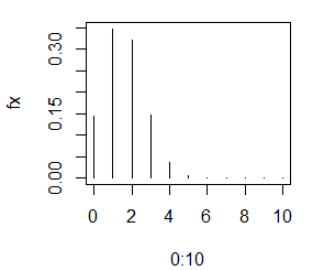
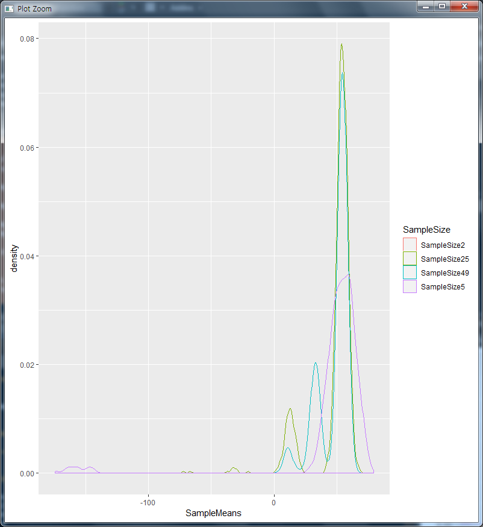

# 딥러닝 기반 빅데이터 분석과정 13일차

## 1. 중요 복습 및 문제

### (1) 주사위를 네번 던져서 나오는 숫자의 합X에 대한 확률

- ```R
  > # 주사위를 네번 던져서 나오는 숫자의 합X에 대한 확률
  > library(prob)
  > # 한번 돌렸을 때
  > s <- rolldie(1) # 6
  > str(s)
  'data.frame':	6 obs. of  1 variable:
   $ X1: int  1 2 3 4 5 6
  > table(s)
  s
  1 2 3 4 5 6 
  1 1 1 1 1 1 
  > X.freq <- table(s)
  > X.freq
  s
  1 2 3 4 5 6 
  1 1 1 1 1 1 
  > length(X.freq)
  [1] 6
  > X.freq <- X.freq / length(X.freq)
  > X.freq
  s
          1         2         3         4         5         6 
  0.1666667 0.1666667 0.1666667 0.1666667 0.1666667 0.1666667 
  > plot(X.freq, type="h")
  > # 4번 돌렸을 때
  > s2 <- rolldie(4)
  > X2 <- apply(s2, 1, sum)
  > X2
     [1]  4  5  6  7  8  9  5  6  7  8  9 10  6  7  8  9 10 11  7  8  9 10 11 12  8  9 10 11 12 13  9 10 11
   
  ... 
  
   [991] 14 15 16 17 18 19 15 16 17 18
   [ reached getOption("max.print") -- omitted 296 entries ]
  > X2.freq <- table(X2)
  > X2.freq
  X2
    4   5   6   7   8   9  10  11  12  13  14  15  16  17  18  19  20  21  22  23  24 
    1   4  10  20  35  56  80 104 125 140 146 140 125 104  80  56  35  20  10   4   1 
  > length(X2.freq)
  [1] 21
  > X2.freq <- X2.freq / length(X2.freq)
  > plot(X2.freq, type="h")
  > # apply에 대한 이해 
  > temp <- matrix(c(1,2,3,4,7,9), nrow = 2)
  > temp
       [,1] [,2] [,3]
  [1,]    1    3    7
  [2,]    2    4    9
  > apply(temp, 1, sum)
  [1] 11 15
  ```
  일반적인 확률문제를 푸는 것과 비슷


### (2) 50개의 제품 중 8개가 불량품이 있는 상자로부터 10개의 제품을 랜덤 샘플링 발견되는 불량 개수 X의 확률분포

- ```R
  > # 이산확률변수 -> 이산확률분포
  > # 50개의 제품 중 8개가 불량품이 있는 상자로부터 10개의 제품을 랜덤 샘플링
  > # 발견되는 불량 개수 X의 확률분포
  > npop <- 50
  > nsampl <- 10
  > ndef <- 8
  > choose(npop, nsampl) # npop개 원소로 이루어진 집합에서 추출 가능한 nsample개의
  [1] 10272278170
  > # 원소로 이루어진 부분집합의 수를 계산하는 함수
  > # 즉, 조합임
  > d <- choose(npop,nsampl) # 50 C 10 => 50개 중 10개를 뽑는 경우의 수
  > freq <- choose(ndef, 0:nsampl) * # 8 C 0, 8 C 1, 8 C 2, ... , 8 C 10
  +   choose(npop-ndef, nsampl - (0:nsampl)) # 42 C 10, 42 C 9, 42 C 8, ..., 42 C 0
  > # 즉, 불량품 8개중에 1개 뽑고 * 정상품 42개중에 10개 뽑는 수, 불량품 8개 중 1개 뽑고 * 정상품 42개 중 9개 뽑는 수 ... 
  > fx <- freq / d
  > plot(0:10, fx, type="h")
  ```

- 


### (3) 8명의 신사가 각각의 모자을 들고 모였다. 갑자기 정전이 되어 아무 모자이나 들고 자기 집으롣 돌아갔다. 자기 자신의 모자를 들고 간 신사의 수를 x라할 때, 확률변수 x의 확률은?

- ```R
  > # 8명의 신사가 각각의 모자을 들고 모였다.
  > # 갑자기 정전이 되어 아무 모자이나 들고 자기 집으롣 돌아갔다.
  > # 자기 자신의 모자를 들고 간 신사의 수를 x라할 때, 확률변수 x의 확률은
  > # 8모자, 8신사
  > hats <- LETTERS[1:8]
  > hats
  [1] "A" "B" "C" "D" "E" "F" "G" "H"
  > urnsamples(1:10, size = 1) # 참고
     out
  1    1
  2    2
  3    3
  4    4
  5    5
  6    6
  7    7
  8    8
  9    9
  10  10
  > urnsamples(1:10, size = 2) # 참
     X1 X2
  1   1  2
  2   1  3
  3   1  4
  4   1  5
  5   1  6
  6   1  7
  7   1  8
  8   1  9
  9   1 10
  10  2  3
  ...
  40  7  8
  41  7  9
  42  7 10
  43  8  9
  44  8 10
  45  9 10
  > s <- urnsamples(hats, size = 8, ordered = T) # 8개의 모자가 8개의 신사에게 가져가질 수 있는 모든 경우의 수
  > # 즉 8! 이다.
  > 8*7*6*5*4*3*2*1
  [1] 40320
  > tail(s)
        X1 X2 X3 X4 X5 X6 X7 X8
  40315  B  A  H  C  D  E  F  G
  40316  B  A  C  H  D  E  F  G
  40317  B  A  C  D  H  E  F  G
  40318  B  A  C  D  E  H  F  G
  40319  B  A  C  D  E  F  H  G
  40320  B  A  C  D  E  F  G  H
  > dim(s)
  [1] 40320     8
  > str(s)
  'data.frame':	40320 obs. of  8 variables:
   $ X1: Factor w/ 8 levels "A","B","C","D",..: 1 1 1 1 1 1 1 8 8 1 ...
   $ X2: Factor w/ 8 levels "A","B","C","D",..: 2 2 2 2 2 2 8 1 1 8 ...
   $ X3: Factor w/ 8 levels "A","B","C","D",..: 3 3 3 3 3 8 2 2 2 2 ...
   $ X4: Factor w/ 8 levels "A","B","C","D",..: 4 4 4 4 8 3 3 3 3 3 ...
   $ X5: Factor w/ 8 levels "A","B","C","D",..: 5 5 5 8 4 4 4 4 4 4 ...
   $ X6: Factor w/ 8 levels "A","B","C","D",..: 6 6 8 5 5 5 5 5 5 5 ...
   $ X7: Factor w/ 8 levels "A","B","C","D",..: 7 8 6 6 6 6 6 6 7 7 ...
   $ X8: Factor w/ 8 levels "A","B","C","D",..: 8 7 7 7 7 7 7 7 6 6 ...
  > rowN <- nrow(s) # 행의 총 갯수이자 8!의 개수
  > rowN
  [1] 40320
  > checkFunc <- function(x) {
  +   sum(x == hats) # s의 첫번째 행이 hats와 같은지. hats는 A, B, C,..., H 이다.
  +   # 만약에 같다면 그 같은 수를 합해서 반환한다. True, true, false..false..false.. 이면 리턴값은 2
  + }
  > x <- apply(s, 1, checkFunc)
  > head(x,5)
  [1] 8 6 5 4 3
  > s[1,] == hats
      X1   X2   X3   X4   X5   X6   X7   X8
  1 TRUE TRUE TRUE TRUE TRUE TRUE TRUE TRUE
  > s[2,] == hats
      X1   X2   X3   X4   X5   X6    X7    X8
  2 TRUE TRUE TRUE TRUE TRUE TRUE FALSE FALSE
  > s[3,] == hats
      X1   X2   X3   X4   X5    X6    X7    X8
  3 TRUE TRUE TRUE TRUE TRUE FALSE FALSE FALSE
  > s[4,] == hats
      X1   X2   X3   X4    X5    X6    X7    X8
  4 TRUE TRUE TRUE TRUE FALSE FALSE FALSE FALSE
  > s[5,] == hats
      X1   X2   X3    X4    X5    X6    X7    X8
  5 TRUE TRUE TRUE FALSE FALSE FALSE FALSE FALSE
  > x.freq <- table(x)
  > x.freq
  x
      0     1     2     3     4     5     6     8 
  14833 14832  7420  2464   630   112    28     1 
  > x.prob <- round(x.freq/rowN, 6)
  > x.prob
  x
         0        1        2        3        4        5        6        8 
  0.367882 0.367857 0.184028 0.061111 0.015625 0.002778 0.000694 0.000025 
  > sum(x.prob)
  [1] 1
  > plot(x.prob, type="h")
  ```

- 


### (4) 주사위 세개를 던지는 시행에서 짝수의 개수?

- ```R
  > # 주사위 세개를 던지는 시행에서 
  > # 짝수의 개수?
  > library(prob)
  > S <- rolldie(3)
  > rowN <- nrow(S)
  > S
      X1 X2 X3
  1    1  1  1
  2    2  1  1
  3    3  1  1
  4    4  1  1
  5    5  1  1
  6    6  1  1
  7    1  2  1
  8    2  2  1
  9    3  2  1
  10   4  2  1
  11   5  2  1
  12   6  2  1
  13   1  3  1
  14   2  3  1
  15   3  3  1
  16   4  3  1
  17   5  3  1
  18   6  3  1
  19   1  4  1
  20   2  4  1
  ...
  210  6  5  6
  211  1  6  6
  212  2  6  6
  213  3  6  6
  214  4  6  6
  215  5  6  6
  216  6  6  6
  > rowN
  [1] 216
  > checkFunc <- function(x) sum(1-x%%2)
  > Y <- apply(S, 1, checkFunc)
  > table(Y)
  Y
   0  1  2  3 
  27 81 81 27
  ```


### (5) 주사위를 두번 던지는 시행에서 눈의 최대치를 X라고 하고, 눈의 최소치를 Y라고 할 때 Z = XY의 기댓값을 구하시오

- ```R
  > # 주사위를 두번 던지는 시행에서 눈의 최대치를 X라고 하고, 눈의 최소치를 Y라고 할 때
  > # Z = XY의 기댓값을 구하시오
  > s1 <- rolldie(2)
  > str(s1)
  'data.frame':	36 obs. of  2 variables:
   $ X1: int  1 2 3 4 5 6 1 2 3 4 ...
   $ X2: int  1 1 1 1 1 1 2 2 2 2 ...
  > head(s1)
    X1 X2
  1  1  1
  2  2  1
  3  3  1
  4  4  1
  5  5  1
  6  6  1
  > x1 <- apply(s1, 1, max)
  > x1
   [1] 1 2 3 4 5 6 2 2 3 4 5 6 3 3 3 4 5 6 4 4 4 4 5 6 5 5 5 5 5 6 6 6 6 6 6 6
  > table(x1)
  x1
   1  2  3  4  5  6 
   1  3  5  7  9 11 
  > x2 <- apply(s1, 1, min)
  > x2
   [1] 1 1 1 1 1 1 1 2 2 2 2 2 1 2 3 3 3 3 1 2 3 4 4 4 1 2 3 4 5 5 1 2 3 4 5 6
  > table(x2)
  x2
   1  2  3  4  5  6 
  11  9  7  5  3  1 
  > x1
   [1] 1 2 3 4 5 6 2 2 3 4 5 6 3 3 3 4 5 6 4 4 4 4 5 6 5 5 5 5 5 6 6 6 6 6 6 6
  > x2
   [1] 1 1 1 1 1 1 1 2 2 2 2 2 1 2 3 3 3 3 1 2 3 4 4 4 1 2 3 4 5 5 1 2 3 4 5 6
  > table(x1, x2) # 이게 좀 헷갈리는데 x1과 x2를 같이 보면은 (x1= 1, x2 = 1) 인 갯수는 1개이고,
     x2
  x1  1 2 3 4 5 6
    1 1 0 0 0 0 0
    2 2 1 0 0 0 0
    3 2 2 1 0 0 0
    4 2 2 2 1 0 0
    5 2 2 2 2 1 0
    6 2 2 2 2 2 1
  > # (x1 = 2, x2 = 1)인 갯수는 2개인 것이다. 반면 (x1 = 1이고, x2 = 6)인 경우는 하나도 없음을 찾을 수 있다.
  > # 아무튼 이렇게하면.. XY값. 즉 곱연산이 됨.
  > # x1의 최대치와 x2의 최소치가 곱연산을 하면 "동시에 그 사건이 이루어지는 것"이 됨.
  > # table(x1, x2)를 보면 동시에 사건이 이루어지는 경우를 표로 잘 나와있는 것임
  > temp <- table(x1, x2) / nrow(s1)
  > sum(table(x1, x2) / nrow(s1))
  [1] 1
  > temp
     x2
  x1           1          2          3          4          5          6
    1 0.02777778 0.00000000 0.00000000 0.00000000 0.00000000 0.00000000
    2 0.05555556 0.02777778 0.00000000 0.00000000 0.00000000 0.00000000
    3 0.05555556 0.05555556 0.02777778 0.00000000 0.00000000 0.00000000
    4 0.05555556 0.05555556 0.05555556 0.02777778 0.00000000 0.00000000
    5 0.05555556 0.05555556 0.05555556 0.05555556 0.02777778 0.00000000
    6 0.05555556 0.05555556 0.05555556 0.05555556 0.05555556 0.02777778
  > XY <- (1:6 %o% 1:6)
  > XY
       [,1] [,2] [,3] [,4] [,5] [,6]
  [1,]    1    2    3    4    5    6
  [2,]    2    4    6    8   10   12
  [3,]    3    6    9   12   15   18
  [4,]    4    8   12   16   20   24
  [5,]    5   10   15   20   25   30
  [6,]    6   12   18   24   30   36
  > (as.vector(XY) %*% as.vector(temp))[1,1]
  [1] 12.25
  > # table(a,b)의 이해를 위한 참고
  > a <- c(1:5)
  > b <- c(3:7)
  > a
  [1] 1 2 3 4 5
  > b
  [1] 3 4 5 6 7
  > table(a, b)
     b
  a   3 4 5 6 7
    1 1 0 0 0 0
    2 0 1 0 0 0
    3 0 0 1 0 0
    4 0 0 0 1 0
    5 0 0 0 0 1
  ```


### (6) 동전의 앞 뒷면 확률

- ```R
  > # 동전의 앞 뒷면 확률
  > # coins
  > s3 <- tosscoin(4)
  > s3
     toss1 toss2 toss3 toss4
  1      H     H     H     H
  2      T     H     H     H
  3      H     T     H     H
  4      T     T     H     H
  5      H     H     T     H
  6      T     H     T     H
  7      H     T     T     H
  8      T     T     T     H
  9      H     H     H     T
  10     T     H     H     T
  11     H     T     H     T
  12     T     T     H     T
  13     H     H     T     T
  14     T     H     T     T
  15     H     T     T     T
  16     T     T     T     T
  > nrow(s3)
  [1] 16
  > # 앞면 뒷면 갯수를 세는 함수
  > countH <- function(x) sum(x=="H")
  > countF <- function(x) sum(x=="T")
  > # 확률 변수 생성
  > x3 <- apply(s3, 1, countH)
  > y3 <- apply(s3, 1, countF)
  > v3 <- y3 - x3 # 별 의미가 없음. 그냥 두 값에 대한 차이값을 의미하는 것임. 0이 되면 앞 뒷면이 같게 나왔다는 것임.
  > # 그냥 이런 변수도 있다는 것을 생각하면 됨.
  > w3 <- abs(v3)
  > x3
   [1] 4 3 3 2 3 2 2 1 3 2 2 1 2 1 1 0
  > y3
   [1] 0 1 1 2 1 2 2 3 1 2 2 3 2 3 3 4
  > v3
   [1] -4 -2 -2  0 -2  0  0  2 -2  0  0  2  0  2  2  4
  > w3
   [1] 4 2 2 0 2 0 0 2 2 0 0 2 0 2 2 4
  > par(mfrow = c(2,3)) # 여러 그림을 한 그림에 넣을 수 있는 행열을 생성하는 것임
  > plot(x3, y3, type = "l") # H, T
  > plot(x3, y3, type = "l") ; abline(lm(y3~x3), col=2) # abline은 직선을 긋는 것
  > plot(x3, v3, type = "l") # H, V
  ```


### (7) 주사위 4개 던졌을 때 평균, 중앙값을 구하시오

- ```R
  # 주사위 4개 던졌을 때 평균, 중앙값을 구하시오
  # mean, median 함수
  # list <- 합, 평균, 최대치, 최소치(4개항목)
  # rolldie(4)
  library(prob)
  S5 <- rolldie(4)
  N5 <- nrow(S5)
  X5_sum <- apply(S5, 1, sum)
  #round(table(X5_sum)/N5,6)
  X5_mean <- apply(S5, 1, mean)
  #round(table(X5_mean)/N5,6)
  X5_max <- apply(S5, 1, max)
  X5_min <- apply(S5, 1, min)
  X5_list <- list()
  X5_list[[1]] <- X5_sum
  X5_list[[2]] <- X5_mean
  X5_list[[3]] <- X5_max
  X5_list[[4]] <- X5_min
  ```


## 2. 개발시 참고사항 및 정규분포관련 복습

### (1) 참고사항

개발시 참고 사항
R 언어 syntax
tidyverse
...

Python 언어 syntax
Numpy, Pandas, Matplot...

2 ~ 3 Study
Database 관리자 
Database 개발자 
Database 모델링(관계형) 
Database 최적화 & 튜닝 
(Oracle,MsSql,MySql,PostgreSql..)

2 ~ 3 Study
MEAN Stack
Mongo DB(1~2), Express JS(1), Angluar JS(1), Node JS(2)
=> Javascript, NoSQL(Mongodb)
Python Django....

Javascript + HTML5, CSS3(2)  //////// Javascript => 반드시 HTML5, CSS3 공부
Javascript OOP
Javascript Pattern
Javascript Framework
(Angular JS(MVC)........)


### (2) 복습

- 이산확률분포

```
# 이산확률분포

# 1.이산균일분포
# n개의 결과 값이 균일한 확률로 
# 발생하는 확률분포
# 예) 1에서 20까지 번호가 적혀 있는 동일한 
# 20개의 공이 들어 있는 상자에서 임의로 
# 하나의 공을 꺼냈을때 나온 번호를 X라고
# 할때, X의 확률분포함수, X의 기댓값과 분산등등
#
# 2.이항분포
# -> 베르누이분포(Bernoulli distribution)는 성공활률이 일정한 1회의 시행에서 나오는 성공
# 횟수의 확률분포를 말함. 
# -> 성공확률이 일정한 n회의 시행에서 나오는 성공 횟수의 확률 분포

# 3. 초기하분포
# 두가지 속성의 개체들로 구성된 유한 모집단에서 일정한 개수의 표본을 비복원추출로 했을 
#때, 특정 속성을 갖는 개체수의 확률분포

# 4. 포아송분포
# 일정한 단위에서 발생한 희소한 사건의 확률분포

# 5. 기하분포
# 성공확률이 일정한 시행에서 첫번째 성공이 발생할 때까지 시행한 횟수의 확률분포

# 6. 음이항분포
# 성공확률이 일정한 시행에서 주어진 횟수(r)의 성공이 발생할때 까지 시행한 횟수의 확률분포

# 7. 다항분포
# 다수의 속성을 갖는 개체들로 구성된 무한한 모집단에서 일정한 개수의 표본을 취했을때, 
# 각속성을 갖는 개체수의 결합확률분포
```

- 균일확률분포

```
# 균일확률분포

# 1. 균일분포
# 유일한 실수 구간[a,b]에서 동일한 확률로 관측되는 확률변수의 변수

# 2. 지수분포
# 확률밀도함수가 지수적으로 감소하는 확률분포

# 3. 감마분포

# 4. 와이플분포

# 5. 베타분포
```

- 정규분포와 관련된 분포

```
# * 정규분포와 관련 분포
# 1. 기댓값 중심으로 대칭이며, 중심위치는 기댓값, 산포는 표준편차에 의해 결정되는 
# 엎어놓은 종 모양의 분포
# dnorm, pnorm, qnorm, rnorm

# 2. 표준정규분포
# 기댓값이 0, 표준편차가 1인 정규분포

# 3. 카이제곱분포
# 표준정규모집단으로부터 추출된 확률표본을 Z1, Z2,...이라면, 
# 자유도가 n인 카이제곱분포를 따름

# 4. t-분포
# 표준정규분포를 따르는 확률변수를 Z라고하고, Z와는 독립적으로 자유도 v인 카이제곱
# 분포를 따르는 확률변수 Y라고 하면, 확률 변수는 자유도 v인 t-분포를 따름

# 5. F-분포
# 카이제곱분포를 따르며 독립적인 두개의 확률변수를 각각의 자유도로 나누어 비율을 취하면 
# F-분포를 따름, 즉, 자유도가 v1와 v2인 카이제곱분포를 따르면 독립적인 확률변수
# 각각 U와 V라함.
```

### (3) 문제

#### 1) 성공확률이 각각 0.2, 0.5, 0.8인 무한모집단에서 10개씩 표본을 취하였을 때
나타나는 성공 횟수의 확률분포는?

- ```R
  > n <- 10 # 시행횟수
  > p <- c(0.2, 0.5, 0.8) # 성공 확률
  > x <- 0:n # 확률변수 x의 범위
  > # (11행, 3열)
  > fx <- array(NA, dim=c(11,3))
  > fx
        [,1] [,2] [,3]
   [1,]   NA   NA   NA
   [2,]   NA   NA   NA
   [3,]   NA   NA   NA
   [4,]   NA   NA   NA
   [5,]   NA   NA   NA
   [6,]   NA   NA   NA
   [7,]   NA   NA   NA
   [8,]   NA   NA   NA
   [9,]   NA   NA   NA
  [10,]   NA   NA   NA
  [11,]   NA   NA   NA
  > dim(fx)
  [1] 11  3
  > for(i in 1:3) fx[,i] <- dbinom(x, n, p[i])
  > fx[,1]
   [1] 0.1073741824 0.2684354560 0.3019898880 0.2013265920 0.0880803840 0.0264241152 0.0055050240
   [8] 0.0007864320 0.0000737280 0.0000040960 0.0000001024
  > fx[,2]
   [1] 0.0009765625 0.0097656250 0.0439453125 0.1171875000 0.2050781250 0.2460937500 0.2050781250
   [8] 0.1171875000 0.0439453125 0.0097656250 0.0009765625
  > fx[,3]
   [1] 0.0000001024 0.0000040960 0.0000737280 0.0007864320 0.0055050240 0.0264241152 0.0880803840
   [8] 0.2013265920 0.3019898880 0.2684354560 0.1073741824
  > colnames(fx) <- p
  > rownames(fx) <- x
  > fx
              0.2          0.5          0.8
  0  0.1073741824 0.0009765625 0.0000001024
  1  0.2684354560 0.0097656250 0.0000040960
  2  0.3019898880 0.0439453125 0.0000737280
  3  0.2013265920 0.1171875000 0.0007864320
  4  0.0880803840 0.2050781250 0.0055050240
  5  0.0264241152 0.2460937500 0.0264241152
  6  0.0055050240 0.2050781250 0.0880803840
  7  0.0007864320 0.1171875000 0.2013265920
  8  0.0000737280 0.0439453125 0.3019898880
  9  0.0000040960 0.0097656250 0.2684354560
  10 0.0000001024 0.0009765625 0.1073741824
  > d <- round(t(fx),4)
  > d
           0      1      2      3      4      5      6      7      8      9     10
  0.2 0.1074 0.2684 0.3020 0.2013 0.0881 0.0264 0.0055 0.0008 0.0001 0.0000 0.0000
  0.5 0.0010 0.0098 0.0439 0.1172 0.2051 0.2461 0.2051 0.1172 0.0439 0.0098 0.0010
  0.8 0.0000 0.0000 0.0001 0.0008 0.0055 0.0264 0.0881 0.2013 0.3020 0.2684 0.1074
  > apply(d, 1, sum)
     0.2    0.5    0.8 
  1.0000 1.0001 1.0000 
  > par(mfrow=c(3,2))
  > plot(x, fx[,1])
  
  > plot(x, fx[,2])
  
  > plot(x, fx[,3])
  
  ```


#### 2) 불량률이 0.03인 공정에서 20개의 표존을 추출하여 검사하고 발견한 불량개수X라 할 때,  2개의 불량률이 발견될 확률

- ```R
  > # 불량률이 0.03인 공정에서
  > # 20개의 표존을 추출하여 검사하고 
  > # 발견한 불량개수X라할때,
  > # X의 확률분포함
  > # 2개의 불량률이 발견될 확률
  > dbinom(0:2, 20, 0.03)
  [1] 0.54379434 0.33636763 0.09882967
  ```


#### 3) 표준정규분포 기대값 = 0, 표준편차 = 1, x축 -7 ~ 7

- ```R
  > # 표준정규분포 기대값 = 0, 표준편차 = 1
  > # x축 -7 ~ 7
  > x <- (-140:140)/20
  > x
    [1] -7.00 -6.95 -6.90 -6.85 -6.80 -6.75 -6.70 -6.65 -6.60 -6.55 -6.50 -6.45 -6.40 -6.35 -6.30 -6.25 -6.20
   [18] -6.15 -6.10 -6.05 -6.00 -5.95 -5.90 -5.85 -5.80 -5.75 -5.70 -5.65 -5.60 -5.55 -5.50 -5.45 -5.40 -5.35
  ...
  [239]  4.90  4.95  5.00  5.05  5.10  5.15  5.20  5.25  5.30  5.35  5.40  5.45  5.50  5.55  5.60  5.65  5.70
  [256]  5.75  5.80  5.85  5.90  5.95  6.00  6.05  6.10  6.15  6.20  6.25  6.30  6.35  6.40  6.45  6.50  6.55
  [273]  6.60  6.65  6.70  6.75  6.80  6.85  6.90  6.95  7.00
  
  dnorm(x, 0, 1) # 기대값이 0이고, 표준편차가 1
  dnorm(x, 0, 2)
  dnorm(x, 2, 1)
  dnorm(x, 2, 2)
  
  > data <- matrix(c(dnorm(x, 0, 1), dnorm(x, 0, 2), dnorm(x, 2, 1), dnorm(x, 2, 2)), ncol = 4, byrow = F )
  > head(data)
               [,1]         [,2]         [,3]         [,4]
  [1,] 9.134720e-12 0.0004363413 1.027977e-18 7.991871e-06
  [2,] 1.294659e-11 0.0004760926 1.610175e-18 8.940686e-06
  [3,] 1.830332e-11 0.0005191406 2.515806e-18 9.995898e-06
  [4,] 2.581182e-11 0.0005657274 3.920986e-18 1.116867e-05
  [5,] 3.630962e-11 0.0006161096 6.095758e-18 1.247124e-05
  [6,] 5.094938e-11 0.0006705594 9.453104e-18 1.391702e-05
  > par(mfrow=c(2,2))
  plot(x, data[,1], type="l")
  plot(x, data[,2], type="l")
  plot(x, data[,3], type="l")
  plot(x, data[,4], type="l")
  segments(0,0,0, max(data[,1]), lty = 2, col = 4)
  ```


#### 4) 확률변수 X가 N(2, 2^2)을 따를 때, 구간 P(-1<X<4)를 구하시오.

- ```R
  > # 확률변수 X가 N(2, 2^2)을 따를 때, 구간 P(-1<X<4)를 구하시오.
  > # X축생성(-7 ~ 7)
  > x3 <- (-140:140)/20
  > x3
    [1] -7.00 -6.95 -6.90 -6.85 -6.80 -6.75 -6.70 -6.65 -6.60 -6.55 -6.50 -6.45 -6.40 -6.35 -6.30 -6.25 -6.20
  ...
  [273]  6.60  6.65  6.70  6.75  6.80  6.85  6.90  6.95  7.00
  > mu3 <- 2
  > # 구간
  > sig3 <- 2
  > a3 <- -1;b3 <- 4
  > # 확률밀도함수 계산
  > fx3 <- matrix(c(dnorm(x3, 0, 1), dnorm(x3,mu3,sig3)), ncol=2, byrow=F)
  > px3 <- pnorm(4, mu3, sig3); px3
  [1] 0.8413447
  > px4 <- pnorm(-1, mu3, sig3); px3
  [1] 0.8413447
  > # -1<x<4 구간 면적의 합은 px3 - px4와 같고 이것이 확률값이다.
  > px5 <- px3 - px4
  > plot(x3, fx3[,2], type="l")
  > x5 <- c(a3, seq(a3, b3, 0.01), b3)
  > y5 <- c(0, dnorm(seq(a3, b3, 0.01), mu3, sig3),0)
  > polygon(x5, y5, col='lightcyan')
  > text(1.5, 0.05, labels=paste0("P(",a3,"<X<",b3,")\n=", round(px5,4)))
  ```


### (4) dbinom, dhyper, dpois 문제

#### 1) dbinom

- 성공확률이 0.2인 n회의 시행에서 나온 성공횟수 Xn이라고 할때, 
  n=10,20,50 각각에 대하여 Xn의 확률 분포함수를 그래프로 출력하시오.

- ```R
  > # 문제 1
  > x10 <- 0:10
  > x20 <- 0:20
  > x50 <- 0:50
  > par(mfrow=c(1,3))
  > plot(x10, dbinom(x10, 10, 0.2), type="h")
  > plot(x20, dbinom(x20, 20, 0.2), type="h")
  > plot(x50, dbinom(x50, 50, 0.2), type="h")
  ```


#### 2) dhyper(초기하분포, 초기하밀도함수) (http://rfriend.tistory.com/100 에 설명이 아주 잘나와 있음 ★★)

- 성공확률이 20%이고 200개의 단위로 구성된 모집단에서 
  비복원추출한 n개의 표본에서 나온 성공회수 Xn이라고 할때, 
  n=10,20,50 각각에 대하여 Xn의 확률 분포함수를 그래프로 출력하시오.

- ```R
  > # 문제 2
  > # hyper는 초기하분포, dhyper는 초기하 밀도함수
  > # 비복원추출은 상자에서 공꺼내기와 같이 꺼낸 공은 다시 넣지 않고, 모집단에서 제
  > # http://rfriend.tistory.com/100 에 설명이 아주 잘나와 있음 ★★
  > x10 <- 0:10
  > x20 <- 0:20
  > x50 <- 0:50
  > plot(x10, dhyper(x10, 40, 160, 10), type="h") # 40은 200개 중의 20%인 성공, 160개는 그 외인 실패
  > # 10은 40개 중에 10개를 뽑을 목표
  > # 문제 3
  > x2 <- 0:12; x5 <- 0:30; x10 <- 0:60 # 임의로 범위를 x2는 0~12, x5는 0~30 .. 으로 설정함
  ```


#### 3) dpois

- 단위 제품 당 평균 결점수가 3개인 n개의 단위 제품에서 나온 결점수를 Xn이라고 할때, 
  n=2,5,10 각각에 대하여 Xn의 확률 분포 함수를 그래프로 작성하시오.

- ```R
  # 문제 3
  x2 <- 0:12; x5 <- 0:30; x10 <- 0:60 # 임의로 범위를 x2는 0~12, x5는 0~30 .. 으로 설정함
  par(mfrow=c(3,3))
  plot(x2, dpois(x2, 2), type="h")
  plot(x2, dpois(x2, 5), type="h")
  plot(x2, dpois(x2, 10), type="h")
  ```


## 3. 예제로 보는 중심극한분포(강사님 파일 살펴보기)

### (1) 데이터를 읽어서 살펴보기

#### 1) 데이터 간단히 파악하기

- ```R
  # 중심극한정리
  # 표본평균 => 모집단 평균
  library(ggplot2)
  install.packages("devtools")
  library(devtools)
  install_github("kassambara/easyGgplot2")
  library(easyGgplot2)
  library(data.table)
  
  > #me_2765tmax.txt
  > data2 <- data.table(read.table("ME_2765tmax.txt", header = F))
  > data2
             V1  V2   V3 V4 V5 V6
      1: 172765   1 1911  1  1 18
      2: 172765   2 1911  1  2 36
      3: 172765   3 1911  1  3 38
      4: 172765   4 1911  1  4 35
      5: 172765   5 1911  1  5 17
     ---                         
  36496: 172765 361 2010 12 27 25
  36497: 172765 362 2010 12 28 26
  36498: 172765 363 2010 12 29 24
  36499: 172765 364 2010 12 30 32
  36500: 172765 365 2010 12 31 44
  > class(data2)
  [1] "data.table" "data.frame"
  > # StateId : 2자리 상태코드, 4자리 스테이션 코드
  > colnames(data2) <- c("StateID", "YearDay", "Year", "Month", "MonthDay", "MaxTemp")
  > ggplot(data=data2, aes(YearDay, MaxTemp)) + geom_point()
  > hist(data2[,MaxTemp], xlab="Temp")
  > ggplot(data=data2, aes(MaxTemp)) + geom_density()
  > # 평균, 표준편차
  > table(data$Year)
  
  1911 1912 1913 1914 1915 1916 1917 1918 1919 1920 1921 1922 1923 1924 1925 1926 1927 1928 1929 1930 1931 
   365  365  365  365  365  365  365  365  365  365  365  365  365  365  365  365  365  365  365  365  365 
  ...
  1995 1996 1997 1998 1999 2000 2001 2002 2003 2004 2005 2006 2007 2008 2009 2010 
   365  365  365  365  365  365  365  365  365  365  365  365  365  365  365  365 
  > range(data$Year)
  [1] 1911 2010
  > data2[, mean(MaxTemp, na.rm=T)] # 평균
  [1] 48.30573
  > data2[, sd(MaxTemp, na.rm=T)] # 표준편차
  [1] 82.95858
  > data2[, sample(MaxTemp, 10000)]
     [1]   77   80   44   19   58   35   75   47   48   86   66   22   54   12   62   65   47   33   79   77
  ...
   [981]   47   75   73   67   25   81   20   44   55   23   42   30   40   41   75   72   47   32   52   86
   [ reached getOption("max.print") -- omitted 9000 entries ]
  ```


#### 2) 데이터를 바탕으로 샘플 크기가 클수록 원래 데이터의 평균값, 편차가 비슷하다는 것을 알아보자.

- 우선 샘플데이터를 갯수를 달리해서 모아보자.

  ```R
  > # me_2765tmax.txt 데이터에서 MaxTemp를 뽑자. 이 데이터에서 랜덤으로 2개를 뽑아서 평균,
  > # 5개를 뽑아서 평균, 25개, 49개를 뽑아서 평균을 각각 내어서 하나의 테이블에 합쳐보자.
  > # 그리고 이를 통해 샘플 크기가 클수록 원래 데이터의 평균값, 편차가 비슷하다는 것을 알아보자.
  > # 함수 Func
  >   # Size가 2인 변수 생성
  > SampleMeans <- NULL
  > Means <- NULL
  > for(i in 1:1000) {
    Means <- append(Means, mean(data2[, sample(MaxTemp, 2)], na.rm = T)) # data2의 MaxTemp에 존재하는 값들 중 
    # 2개를 임의로 뽑아서 그 두개를 평균을 낸다. 이 값을 Means 변수에 계속 추가하여 넣는다.
    i <- i+1
    if(i==1001) break
  }
  > SampleMeans <- data.table(sampleSize2 = Means)
  > SampleMeans
        sampleSize2
     1:        55.0
     2:        43.5
     3:        51.0
     4:        49.5
     5:        65.5
    ---            
   996:        65.5
   997:        60.0
   998:        72.5
   999:        71.5
  1000:        27.5
  
  > # size가 5인 변수 생성해서 SampleMeans에 추가하기
  > Means <- NULL
  > for(i in 1:1000) {
  +   Means <- append(Means, mean(data2[, sample(MaxTemp, 5)], na.rm = T)) # data2의 MaxTemp에 존재하는 값들 중
  +   # 5개를 임의로 뽑아서 그 두개를 평균을 낸다. 이 값을 초기화한 Means 변수에 계속 추가하여 넣는다.
  +   i <- i+1
  +   if(i==1001) break
  + }
  > SampleMeans[, SampleSize5 := Means] # := 는 행에 추가한다는 의미!!
  > SampleMeans
        sampleSize2 SampleSize5
     1:        55.0        54.8
     2:        43.5        52.2
     3:        51.0        65.6
     4:        49.5        45.0
     5:        65.5        61.8
    ---                        
   996:        65.5        59.4
   997:        60.0        57.2
   998:        72.5        48.0
   999:        71.5        53.0
  1000:        27.5        49.8
  
  > # size 25
  > Means <- NULL
  > for(i in 1:1000) {
  +   Means <- append(Means, mean(data2[, sample(MaxTemp, 25)], na.rm = T)) 
  +   i <- i+1
  +   if(i==1001) break
  + }
  > 
  > SampleMeans[, SampleSize25 := Means]
  > SampleMeans
        sampleSize2 SampleSize5 SampleSize25
     1:        55.0        54.8        51.32
     2:        43.5        52.2        48.80
     3:        51.0        65.6        58.44
     4:        49.5        45.0        56.68
     5:        65.5        61.8        45.96
    ---                                     
   996:        65.5        59.4        62.52
   997:        60.0        57.2        13.88
   998:        72.5        48.0        53.12
   999:        71.5        53.0        55.40
  1000:        27.5        49.8        57.00
  > 
  >   # size 49
  > Means <- NULL
  > for(i in 1:1000) {
  +   Means <- append(Means, mean(data2[, sample(MaxTemp, 49)], na.rm = T)) 
  +   i <- i+1
  +   if(i==1001) break
  + }
  > 
  > SampleMeans[, SampleSize49 := Means]
  > SampleMeans
        sampleSize2 SampleSize5 SampleSize25 SampleSize49
     1:        55.0        54.8        51.32     51.63265
     2:        43.5        52.2        48.80     36.55102
     3:        51.0        65.6        58.44     49.71429
     4:        49.5        45.0        56.68     54.91837
     5:        65.5        61.8        45.96     55.55102
    ---                                                  
   996:        65.5        59.4        62.52     55.04082
   997:        60.0        57.2        13.88     50.77551
   998:        72.5        48.0        53.12     49.69388
   999:        71.5        53.0        55.40     51.44898
  1000:        27.5        49.8        57.00     53.08163
  
  
  ```

- 이를 간단히 분석해보자

  - ```R
    > SampleMeans[1]
       sampleSize2 SampleSize5 SampleSize25 SampleSize49
    1:          55        54.8        51.32     51.63265
    > data2[, mean(MaxTemp, na.rm = T)]
    [1] 48.30573
    > SampleMeans[1] - data2[, mean(MaxTemp, na.rm = T)]
       sampleSize2 SampleSize5 SampleSize25 SampleSize49
    1:    6.694274    6.494274     3.014274     3.326927
    > # 표본 평균의 평균
    > sapply(SampleMeans, mean)
     sampleSize2  SampleSize5 SampleSize25 SampleSize49 
        48.16150     48.29080     48.23156     48.05149 
    > SampleMeans[1:10, mean(SampleSize5)]
    [1] 51.32
    > SampleMeans[1:100, mean(SampleSize5)]
    [1] 51.908
    > SampleMeans[1:500, mean(SampleSize5)]
    [1] 48.2088
    > SampleMeans[1:1000, mean(SampleSize5)]
    [1] 48.2908
    > data2[, mean(MaxTemp, na.rm = T)] # sample이 늘어날 수록점점 이 값과 유사해짐을 알 수 있음
    [1] 48.30573
    > sapply(SampleMeans, sd)
     sampleSize2  SampleSize5 SampleSize25 SampleSize49 
        57.11739     36.64080     16.92959     12.13894 
    ```

- 그래프로 표현해서 분석해보기

  - ```R
    > # sqrt는 제곱근함수
    > SampleMeans[, sd(SampleSize49, na.rm = T)]*sqrt(49)
    [1] 84.97257
    > data2[, sd(MaxTemp, na.rm = T)]
    [1] 82.95858
    > 
    > dt1 <- data.table(SampleSize = "SampleSize2", SampleMeans = SampleMeans$SampleSize2)
    > dt1
           SampleSize SampleMeans
       1: SampleSize2       51.32
       2: SampleSize2       48.80
       3: SampleSize2       58.44
       4: SampleSize2       56.68
       5: SampleSize2       45.96
      ---                        
     996: SampleSize2       62.52
     997: SampleSize2       13.88
     998: SampleSize2       53.12
     999: SampleSize2       55.40
    1000: SampleSize2       57.00
    > dt2 <- data.table(SampleSize = "SampleSize5", SampleMeans = SampleMeans$SampleSize5)
    > dt2
           SampleSize SampleMeans
       1: SampleSize5        54.8
       2: SampleSize5        52.2
       3: SampleSize5        65.6
       4: SampleSize5        45.0
       5: SampleSize5        61.8
      ---                        
     996: SampleSize5        59.4
     997: SampleSize5        57.2
     998: SampleSize5        48.0
     999: SampleSize5        53.0
    1000: SampleSize5        49.8
    > dt3 <- data.table(SampleSize = "SampleSize25", SampleMeans = SampleMeans$SampleSize25)
    > dt4 <- data.table(SampleSize = "SampleSize49",  SampleMeans = SampleMeans$SampleSize49)
    > 
    > data_temp <- rbindlist(l=list(dt1, dt2, dt3, dt4))
    > data_temp
            SampleSize SampleMeans
       1:  SampleSize2    51.32000
       2:  SampleSize2    48.80000
       3:  SampleSize2    58.44000
       4:  SampleSize2    56.68000
       5:  SampleSize2    45.96000
      ---                         
    3996: SampleSize49    55.04082
    3997: SampleSize49    50.77551
    3998: SampleSize49    49.69388
    3999: SampleSize49    51.44898
    4000: SampleSize49    53.08163
    > 
    > p <- ggplot(data_temp, aes(SampleMeans,fill=SampleMeans, color=SampleSize))
    > p + geom_density(alpha = 0.1)
    ```

  - 