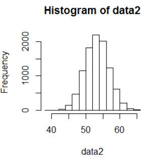
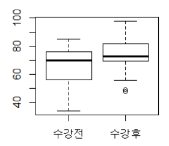
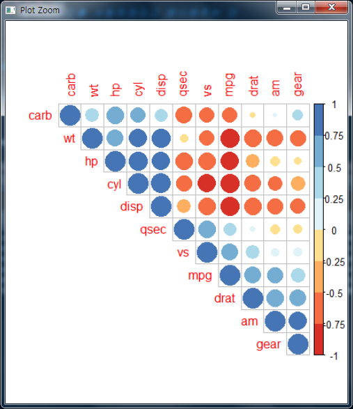
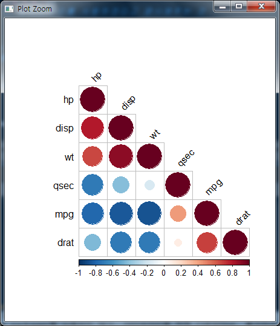
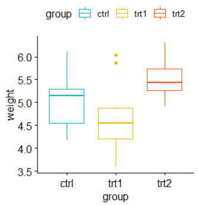
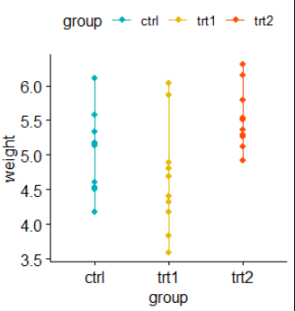
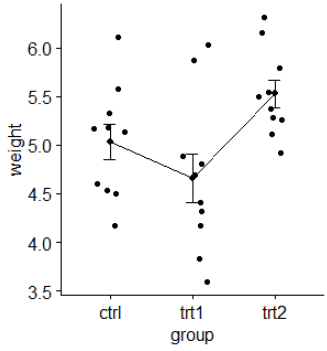
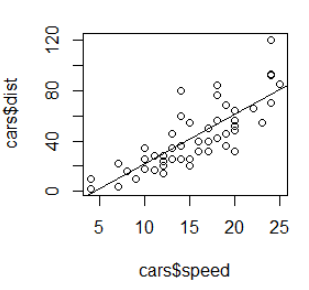
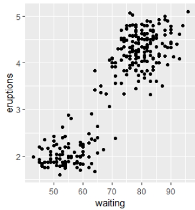
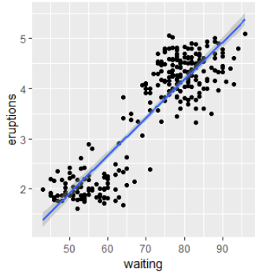

# 딥러닝 기반 빅데이터 분석과정 14일차

## 1. 중심극한정리 복습

- 중심극한정리

  - 동일한 확률분포를 가진 독립 확률 변수 n개의 평균 분포는 n이 적당히 크면 정규분포에 가까워진다.

- ```R
  > AClass <- c(10,10,10,100)
  > mean(AClass)
  [1] 32.5
  > hist(AClass, breaks = 10)
  > sample(AClass, 2, replace = F)
  [1] 10 10
  > data <- sapply(1:20, function(i) mean(
  +   sample(AClass, 2, replace = F)
  + ))
  > data
   [1] 10 55 10 55 10 55 55 55 10 10 55 55 55 55 55 55 10 55 10 10
  > mean(data)
  [1] 37
  > hist(data)
  > AClass2 <- c(rep(10, 100), rep(50, 100), rep(100,100))
  > AClass2
    [1]  10  10  10  10  10  10  10  10  10  10  10  10  10  10  10  10  10  10  10  10  10  10  10  10  10
  ...
  [276] 100 100 100 100 100 100 100 100 100 100 100 100 100 100 100 100 100 100 100 100 100 100 100 100 100
  > length(AClass2)
  [1] 300
  > data2 <- sapply(1:10000, function(i) mean(sample(AClass2, 80, replace = F)))
  > data2
     [1] 53.125 46.625 53.625 50.625 56.875 57.875 51.625 53.750 50.250 50.750 55.875 51.625 52.250 49.250
  ...
   [995] 49.375 52.000 53.875 52.500 52.000 53.875
   [ reached getOption("max.print") -- omitted 9000 entries ]
  > mean(data2)
  [1] 53.29406
  ```

- 


## 2. t-검정

- t-검정은 데이터의 평균 또는 두 변수의 평균을 비교하는 검정을 하는 방법.

### (1) 가설, p-value

#### 1) 가설

- 귀무가설(Null Hypothesis) : H0
  - 가설 검증에서 연구자의 주장이 담긴 진술
- 대립가설(Alternative Hypothesis) : H1
  - 가설 검증에서 연구자의 주장에 대한 부정 진술


#### 2) p-value

- p-value(유의수준/확률)
  - 귀무가설 참이라는 가정 아래 얻은 통계량이 귀무가설을 얼마나 지지하는지를 나타낸 확률
  - p-value >= 0.05 : 대립가설 기각, 귀무가설 채택
  - p-value < 0.05 : 대립가설 채택 , 귀무가설 기각


### (2) t-test

#### 1) 예제로 보는 t-test

- 학원을 다니기 전과 다닌 후의 점수 차이를 임의로 정하고 학원이 점수차이를 만들어내는 것에 유의미한 결과가 있는지 확인해보자.
  - 

  ```R
  > # t-test
  > # 학원에 다니기 전의 점수
  > before_study <- 
  +   c(34,76,76,63,73,75,67,78,81,53,58,81,77,80,43,65,76,63,54,64,85,54,70,71,71,55,40)
  > # 학원을 다닌 후의 점수
  > after_study <- 
  +   c(74,87,89,98,65,82,70,70,70,84,56,76,72,69,73,61,83,82,89,75,48,72,80,66,82,71,49)
  > boxplot(before_study, after_study, names = c("수강전", "수강후"))
  ```

  - 

- 어느 두집단이 정규분포를 따르는지 확인을 하고 싶을 때에는 `Shaprio.test(데이터벡터)`를 사용한다.

  - 샘플수가 너무 작은 경우에는 샘플만으로도 모집단이 정규분포를 따른다고 인정할 수 있는 검사가 필요함 => Shapiro 검증

  - ```R
    > # 두집단의 평균값이 다릅니까?
    > # 두집단의 정규분포를 따른다.
    > # Shaprio.test(데이터벡터)
    > # 샘플수가 너무 작은 경우에는 샘플만으로도 모집단이 정규분포를 따른다고 인정할 수 있는
    > # 검사가 필요함. => Shapiro 검증
    > shapiro_test <- c(74,87,89,98,65,82,70,70,70)
    > # 정규분포성을 확인한다.
    >   # p-value가 0.05보다 크기 때문에 귀무가설을 기각할 수 없음. 
    >   # 정규분포를 따른다.
    > shapiro.test(shapiro_test)
    
    	Shapiro-Wilk normality test
    
    data:  shapiro_test
    W = 0.91132, p-value = 0.3252
    ```

  - 이를 보면 p-value가 0.05 이상이므로 유의수준 0.05 수준에서 귀무가설이 성립되어 정규분포를 따름을 알 수가 있다.

  - 정규성검정은 의미가 있지만 히스토그램이나 qqplot들을 같이 판단하는 것이 좋다.

- t-test를 살펴보자. `t.test(x, y, paired = TRUE, var.equal=TRUE, alternative = "two.sided")`

  - x => A집단, y => B집단
  - paired => TRUE일 시 대응표본, FALSE일시 독립표본
    - 대응표본 => 한 집단으로부터 두번 반복하여 샘플을 추출
    - 독립표본 => 서로 독립된 집단에서 각각 샘플 추출
  - var.equal => TRUE인 경우 두집단의 분산이 같음
  - alternative => two.sided, less, greater 중에 사용할 수 있다.
    - two.sided => A, B 집단이 서로 같은지 비교함.
    - less : A집단이 B집단보다 작은지 비교. 유의수준이 0.05가 넘는다면 작다는 주장이 맞는 것임! 0.05보다 작다면 주장 기각!
    - grater : A집단이 B집단보다 큰지 비교

  - 

    ```r
    > var.test(before_study, after_study)
    
    	F test to compare two variances
    
    data:  before_study and after_study
    F = 1.2817, num df = 26, denom df = 26, p-value = 0.5314
    alternative hypothesis: true ratio of variances is not equal to 1
    95 percent confidence interval:
     0.5841081 2.8124682
    sample estimates:
    ratio of variances 
              1.281712 
    
    > t.test(before_study, after_study)
    
    	Welch Two Sample t-test
    
    data:  before_study and after_study
    t = -2.2618, df = 51.219, p-value = 0.02798
    alternative hypothesis: true difference in means is not equal to 0
    95 percent confidence interval:
     -14.6805917  -0.8749639
    sample estimates:
    mean of x mean of y 
     66.03704  73.81481 
    
    > t.test(before_study, after_study, paired = TRUE)
    
    	Paired t-test
    
    data:  before_study and after_study
    t = -2.3225, df = 26, p-value = 0.0283
    alternative hypothesis: true difference in means is not equal to 0
    95 percent confidence interval:
     -14.6613849  -0.8941706
    sample estimates:
    mean of the differences 
                  -7.777778 
    
    > t.test(before_study, after_study, paired = TRUE, alternative = "less")
    
    	Paired t-test
    
    data:  before_study and after_study
    t = -2.3225, df = 26, p-value = 0.01415
    alternative hypothesis: true difference in means is less than 0
    95 percent confidence interval:
          -Inf -2.065963
    sample estimates:
    mean of the differences 
                  -7.777778 
    ```

    - var.test도 t.test와 비슷한데, 분산 비교를(등분산성) 위해 var.test 사용 
    - 위 결과값들을 통해 연관이 있는지 없는지 볼 수 있다.
    - alternative를 따로 설정하지 않는다면 two.sided가 디폴트로 실행이되며, p-value가 0.05 이상일 시 두 비교값은 같다는 주장이 유의미하다고 볼 수 있다.


#### 2) 문제로 보는 t-test

- ```R
  # Data in two numeric vectors
  women_weight <- c(38.9, 61.2, 73.3, 21.8, 63.4, 64.6, 48.4, 48.8, 48.5)
  men_weight <- c(67.8, 60, 63.4, 76, 89.4, 73.3, 67.3, 61.3, 62.4) 
  
  1. 남자, 여자의 몸무게에 대한 BoxPlot를 출력하시오.
  
  2. 남자, 여자를 기준으로 총명수, 평균, 분산을 출력하시오.
  
  3. var.test를 적용하고, 확인하시오.
  
  4. unpaired two-samples t-test를 적용하고, 확인하시오.
  ```

- ```R
  > data2 <- data.frame(
  +   name=paste0(rep("M_", 10), 1:10),
  +   weight=round(rnorm(10,20,2),1)
  + )
  > data2
     name weight
  1   M_1   21.6
  2   M_2   22.4
  3   M_3   16.6
  4   M_4   22.5
  5   M_5   19.8
  6   M_6   19.8
  7   M_7   20.4
  8   M_8   22.6
  9   M_9   16.5
  10 M_10   23.4
  > #round(rnorm(10,20,2),1)
  > #paste0(rep("M_", 10), 1:10)
  > summary(data2$weight)
     Min. 1st Qu.  Median    Mean 3rd Qu.    Max. 
    16.50   19.80   21.00   20.56   22.48   23.40 
  > boxplot(data2$weight)
  > # Shapiro-Wilk정규성 테스트
  > # Null 가설 : 데이터가 정상적으로 분산되어있음.
  > # 대립 가설 : 데이터 정상적으로 분산되어있않음.
  > shapiro.test(data2$weight)
  
  	Shapiro-Wilk normality test
  
  data:  data2$weight
  W = 0.87939, p-value = 0.1284
  
  > #install.packages("ggpubr")
  > library(ggpubr)
  > ggqqplot(data2$weight, 
  +          ylab="Test",
  +          ggtheme = theme_minimal())
  > t.test(data2$weight, mu=25)
  
  	One Sample t-test
  
  data:  data2$weight
  t = -5.7424, df = 9, p-value = 0.0002789
  alternative hypothesis: true mean is not equal to 25
  95 percent confidence interval:
   18.81092 22.30908
  sample estimates:
  mean of x 
      20.56 
  
  > # 평균체중이 25kg미만인지 여부 테스트
  > # 
  > t.test(data2$weight, mu=25,
  +        alternative = "less")
  
  	One Sample t-test
  
  data:  data2$weight
  t = -5.7424, df = 9, p-value = 0.0001395
  alternative hypothesis: true mean is less than 25
  95 percent confidence interval:
       -Inf 21.97734
  sample estimates:
  mean of x 
      20.56 
  
  > # 평균체중이 25KG보다 큰지 여부 테스트
  > t.test(data2$weight, mu=25,
  +        alternative = "greater")
  
  	One Sample t-test
  
  data:  data2$weight
  t = -5.7424, df = 9, p-value = 0.9999
  alternative hypothesis: true mean is greater than 25
  95 percent confidence interval:
   19.14266      Inf
  sample estimates:
  mean of x 
      20.56 
  ```


## 3. 상관분석, 분산분석

### (1) 상관분석

- 상관분석은 변수간의 상관계수에 대하여 추정과 검정을 하는 것. 두 변수간에 어떤 선형적 관계를 갖고 있는지를 분석하는 것

  - r 값은 X 와 Y 가 완전히 동일하면 +1, 전혀 다르면 0, 반대방향으로 완전히 동일 하면 –1 을 가진다. 

  - 결정계수 (coefficient of determination) 는 r^2 로 계산하며 이것은 X 로부터 Y 를 예측할 수 있는 정도를 의미한다. 

    일반적으로 r이

    -1.0과 -0.7 사이이면, 강한 음적 선형관계, 

    -0.7과 -0.3 사이이면, 뚜렷한 음적 선형관계, 

    -0.3과 -0.1 사이이면, 약한 음적 선형관계, 

    -0.1과 +0.1 사이이면, 거의 무시될 수 있는 선형관계, 

    +0.1과 +0.3 사이이면, 약한 양적 선형관계, 

    +0.3과 +0.7 사이이면, 뚜렷한 양적 선형관계, 

    +0.7과 +1.0 사이이면, 강한 양적 선형관계 

    로 해석한다.

    **[출처]** [[R Studio\] 상관분석(Correlation Analysis) 해보기](https://blog.naver.com/parksehoon1971/220966449722)|**작성자** [박선생](https://blog.naver.com/parksehoon1971)

#### 1) cor 함수

- 기본 제공 함수인 cor으로 상관관계를 분석해보자

  - ```R
    # 상관분석
    # Correlation Analysis
    
    > # corrplot과 RColorBrewer를 사용한 상관관계 보기
    > data3 <- cor(mtcars) # cor은 상관관계를 보여주는 함
    > data3
                mpg        cyl       disp         hp        drat         wt        qsec         vs          am
    mpg   1.0000000 -0.8521620 -0.8475514 -0.7761684  0.68117191 -0.8676594  0.41868403  0.6640389  0.59983243
    cyl  -0.8521620  1.0000000  0.9020329  0.8324475 -0.69993811  0.7824958 -0.59124207 -0.8108118 -0.52260705
    disp -0.8475514  0.9020329  1.0000000  0.7909486 -0.71021393  0.8879799 -0.43369788 -0.7104159 -0.59122704
    hp   -0.7761684  0.8324475  0.7909486  1.0000000 -0.44875912  0.6587479 -0.70822339 -0.7230967 -0.24320426
    drat  0.6811719 -0.6999381 -0.7102139 -0.4487591  1.00000000 -0.7124406  0.09120476  0.4402785  0.71271113
    wt   -0.8676594  0.7824958  0.8879799  0.6587479 -0.71244065  1.0000000 -0.17471588 -0.5549157 -0.69249526
    qsec  0.4186840 -0.5912421 -0.4336979 -0.7082234  0.09120476 -0.1747159  1.00000000  0.7445354 -0.22986086
    vs    0.6640389 -0.8108118 -0.7104159 -0.7230967  0.44027846 -0.5549157  0.74453544  1.0000000  0.16834512
    am    0.5998324 -0.5226070 -0.5912270 -0.2432043  0.71271113 -0.6924953 -0.22986086  0.1683451  1.00000000
    gear  0.4802848 -0.4926866 -0.5555692 -0.1257043  0.69961013 -0.5832870 -0.21268223  0.2060233  0.79405876
    carb -0.5509251  0.5269883  0.3949769  0.7498125 -0.09078980  0.4276059 -0.65624923 -0.5696071  0.05753435
               gear        carb
    mpg   0.4802848 -0.55092507
    cyl  -0.4926866  0.52698829
    disp -0.5555692  0.39497686
    hp   -0.1257043  0.74981247
    drat  0.6996101 -0.09078980
    wt   -0.5832870  0.42760594
    qsec -0.2126822 -0.65624923
    vs    0.2060233 -0.56960714
    am    0.7940588  0.05753435
    gear  1.0000000  0.27407284
    ```

  - 기본제공함수는 상관관계를 알아보기가 조금 힘들다.


#### 2) corrplot과 RColorBrewer

- corrplot과 RColorBrewer를 사용해서 상관관계를 살펴보자.

  - ```r
    install.packages("corrplot")
    install.packages("RColorBrewer")
    library(corrplot)
    library(RColorBrewer)
    
    > corrplot(data3, type="upper", order="hclust", col=brewer.pal(n=8, name="RdYlBu"))
    ```

  - 

  - 훨씬 알아보기가 쉽다.


#### 3) rquery_cormat.r 라이브러리

- 라이브러리를 직접 설치해서 사용할 수도 있다. 자바에서 다른 클래스 파일을 import해서 사용하는 것과 같다.

  - ```R
    > # 라이브러리를 사용한 상관관계 보기
    > source("rquery_cormat.r") # packages를 사용하지 않고, 라이브러리를 직접 다운받아서, 불러와서 사용해보자.
    > data4 <- mtcars[, c(1,3,4,5,6,7)]
    > require("corrplot") # 이 라이브러리를 사용하겠다고 명시해주는 것
    > rquery.cormat(data4)
    $`r`
            hp  disp    wt  qsec  mpg drat
    hp       1                            
    disp  0.79     1                      
    wt    0.66  0.89     1                
    qsec -0.71 -0.43 -0.17     1          
    mpg  -0.78 -0.85 -0.87  0.42    1     
    drat -0.45 -0.71 -0.71 0.091 0.68    1
    
    $p
              hp    disp      wt  qsec     mpg drat
    hp         0                                   
    disp 7.1e-08       0                           
    wt   4.1e-05 1.2e-11       0                   
    qsec 5.8e-06   0.013    0.34     0             
    mpg  1.8e-07 9.4e-10 1.3e-10 0.017       0     
    drat    0.01 5.3e-06 4.8e-06  0.62 1.8e-05    0
    
    $sym
         hp disp wt qsec mpg drat
    hp   1                       
    disp ,  1                    
    wt   ,  +    1               
    qsec ,  .       1            
    mpg  ,  +    +  .    1       
    drat .  ,    ,       ,   1   
    attr(,"legend")
    [1] 0 ‘ ’ 0.3 ‘.’ 0.6 ‘,’ 0.8 ‘+’ 0.9 ‘*’ 0.95 ‘B’ 1
    ```

  - 

  - 이처럼 rquery_cormat.r 라이브러리는 텍스트로도 상관관계를 볼 수 있으며, 그림으로도 볼 수 있다.


### (2) 분산분석

- **분산분석** (analysis of variance; ANOVA) 은 관측자료가 몇 개의 그룹으로 구분된 경우 그룹 평균 간 차이를 그룹 내 변동에 비교하여 살펴보는 데이터 분석 방법이다. 분산분석은 두 개 이상 집단들의 평균 간 차이에 대한 통계적 유의성을 검증하는 방법이다.
  - 분산분석 - 일원분산 : 두개 이상의 그룹의 평균을 비교
  - ANOVA 테스트 가설
    - Null Hypthesis => 다른 그룹의 평균과 같음.
    - Alternative hypothesis => 하나 이상의 표본이 다른 평균과 동일하지 않음

#### 1) ggpubr 패키지

- PlantGrowth 데이터로 분산분석을 살펴보자. 데이터내용은 아래와 같다.

  - ```R
    > # 분산 분석 - 일원분산 분
    > # 두개 이상의 그룹의 평균을 비교
    > # ANOVA 테스트 가설
    >   ## Null Hypthesis => 다른 그룹의 평균과 같음.
    >   ## Alternative hypothesis => 하나 이상의 표본이 다른 평균과 동일하지 않음
    > PlantGrowth
       weight group
    1    4.17  ctrl
    2    5.58  ctrl
    3    5.18  ctrl
    4    6.11  ctrl
    5    4.50  ctrl
    6    4.61  ctrl
    7    5.17  ctrl
    8    4.53  ctrl
    9    5.33  ctrl
    10   5.14  ctrl
    11   4.81  trt1
    12   4.17  trt1
    13   4.41  trt1
    14   3.59  trt1
    15   5.87  trt1
    16   3.83  trt1
    17   6.03  trt1
    18   4.89  trt1
    19   4.32  trt1
    20   4.69  trt1
    21   6.31  trt2
    22   5.12  trt2
    23   5.54  trt2
    24   5.50  trt2
    25   5.37  trt2
    26   5.29  trt2
    27   4.92  trt2
    28   6.15  trt2
    29   5.80  trt2
    30   5.26  trt2
    > str(PlantGrowth)
    'data.frame':	30 obs. of  2 variables:
     $ weight: num  4.17 5.58 5.18 6.11 4.5 4.61 5.17 4.53 5.33 5.14 ...
     $ group : Factor w/ 3 levels "ctrl","trt1",..: 1 1 1 1 1 1 1 1 1 1 ...
    > names(PlantGrowth)
    [1] "weight" "group" 
    > levels(PlantGrowth$group)
    [1] "ctrl" "trt1" "trt2"
    ```

- dplyr을 통해 자료를 정리하자. ggpubr 이라는 패키지를 사용하여 분산분석을 해보자.

  - ```R
    > library(magrittr)
    > library(dplyr)
    > data4 %>% group_by(group) %>% summarize(count = n(), mean = mean(weight, na.rm=T), sd = sd(weight, na.rm = T))
    # A tibble: 3 x 4
      group count  mean    sd
      <fct> <int> <dbl> <dbl>
    1 ctrl     10  5.03 0.583
    2 trt1     10  4.66 0.794
    3 trt2     10  5.53 0.443
    ```

  - ggboxplot

    - 

    ```R
    > library(ggpubr)
    > ggboxplot(data4, x="group", y="weight", color="group", palette = c("#00AFBB", "#E7B800", "#FC4E07"))
    ```

    - 

  - ggline

    - ```R
      > ggline(data4, x="group", y="weight", color="group", palette = c("#00AFBB", "#E7B800", "#FC4E07"))
      > ggline(data4, x="group", y="weight", add = c("mean_se", "jitter"))
      ```

    - 

    - 

#### 2) aov함수

- aov함수를 사용해서 분산분석도 가능하다.

  - ```R
    > data5 <- aov(weight ~ group, data = data4)
    > data5
    Call:
       aov(formula = weight ~ group, data = data4)
    
    Terms:
                       group Residuals
    Sum of Squares   3.76634  10.49209
    Deg. of Freedom        2        27
    
    Residual standard error: 0.6233746
    Estimated effects may be unbalanced
    > summary.aov(data5) # * 이 많을 수록 연관이 많다는 것이다.
                Df Sum Sq Mean Sq F value Pr(>F)  
    group        2  3.766  1.8832   4.846 0.0159 *
    Residuals   27 10.492  0.3886                 
    ---
    Signif. codes:  0 ‘***’ 0.001 ‘**’ 0.01 ‘*’ 0.05 ‘.’ 0.1 ‘ ’ 1
    ```


## 4. 선형회귀

### (1) 회귀분석

- 어떤 현상을 발생시키는 원인들(독립변수, 예측변수)이 결과(종속변수, 반응변수)에 영향을 미치는지를 간략화된 "회귀방정식"을 통해서 분석/예측하는방법


#### 1) 예시로 보는 회귀분석

- 우선 상관관계를 살펴보자

  - ```R
    > # 정수기 AS기사는 몇명이 적당할까?
    > # csv 파일명 : example_data01.csv
    > # 1열 : 총정수기 대여 대수(월)
    > # 2열 :10년 이상 대여 대수
    > # 3열 : AS시간(당월)
    > data <- read.csv("example_data01.csv")
    > head(data, 5)
      purifier old_purifier as_time
    1   168750        33750   20453
    2   171450        42863   21850
    3   172800        31104   20214
    4   174000        40020   21660
    5   174810        26222   19659
    > str(data)
    'data.frame':	31 obs. of  3 variables:
     $ purifier    : num  168750 171450 172800 174000 174810 ...
     $ old_purifier: num  33750 42863 31104 40020 26222 ...
     $ as_time     : num  20453 21850 20214 21660 19659 ...
    > par(mfrow = c(1,2))
    > plot(data$purifier, data$as_time) # 그래프로 보면 어느정도 선형을 가지고 있다.
    > plot(data$old_purifier, data$as_time) # 그래프로 보면 어느정도 선형을 가지고 있다.
    > # r 값은 X 와 Y 가 완전히 동일하면 +1, 전혀 다르면 0, 반대방향으로 완전히 동일 하면 –1 을 가진다. 
    > cor(data$purifier, data$as_time) # 1에 가까우므로 상관관계가 있다.
    [1] 0.9102497
    > cor(data$old_purifier, data$as_time) # 1에 가까우므로 상관관계가 있다.
    [1] 0.8795908
    ```

- cars를 사용하여 회귀분석을 예시로 살펴보자

  - ```R
    > # speed : 차속도, dist : 제공거리
    > # lm은 회귀모형을 만드는 함수. lm(y ~ x)에서 y는 종속변수, x는 독립변수
    > lm_result <- lm(formula = dist ~ speed, data = cars)
    > lm_result
    
    Call:
    lm(formula = dist ~ speed, data = cars)
    
    Coefficients:
    (Intercept)        speed  
        -17.579        3.932  
    
    > summary(lm_result)
    
    Call:
    lm(formula = dist ~ speed, data = cars)
    
    Residuals:
        Min      1Q  Median      3Q     Max 
    -29.069  -9.525  -2.272   9.215  43.201 
    
    Coefficients:
                Estimate Std. Error t value Pr(>|t|)    
    (Intercept) -17.5791     6.7584  -2.601   0.0123 *  
    speed         3.9324     0.4155   9.464 1.49e-12 ***
    ---
    Signif. codes:  0 ‘***’ 0.001 ‘**’ 0.01 ‘*’ 0.05 ‘.’ 0.1 ‘ ’ 1
    
    Residual standard error: 15.38 on 48 degrees of freedom
    Multiple R-squared:  0.6511,	Adjusted R-squared:  0.6438 
    F-statistic: 89.57 on 1 and 48 DF,  p-value: 1.49e-12
    
    > coef(lm_result)
    (Intercept)       speed 
     -17.579095    3.932409 
    > plot(cars$speed, cars$dist)
    > abline(lm_result) # 분포에 대한 중간값으로 선을 그어줌
    ```

  - 

  - Coefficients:
    (Intercept)        speed  
    ​    -17.579        3.932 

    - intercept는 y절편을 의미한다. (아마도)
    - speed는 dist가 1 상승할 때 3.932 상승한다는 것을 의미한다. 즉 speed 예측변수의 기울기를 알 수 있다.
    - 이를 식으로 세우면 y = 3.932*speed - 17.579이다.

- 키를 예시로 회귀분석을 살펴보자

  - ```R
    > # 예시 
    > x <- c(151,174,160,186,150,179,153) # 아버지의 키
    > y <- c(63,81,56,91,47,76,62) # 자식의 키
    > height <- lm(formula = y ~ x)
    > height # y = 0.94x - 86.83 + error
    
    Call:
    lm(formula = y ~ x)
    
    Coefficients:
    (Intercept)            x  
         -86.83         0.94  
    
    > summary(height)
    
    Call:
    lm(formula = y ~ x)
    
    Residuals:
         1      2      3      4      5      6      7 
     7.892  4.271 -7.569  2.991 -7.168 -5.429  5.012 
    
    Coefficients:
                Estimate Std. Error t value Pr(>|t|)   
    (Intercept) -86.8336    32.4975  -2.672  0.04424 * 
    x             0.9400     0.1966   4.781  0.00497 **
    ---
    Signif. codes:  0 ‘***’ 0.001 ‘**’ 0.01 ‘*’ 0.05 ‘.’ 0.1 ‘ ’ 1
    
    Residual standard error: 7.109 on 5 degrees of freedom
    Multiple R-squared:  0.8205,	Adjusted R-squared:  0.7846 
    F-statistic: 22.86 on 1 and 5 DF,  p-value: 0.004967
    
    > plot(x, y)
    > abline(height)
    > h <- data.frame(c(155,172,156,181,151,175,159))
    > predict(height, h)
           1        2        3        4        5        6        7 
    55.10839 76.72869 63.56851 88.00885 54.16838 81.42876 56.98842 
    ```

    predict를 통해서 예측도 가능하다.

- faithful 데이터로 살펴보자

  - ```R
    > # 예시2
    > p <- ggplot(faithful, aes(waiting, eruptions))
    > p1 <- p + geom_point()
    > p1
    > cor(faithful$waiting, faithful$eruptions)
    [1] 0.9008112
    > lm_data2 <- lm(faithful$eruptions ~ faithful$waiting,data = faithful)
    > lm_data2
    
    Call:
    lm(formula = faithful$eruptions ~ faithful$waiting, data = faithful)
    
    Coefficients:
         (Intercept)  faithful$waiting  
            -1.87402           0.07563 
    ```

  - 

  - ```R
    p2 <- p + geom_point() + geom_smooth(method = "lm") # geom_smooth(method = "lm")는 회귀 결과를 그래프로 보여준다.
    p2
    ```

  - 

    - geom_smooth(method = "lm")는 회귀 결과를 그래프로 보여준다. 파란선은 회귀직선이고, 주변의 회색은 이 적합에 대한 불확실성을 나타낸다.


#### 2) 참고하면 좋은 예제 사이트

- https://blog.naver.com/ehdtnsla369/220667479345