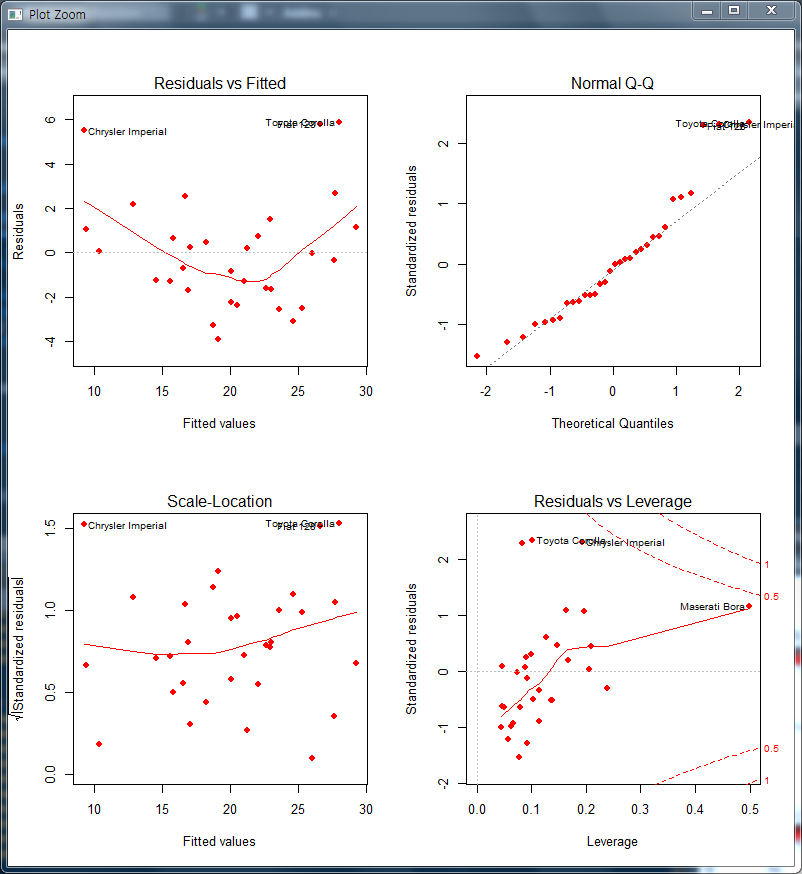
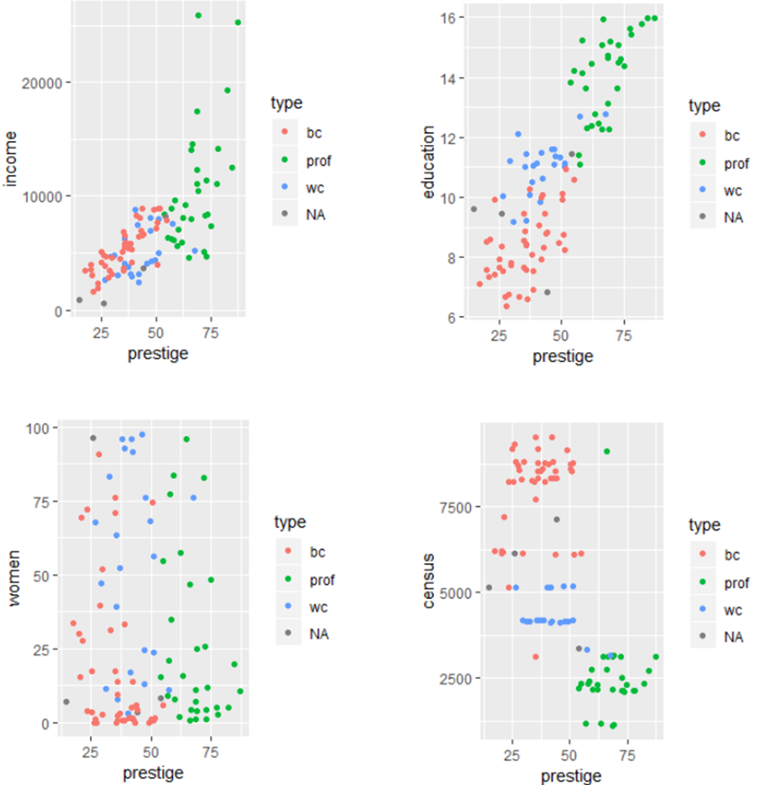
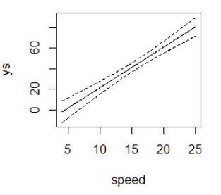
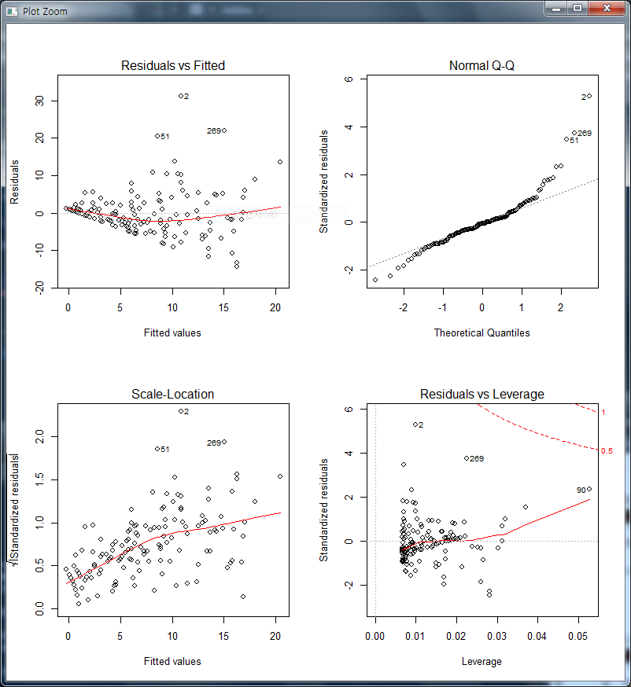

# 딥러닝 기반 빅데이터 분석과정 15일차

## ★ Kaggle


## 1. 선형회귀

- 종속변수 또는 목표번수와 연속변수 또는 독립변수의 관계를 찾는 방법

- 변수는 연속적이어야하고, 숫자값이어야 한다.

- Residual => 종속변수의 관측된 값과 회귀에서 예측된 종속 변수값간의 차이

- 단순회귀(Simpler Linear)

- 다항(Polynomial)

- 다중(Multiple linear)

- 다수준, 다변량, 로지스틱...

- y = ax +- b

- weight = a * height + b

- plot에 관한 설명 https://blog.naver.com/httyu/221208546403

### (1) 다항회귀

- ```R
  > # 다향회귀
  > height <- c(58,59,60,61,62,63)
  > weight <- c(115,117,120,123,126,129)
  > data2 <- data.frame(height, weight)
  > data3 <- lm(weight ~ height + I(height^2), data= data2)
  > data3
  
  Call:
  lm(formula = weight ~ height + I(height^2), data = data2)
  
  Coefficients:
  (Intercept)       height  I(height^2)  
    275.35714     -7.94643      0.08929  
  
  > # weight = a + bx + x^2
  > plot(weight ~ height, data=data2)
  > lines(data2$height, fitted(data3))
  ```


### (2) 다중회귀

- 다향회귀에서 그냥 x값 몇개를 더 넣어서 함께 비교하는 것임!

- ```R
  > # 다중회귀(Multiple linear regression)
  > data5 <- mtcars[,c("mpg","disp","hp","wt")]
  > data5
                       mpg  disp  hp    wt
  Mazda RX4           21.0 160.0 110 2.620
  Mazda RX4 Wag       21.0 160.0 110 2.875
  Datsun 710          22.8 108.0  93 2.320
  Hornet 4 Drive      21.4 258.0 110 3.215
  Hornet Sportabout   18.7 360.0 175 3.440
  Valiant             18.1 225.0 105 3.460
  ...
  Lotus Europa        30.4  95.1 113 1.513
  Ford Pantera L      15.8 351.0 264 3.170
  Ferrari Dino        19.7 145.0 175 2.770
  Maserati Bora       15.0 301.0 335 3.570
  Volvo 142E          21.4 121.0 109 2.780
  > model <- lm(mpg~disp+hp+wt, data=data5) # 다향회귀에서 그냥 x값 몇개를 더 넣어서 함께 비교하는 것임!
  > model
  
  Call:
  lm(formula = mpg ~ disp + hp + wt, data = data5)
  
  Coefficients:
  (Intercept)         disp           hp           wt  
    37.105505    -0.000937    -0.031157    -3.800891  
  > plot(mpg~disp+hp+wt, data=data5) # 그러므로 그래프도 총 3개가 나오겠지!
  > # coef 회귀계수
  > # (Intercept) weight
  > # -10         3
  > coef(model)
    (Intercept)          disp            hp            wt 
  37.1055052690 -0.0009370091 -0.0311565508 -3.8008905826 
  > coef(model)[1]
  (Intercept) 
     37.10551 
  > coef(model)[2]
           disp 
  -0.0009370091 
  > model # y = 37 -0.0009*disp -0.031*hp -3.8*wt
  
  Call:
  lm(formula = mpg ~ disp + hp + wt, data = data5)
  
  Coefficients:
  (Intercept)         disp           hp           wt  
    37.105505    -0.000937    -0.031157    -3.800891  
  
  > # disp, hp, wt
  > # coef : 회귀계수
  > # fitted() : 적합한 값 출력
  > fitted(model)[1:4]
       Mazda RX4  Mazda RX4 Wag     Datsun 710 Hornet 4 Drive 
        23.57003       22.60080       25.28868       21.21667 
  > # residuals() : 오차(error)
  > residuals(model)[1:4]
       Mazda RX4  Mazda RX4 Wag     Datsun 710 Hornet 4 Drive 
      -2.5700299     -1.6008028     -2.4886829      0.1833269 
  > # confint() : 회귀계수의 신뢰구간
  > confint(model)
                    2.5 %       97.5 %
  (Intercept) 32.78169625 41.429314293
  disp        -0.02213750  0.020263482
  hp          -0.05458171 -0.007731388
  wt          -5.98488310 -1.616898063
  > plot(model, pch=16, col="red")
  ```

  


### (3) 피어슨 상관계수 https://thebook.io/006723/ch07/06/01/

#### 1) 피어슨 상관계수

- 피어슨 상관 계수Pearson Correlation Coefficient[[13\]](https://thebook.io/006723/ch07/08/#ref13)는 두 변수 간의 선형적 상관관계를 측정하며, [-1, 1] 사이의 값을 가진다. 0보다 큰 상관 계수 값은 한 변수가 커지면 다른 변수도 선형적으로 증가함을 뜻하고, 0보다 작은 상관 계수는 한 변수가 커지면 다른 변수가 선형적으로 감소함을 뜻한다. X, Y의 피어슨 상관 계수가 1이면 (X, Y)를 좌표 평면에 그렸을 때 직선으로 나타난다. 0은 두 변수 간 상관관계가 없음을 뜻한다.
- 피어슨 상관 계수는 선형 관계를 판단하므로 Y = aX + b와 같은 형태의 관계를 잘 찾는다. 반면 Y = aX2 + b와 같은 비선형 관계에서 Y는 X가 증가함에 따라 값이 커지는 것이 확실하지만 값의 증가 형태가 선형이 아니므로 피어슨 상관 계수가 작게 나타날 수 있다.


#### 2) 공분산

- 공분산은 두 확률 변수가 얼마나 함께 변하는지를 측정한다. 한 변수가 커질 때 다른 변수가 함께 커지거나, 한 변수가 작아질 때 다른 변수가 함께 작아지는 것과 같이 크기 변화의 방향이 같다면 공분산은 양의 값을 가진다. 반대로 한 변수가 커질 때 다른 변수가 작아지거나 한 변수가 작아질 때 다른 변수가 커지면 공분산은 음의 값을 가진다. 만약 두 변수의 값이 서로 상관없이 움직인다면 공분산은 0이다.

- 피어슨 상관 계수는 공분산을 σX σY로 나눠 그 값이 [-1, 1] 사이가 되도록 만들어준 것으로 볼 수 있다.

- 공분산의 정의는 다음과 같다.

  cov(X, Y) = E[(X - E(X))(Y - E(Y))]


#### 3) 예제

- ```R
  > # 피어슨 상관계수
  > # 선형적 상관계 있는지 확인할 때 (-1 ~ 1)
  > cov(1:10, 2:11)
  [1] 9.166667
  > cov(1:5, 2:6)
  [1] 2.5
  > cov(1:5, c(4,4,4,4,4))
  [1] 0
  > # 스피어만 상관계수
  > # 두 데이터의 실제 값의 순위를 사용해 상관계수를 계산하는 방식
  > s <- c(2,3,4,3,2,1,5)
  > sort(s)
  [1] 1 2 2 3 3 4 5
  > rank(sort(s))
  [1] 1.0 2.5 2.5 4.5 4.5 6.0 7.0
  > x <- matrix(c(1:10, (1:10)^2), ncol=2)
  > x
        [,1] [,2]
   [1,]    1    1
   [2,]    2    4
   [3,]    3    9
   [4,]    4   16
   [5,]    5   25
   [6,]    6   36
   [7,]    7   49
   [8,]    8   64
   [9,]    9   81
  [10,]   10  100
  > cor(x, method = "spearman")
       [,1] [,2]
  [1,]    1    1
  [2,]    1    1
  > cor(x, method = "pearson")
            [,1]      [,2]
  [1,] 1.0000000 0.9745586
  [2,] 0.9745586 1.0000000
  ```


### (4) 다중회귀분석

#### 1) 단순, 다중, 단변량, 다변량 이해

- https://blog.naver.com/ryul01/221322235531

- Y =a+bX+cX+e

  여기서 Y는 종속변수 a는 상수 b, c는 독립변수 입니다


#### 2) 다중회귀분석

- 다중회귀분석 multiple Regression => x값이 많은 회귀분석

- 예제

  - ```R
    install.packages("car")
    library(car)
    library(corrplot)
    install.packages("visreg")
    library(visreg)
    install.packages("rgl")
    library(rgl)
    library(knitr)
    install.packages("scatterplot3d")
    library(scatterplot3d)
    ```

  - ```R
    > head(Prestige)
                        education income women prestige census type
    gov.administrators      13.11  12351 11.16     68.8   1113 prof
    general.managers        12.26  25879  4.02     69.1   1130 prof
    accountants             12.77   9271 15.70     63.4   1171 prof
    purchasing.officers     11.42   8865  9.11     56.8   1175 prof
    chemists                14.62   8403 11.68     73.5   2111 prof
    physicists              15.64  11030  5.13     77.6   2113 prof
    > str(Prestige)
    'data.frame':	102 obs. of  6 variables:
     $ education: num  13.1 12.3 12.8 11.4 14.6 ...
     $ income   : int  12351 25879 9271 8865 8403 11030 8258 14163 11377 11023 ...
     $ women    : num  11.16 4.02 15.7 9.11 11.68 ...
     $ prestige : num  68.8 69.1 63.4 56.8 73.5 77.6 72.6 78.1 73.1 68.8 ...
     $ census   : int  1113 1130 1171 1175 2111 2113 2133 2141 2143 2153 ...
     $ type     : Factor w/ 3 levels "bc","prof","wc": 2 2 2 2 2 2 2 2 2 2 ...
    > summary(Prestige)
       education          income          women           prestige         census       type   
     Min.   : 6.380   Min.   :  611   Min.   : 0.000   Min.   :14.80   Min.   :1113   bc  :44  
     1st Qu.: 8.445   1st Qu.: 4106   1st Qu.: 3.592   1st Qu.:35.23   1st Qu.:3120   prof:31  
     Median :10.540   Median : 5930   Median :13.600   Median :43.60   Median :5135   wc  :23  
     Mean   :10.738   Mean   : 6798   Mean   :28.979   Mean   :46.83   Mean   :5402   NAs: 4  
     3rd Qu.:12.648   3rd Qu.: 8187   3rd Qu.:52.203   3rd Qu.:59.27   3rd Qu.:8312            
     Max.   :15.970   Max.   :25879   Max.   :97.510   Max.   :87.20   Max.   :9517            
    > colnames(Prestige)
    [1] "education" "income"    "women"     "prestige"  "census"    "type"     
    > data <- Prestige[, c(1:4)]
    > data
                              education income women prestige
    gov.administrators            13.11  12351 11.16     68.8
    general.managers              12.26  25879  4.02     69.1
    accountants                   12.77   9271 15.70     63.4
    ...
    bus.drivers                    7.58   5562  9.47     35.9
    taxi.drivers                   7.93   4224  3.59     25.1
    longshoremen                   8.37   4753  0.00     26.1
    typesetters                   10.00   6462 13.58     42.2
    bookbinders                    8.55   3617 70.87     35.2
    > plot(data, pch=16) # pch는 점 크기
    > # Income = B0 + B1*Education + B2*Prestige * B3*Women 을 뜻한다.
    > plot(data$education)
    > educ <- scale(data$education, center = T, scale = F) #scale() = (x-mean(x)) / sd(x)와 동일
    > educ
                  [,1]
      [1,]  2.37196078
      [2,]  1.52196078
      [3,]  2.03196078
    ...
     [99,] -2.80803922
    [100,] -2.36803922
    [101,] -0.73803922
    [102,] -2.18803922
    attr(,"scaled:center")
    [1] 10.73804
    ```

  - 상관관계를 그래프로 잘 살펴보자

    - ```R
      > colnames(Prestige)
      [1] "education" "income"    "women"     "prestige"  "census"    "type"     
      > data <- Prestige[,-6]
      > cor(data) # 상관관계 살펴보기 => X 와 Y 가 완전히 동일하면 +1, 전혀 다르면 0, 반대방향으로 완전히 동일 하면 –1 을 가진다.
                  education     income       women   prestige     census
      education  1.00000000  0.5775802  0.06185286  0.8501769 -0.8230882
      income     0.57758023  1.0000000 -0.44105927  0.7149057 -0.3610023
      women      0.06185286 -0.4410593  1.00000000 -0.1183342 -0.2270028
      prestige   0.85017689  0.7149057 -0.11833419  1.0000000 -0.6345103
      census    -0.82308821 -0.3610023 -0.22700277 -0.6345103  1.0000000
      > corrplot(cor(Prestige[,-6]), method="number") # 상관관계를 그래프로 살펴보자
      > par(mfrow=c(2,2))
      > # income * prestige => 상관관계에서 prestige와 income의 상관계수는 0.714957이다. 그래프와 같이 상관관계가 유의하다.
      > ggplot(data=Prestige, aes(x=prestige, y=income, col=type)) + geom_point()
      > # education * prestige
      > ggplot(data=Prestige, aes(x=prestige, y=education, col=type)) + geom_point()
      > # women * prestige => 상관관계에서 prestige와 women의 상관계수는-0.1183342이다. 그래프와 같이 상관이 거의 없다.
      > ggplot(data=Prestige, aes(x=prestige, y=women, col=type)) + geom_point()
      > # census * prestige
      > ggplot(data=Prestige, aes(x=prestige, y=census, col=type)) + geom_point()
      ```

    - 

  - 다중회귀분석

    - ```R
      > lm_data3 <- lm(prestige ~ education + log(income) + women + census, data = Prestige)
      > lm_data3
      
      Call:
      lm(formula = prestige ~ education + log(income) + women + census, 
          data = Prestige)
      
      Coefficients:
       (Intercept)     education   log(income)         women        census  
      -113.9355131     3.9826752    13.2760580     0.0495433     0.0002943  
      
      > lm_data4 <- lm(prestige ~ education + log(income), data = Prestige)
      > lm_data4
      
      Call:
      lm(formula = prestige ~ education + log(income), data = Prestige)
      
      Coefficients:
      (Intercept)    education  log(income)  
          -95.194        4.002       11.437  
      
      ```

### (5) 간단한 예제로 다시 살펴보기

- coef 함수는 lm함수랑 동일한데, coef()[1] 와 같이 추출이 가능하다는 점만 다르다.

- fitted() : 적합한 값 출력
  residuals() : 오차(error) 출력

- ```R
  > cars$speed
   [1]  4  4  7  7  8  9 10 10 10 11 11 12 12 12 12 13 13 13 13 14 14 14 14 15 15 15 16 16 17 17 17 18 18 18
  [35] 18 19 19 19 20 20 20 20 20 22 23 24 24 24 24 25
  > cars$dist
   [1]   2  10   4  22  16  10  18  26  34  17  28  14  20  24  28  26  34  34  46  26  36  60  80  20  26
  [26]  54  32  40  32  40  50  42  56  76  84  36  46  68  32  48  52  56  64  66  54  70  92  93 120  85
  > m <- lm(dist ~ speed, data = cars)
  > m
  
  Call:
  lm(formula = dist ~ speed, data = cars)
  
  Coefficients:
  (Intercept)        speed  
      -17.579        3.932  
  
  > # dist = B0 + B1 * speed + e
  > # dist = -17.579 + 3.932*speed + e
  > coef(m) # coef 함수는 lm함수랑 동일한데, coef()[1] 와 같이 추출이 가능하다는 점만 다르다.
  (Intercept)       speed 
   -17.579095    3.932409 
  > # fitted() : 적합한 값 출력
  > # residuals() : 오차(error) 출력
  > fitted(m)
          1         2         3         4         5         6         7         8         9        10 
  -1.849460 -1.849460  9.947766  9.947766 13.880175 17.812584 21.744993 21.744993 21.744993 25.677401 
  ...
         41        42        43        44        45        46        47        48        49        50 
  61.069080 61.069080 61.069080 68.933898 72.866307 76.798715 76.798715 76.798715 76.798715 80.731124 
  > coef(m)[1:4]
  (Intercept)       speed        <NA>        <NA> 
   -17.579095    3.932409          NA          NA 
  > fitted(m)[1:4]
          1         2         3         4 
  -1.849460 -1.849460  9.947766  9.947766 
  > residuals(m)[1:4]
          1         2         3         4 
   3.849460 11.849460 -5.947766 12.052234 
  > fitted(m)[1:4] + residuals(m)[1:4]
   1  2  3  4 
   2 10  4 22 
  > cars$dist[1:4]
  [1]  2 10  4 22
  > confint(m)
                   2.5 %    97.5 %
  (Intercept) -31.167850 -3.990340
  speed         3.096964  4.767853
  > predict(m)
          1         2         3         4         5         6         7         8         9        10 
  -1.849460 -1.849460  9.947766  9.947766 13.880175 17.812584 21.744993 21.744993 21.744993 25.677401 
  ...
         41        42        43        44        45        46        47        48        49        50 
  61.069080 61.069080 61.069080 68.933898 72.866307 76.798715 76.798715 76.798715 76.798715 80.731124 
  > predict(m, newdata = data.frame(speed=3))
          1 
  -5.781869 
  > coef(m)
  (Intercept)       speed 
   -17.579095    3.932409 
  > -17.579095 + 3.932409 * 3 # predict(m, newdata = data.frame(speed=3)) 과 값이 동일한 것을 알 수 있다.
  [1] -5.781868
  > predict(m, newdata = data.frame(speed=3), interval = "prediction")
          fit       lwr      upr
  1 -5.781869 -38.68565 27.12192
  ```

- ```R
  ys <- predict(m, newdata = data.frame(speed=speed), interval = "confidence")
  matplot(speed, ys, type="n")
  matlines(speed, ys, lty=c(1,2,2), col=1)
  ```

- 


### (6) 문제로 복습하기

#### 1) 야구문제

- www.koreabaseball.com
  => example_kbo2015_player.csv

  1. 2015 KBO 야구 데이터 분석하기
  - 홈런과 다른 변수간의 상관계수를 살펴보시오.
  - 회귀모델을 구하고 p-value값을 확인하시오.
  - 잔차(residuals)관련 그래프를 출력하시오. 
    residual = 모델로부터 구한 예측 값과 실제 값의 차이를 나타내는 값

- 

  - ```R
    > df <- read.csv("example_kbo2015_player.csv", stringsAsFactors = F, na = "-")
    > df
        순위   선수명 팀명   AVG   G  PA  AB   R   H X2B X3B HR  TB RBI SAC SF XBH  GO  AO GO.AO GW.RBI BB.K
    1      1   유한준 넥센 0.364 101 436 376  82 137  35   1 19 231  84   0  6  55  97  95  1.02      7 1.00
    2      2   박병호 넥센 0.349 106 476 410 100 143  29   1 42 300 111   0  3  72  70  74  0.95     10 0.42
    3      3   홍성갑 넥센 0.333   7  10   9   0   3   0   0  0   3   2   0  0   0   2   0    NA      0 0.25
    ...
    37    13   최주환 두산 0.245  67 178 155  24  38   8   0  2  52  14   3  0  10  52  46  1.13      1 1.00
    38    14   정진호 두산 0.241  63 158 141  34  34   5   3  4  57  18   3  0  12  51  38  1.34      3 0.78
        P.PA  ISOP    XR   GPA
    1   4.00 0.250  88.4 0.351
    2   4.07 0.383 113.3 0.378
    3   4.70 0.000   1.3 0.263
    ...
    20  4.58 0.127   6.4 0.200
    21  4.17 0.160   1.9 0.215
    22  7.00 0.000   0.3 0.225
    23    NA    NA   0.0 0.000
    24    NA    NA   0.0 0.000
    25  3.71 0.149   8.9 0.323
    26  3.77 0.222  70.8 0.330
    ...
    36  4.01 0.073  27.1 0.243
    37  4.00 0.090  16.3 0.233
    38  3.49 0.163  19.0 0.241
     [ reached getOption("max.print") -- omitted 299 rows ]
    > str(df)
    'data.frame':	337 obs. of  26 variables:
     $ 순위  : int  1 2 3 4 5 6 7 8 9 10 ...
     $ 선수명: chr  "유한준" "박병호" "홍성갑" "고종욱" ...
     $ 팀명  : chr  "넥센" "넥센" "넥센" "넥센" ...
     $ AVG   : num  0.364 0.349 0.333 0.324 0.318 0.316 0.311 0.3 0.295 0.287 ...
     $ G     : int  101 106 7 85 44 96 68 99 79 103 ...
    ...
     $ AO    : int  95 74 0 67 2 105 57 84 75 106 ...
     $ GO.AO : num  1.02 0.95 NA 1.09 3 0.9 1.05 1.14 0.52 0.75 ...
     $ GW.RBI: int  7 10 0 6 0 2 1 5 1 3 ...
     $ BB.K  : num  1 0.42 0.25 0.3 0.29 0.45 0.78 0.63 0.31 0.46 ...
     $ P.PA  : num  4 4.07 4.7 3.89 4.08 3.98 4.19 3.85 4.14 4.22 ...
     $ ISOP  : num  0.25 0.383 0 0.174 0.091 0.17 0.155 0.189 0.251 0.204 ...
     $ XR    : num  88.4 113.3 1.3 47.9 4.2 ...
     $ GPA   : num  0.351 0.378 0.263 0.293 0.271 0.287 0.293 0.292 0.304 0.285 ...
    > df$AO <- as.numeric(df$AO)
    > df$GO.AO <- as.numeric(df$GO.AO)
    > df$BB.K <- as.numeric(df$BB.K)
    > df$P.PA <- as.numeric(df$P.PA)
    > df$ISOP <- as.numeric(df$ISOP)
    > # 홈런과 다른 변수간의 상관계수를 확인(정렬)
    > Cors <- cor(df$HR, df[,5:length(df)], use = "pairwise")
    > Cors
                 G        PA        AB         R         H       X2B       X3B HR        TB       RBI
    [1,] 0.6573121 0.7607232 0.7519703 0.8012273 0.7815465 0.7756991 0.3089791  1 0.8828075 0.9217014
                SAC        SF       XBH        GO        AO      GO.AO    GW.RBI      BB.K       P.PA
    [1,] 0.02882778 0.6766359 0.9190164 0.6096195 0.7477335 -0.1618067 0.7889489 0.2839297 0.03248409
              ISOP        XR       GPA
    [1,] 0.7813991 0.8815765 0.5505212
    > Cors <- Cors[, order(Cors)]
    > Cors
          GO.AO         SAC        P.PA        BB.K         X3B         GPA          GO           G 
    -0.16180671  0.02882778  0.03248409  0.28392966  0.30897909  0.55052123  0.60961949  0.65731209 
             SF          AO          AB          PA         X2B        ISOP           H      GW.RBI 
     0.67663588  0.74773350  0.75197032  0.76072321  0.77569907  0.78139909  0.78154650  0.78894892 
              R          XR          TB         XBH         RBI          HR 
     0.80122734  0.88157647  0.88280745  0.91901637  0.92170137  1.00000000 
    ```

  - 

  - ```
    > # 홈런과 뜬공 변수에서 값이 0인 관측치
    > df$HR[df$HR == 0] <- NA # 안해도 상관이 없음. 그러나 0이 좀 의미가 없다고 생각해서 NA로 바꿈.
    > # 회귀모델을 구함
    > lm_data <- lm(HR ~ AO, data=df)
    > lm_data
    
    Call:
    lm(formula = HR ~ AO, data = df)
    
    Coefficients:
    (Intercept)           AO  
        -0.5244       0.1541  
    
    > # y = -0.5244 + 0.1541x
    > summary(lm_data)
    
    Call:
    lm(formula = HR ~ AO, data = df)
    
    Residuals:
         Min       1Q   Median       3Q      Max 
    -14.2728  -2.8553  -0.4085   2.2129  31.1208 
    
    Coefficients:
                Estimate Std. Error t value            Pr(>|t|)    
    (Intercept) -0.52444    0.90894  -0.577               0.565    
    AO           0.15410    0.01502  10.260 <0.0000000000000002 ***
    ---
    Signif. codes:  0 ‘***’ 0.001 ‘**’ 0.01 ‘*’ 0.05 ‘.’ 0.1 ‘ ’ 1
    
    Residual standard error: 5.932 on 148 degrees of freedom
      (187 observations deleted due to missingness)
    Multiple R-squared:  0.4156,	Adjusted R-squared:  0.4117 
    F-statistic: 105.3 on 1 and 148 DF,  p-value: < 0.00000000000000022
    
    > par(mfrow=c(2,2))
    > plot(lm_data)
    ```

  - 


#### 2) 다이아몬드 문제

- diamonds데이터로 캐럿에 따른 가격을 예측하시오.
  - 회귀 모델을 구하고, 검증하시오.
  - 10캐럿, 20캐럿값은?

- ```R
  > diamonds
  # A tibble: 53,940 x 10
     carat cut       color clarity depth table price     x     y     z
     <dbl> <ord>     <ord> <ord>   <dbl> <dbl> <int> <dbl> <dbl> <dbl>
   1 0.23  Ideal     E     SI2      61.5    55   326  3.95  3.98  2.43
   2 0.21  Premium   E     SI1      59.8    61   326  3.89  3.84  2.31
   3 0.23  Good      E     VS1      56.9    65   327  4.05  4.07  2.31
   4 0.290 Premium   I     VS2      62.4    58   334  4.2   4.23  2.63
   5 0.31  Good      J     SI2      63.3    58   335  4.34  4.35  2.75
   6 0.24  Very Good J     VVS2     62.8    57   336  3.94  3.96  2.48
   7 0.24  Very Good I     VVS1     62.3    57   336  3.95  3.98  2.47
   8 0.26  Very Good H     SI1      61.9    55   337  4.07  4.11  2.53
   9 0.22  Fair      E     VS2      65.1    61   337  3.87  3.78  2.49
  10 0.23  Very Good H     VS1      59.4    61   338  4     4.05  2.39
  # ... with 53,930 more rows
  > 
  > d <- lm(diamonds$price ~ diamonds$carat, data=diamonds) # diamonds 데이터로 회귀모델을 구한다.
  > summary(d) # summary로 요약된 자료를 살펴보자.
  
  Call:
  lm(formula = diamonds$price ~ diamonds$carat, data = diamonds)
  
  Residuals:
       Min       1Q   Median       3Q      Max 
  -18585.3   -804.8    -18.9    537.4  12731.7 
  
  Coefficients:
                 Estimate Std. Error t value            Pr(>|t|)    
  (Intercept)    -2256.36      13.06  -172.8 <0.0000000000000002 ***
  diamonds$carat  7756.43      14.07   551.4 <0.0000000000000002 ***
  ---
  Signif. codes:  0 ‘***’ 0.001 ‘**’ 0.01 ‘*’ 0.05 ‘.’ 0.1 ‘ ’ 1
  
  Residual standard error: 1549 on 53938 degrees of freedom
  Multiple R-squared:  0.8493,	Adjusted R-squared:  0.8493 
  F-statistic: 3.041e+05 on 1 and 53938 DF,  p-value: < 0.00000000000000022
  
  > 
  > d2 <- data.frame(carat=c(10,20)) # 10캐럿괴 20캐럿을 추출하여 데이터프레임으로 만들자.
  > predict(d, newdata = d2) # 회귀모델 d에 10, 20캐럿 자료를 newdata로 적용시켜보자.
            1           2           3           4           5           6           7           8 
  -472.382688 -627.511200 -472.382688   -6.997151  148.131362 -394.818432 -394.818432 -239.689919 
            9          10          11          12          13          14          15          16 
  -549.946944 -472.382688   70.567105 -472.382688 -549.946944  148.131362 -705.075456  225.695618 
  ...
  3716.087146 3716.087146 1854.544997 3871.215658 3405.830121 3716.087146 3716.087146 5577.629294 
          993         994         995         996         997         998         999        1000 
  5577.629294 2397.494791 3638.522890 1932.109254 3328.265865 3328.265865 3483.394377 6430.836112 
   [ reached getOption("max.print") -- omitted 52940 entries ]
  Warning message:
  'newdata'는 2 개의 행을 가지고 있었습니다. 그러나 찾아진 변수는 53940개의 행을 가지고 있었습니다.
  ```