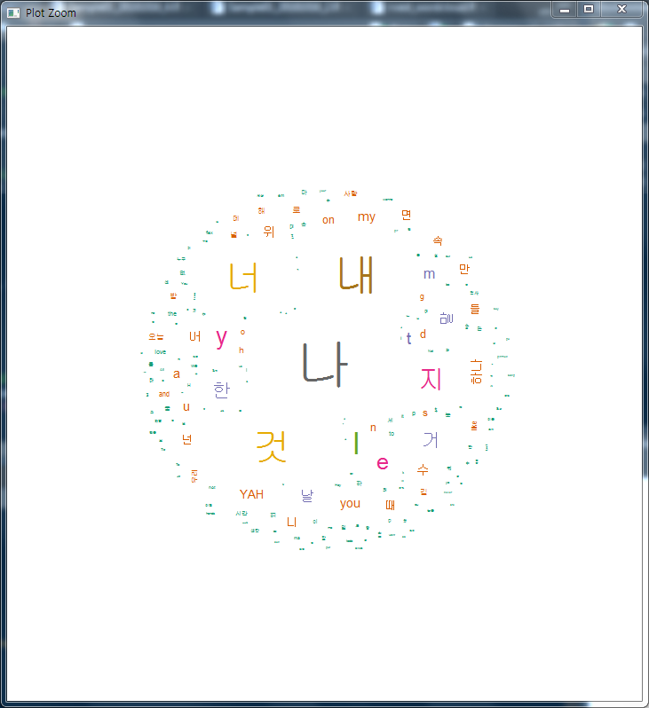

# 딥러닝 기반 빅데이터 분석과정 17일차

## 1. 텍스트 마이닝

- rvest => text mining => wordcloud

- 텍스트 마이닝 : 문자로 된 데이터에서 가치있는 정보를 얻어내는 방법

- 분석순서
  - 1. 형태소 분석
    2. 명사, 동사 형용샤 등의 의미를 지닌 품사 단어 추출
    3. 빈도표 만들기
    4. 시각화

### (1) 자바 설치

[jdk-8u181-windows-x64.exe](http://download.oracle.com/otn-pub/java/jdk/8u181-b13/96a7b8442fe848ef90c96a2fad6ed6d1/jdk-8u181-windows-x64.exe)


### (2) 패키지 및 라이브러리 설치 및 사용해보기

- 

```R
install.packages("scam")
install.packages("RSelenium")
install.packages("igraph")
install.packages("qdap")
install.packages("text2vec")
install.packages("RWeka")
install.packages("ggmap")
install.packages("rworldmap")
install.packages("rworldxtra")
library(rvest) # R webscraping package
library(RSelenium) # R login package
library(igraph)
library(qdap)
library(text2vec)
library(data.table)
library(stringr)
library(tm)
library(RWeka)
library(tokenizers)
library(slam)
library(wordcloud) # 워드클라우드
library(ggplot2) # 그래프
library(scam)
library(NLP) # word parsing package
library(openNLP)
library(ggmap)
library(rworldmap)
library(rworldxtra)
```


#### 1) 예시1 - 단어 추출 함수

- ```R
  text.clean = function(x)                    
  { require("tm")
    x  =  gsub("<.*?>", " ", x)               # HTML 태그를 제거하기위한 정규 표현식
    x  =  iconv(x, "latin1", "ASCII", sub="") # ASCII 문자 유지
    x  =  gsub("[^[:alnum:]]", " ", x)        # 영문숫자만 유지 
    x  =  tolower(x)                          # 소문자로 변환
    x  =  removeNumbers(x)                    # 숫자 제거
    x  =  stripWhitespace(x)                  # 공백제거
    x  =  gsub("^\\s+|\\s+$", "", x)          # 선행 및 후행 공백 제거
    return(x)
  }
  counts = c(0,10,20,30,40,50)
  reviews = NULL
  
  reviews = gsub("\n",' ',reviews)
  #writeLines(reviews,'Wall-e reviews.txt')
  
  temp.text = readLines(file.choose())  #  Wall-e reviews
  head(temp.text, 4)
  ```


#### 2) 예시2(문단을 단어만 나오게하고, 추출) - 직접 스크래핑까지 해보기

- ```R
  > # 예시
  > # http://www.imdb.com/title/tt0910970/reviews?filter=love;filter=love;start=40
  > #url <- "http://www.imdb.com/title/tt0910970/reviews?filter=love;filter=love;start=10"
  > url <- "http://www.imdb.com/title/tt0910970/reviews?filter=love;filter=love;start=10"
  > url
  [1] "http://www.imdb.com/title/tt0910970/reviews?filter=love;filter=love;start=10"
  > page1 <- read_html(url)
  > class(page1)
  [1] "xml_document" "xml_node"    
  > filter_page1 <- html_nodes(page1, ".content")
  > filter_page1
  {xml_nodeset (25)}
   [1] <div class="content">\n                <div class="text show-more__control">Who says popular films  ...
   [2] <div class="content">\n                <div class="text show-more__control">I just returned from an ...
   [3] <div class="content">\n                <div class="text show-more__control">Im starting to wonder  ...
   [4] <div class="content">\n                <div class="text show-more__control">We went to the San Fran ...
   [5] <div class="content">\n                <div class="text show-more__control">Wall-E is the movie exp ...
   [6] <div class="content">\n                <div class="text show-more__control">Over the years I've bec ...
   [7] <div class="content">\n                <div class="text show-more__control">I can't say enough abou ...
   [8] <div class="content">\n                <div class="text show-more__control">This truly is one beaut ...
   [9] <div class="content">\n                <div class="text show-more__control">Pixar has produced some ...
  [10] <div class="content">\n                <div class="text show-more__control">Just got back from a sp ...
  [11] <div class="content">\n                <div class="text show-more__control">I just saw the screener ...
  [12] <div class="content">\n                <div class="text show-more__control">When it comes to animat ...
  [13] <div class="content">\n                <div class="text show-more__control">Not only it's Pixar's b ...
  [14] <div class="content">\n                <div class="text show-more__control">Robots falling in love. ...
  [15] <div class="content">\n                <div class="text show-more__control">We live in a consumeris ...
  [16] <div class="content">\n                <div class="text show-more__control">I thought that Pixar wa ...
  [17] <div class="content">\n                <div class="text show-more__control">I join the gushing majo ...
  [18] <div class="content">\n                <div class="text show-more__control">Wall-E is the film Pixa ...
  [19] <div class="content">\n                <div class="text show-more__control">I very rarely give ten  ...
  [20] <div class="content">\n                <div class="text show-more__control">WALL-E is a robot left  ...
  ...
  > length(filter_page1)
  [1] 25
  
  ```

- ```R
  > data <- html_text(filter_page1) # 살펴보면 \n이 들어간 것을 확인할 수 있다.
  > data <- gsub("\n", " ", data) # \n을 삭제함. 기본적으로는 이렇게 삭제한다.
  
  > text.clean(data) # 데이터를 완전 깔끔해주게 해주는 위의 text.clean을 해준다.
   [1] "who says popular films are not and cannot be art if anything is proof that popular films can be of a stunningly high quality the beauty of the animation writing music and sound design in walle is it walle eclipses even andrew stanton s toy story and toy story in the pixar pantheon is perhaps pixar s best film to date and call me crazy as i ve just seen it a contender for the title of best animated film period walle is everything we ve come to expect from pixar and more colorful vibrant imaginative exciting involving beautiful and most importantly a film with interesting involving characters sure walle is adorable and as much credit as the animators get for that this film would be nothing without stanton s screenplay which features very little dialogue but is still notably intelligent and surprisingly subtle maki
   ...
   
   > library(tm)
  > stopwords("english") # 조사, 주어 등을 모아놓은 곳. 이것을 활용하여 데이터를 더 정제할 수 있다.
    [1] "i"          "me"         "my"         "myself"     "we"         "our"        "ours"      
    [8] "ourselves"  "you"        "your"       "yours"      "yourself"   "yourselves" "he"        
   [15] "him"        "his"        "himself"    "she"        "her"        "hers"       "herself"   
   [22] "it"         "its"        "itself"     "they"       "them"       "their"      "theirs"    
  ...     
  [148] "once"       "here"       "there"      "when"       "where"      "why"        "how"       
  [155] "all"        "any"        "both"       "each"       "few"        "more"       "most"      
  [162] "other"      "some"       "such"       "no"         "nor"        "not"        "only"      
  [169] "own"        "same"       "so"         "than"       "too"        "very"      
  > stopword2 <- stopwords("english")
  > data2 <- removeWords(data2, stopword2)
  
  > data2 # 주어, 조사 등이 삭제데어 거의 단어만 완전히 남은 것을 볼 수 있다.
  [25] " can read elsewhere ordinary stuff wonderful exploits cinematic characterization even conservative bloggers decided criticize supposedly leftist premise jeecome ...
  
  > data2 <- stripWhitespace(data2) # 띄어쓰기가 조절된다.
  [25] " can read elsewhere ordinary stuff wonderful exploits cinematic characterization even conservative bloggers decided criticize supposedly leftist premise jees enjoy amazing experience watching also admiring minds behind som
  
  > length(data2) # 25개 리뷰
  [1] 25
  > data3 <- data2[1]
  > data3
  [1] " says popular films art anything proof popular films can stunningly high quality beauty animation writing music sound design walle walle eclipses even andrew stanton s toy story toy story pixar pantheon perhaps pixar s best film date call crazy ve just seen contender title best animated film period walle
  ...
  
  > data3 <- strsplit(data3, " ") # 데이터를 띄어쓰기 기준으로 분
  > data3 <- table(data3)
  > data3
  data3
                   absolutely      achingly      actually      adorable          also        andrew 
              1             1             1             2             1             1             1 
       animated     animation     animators      anything           art        barren     beautiful 
              2             2             1             1             1             1             2 
    beautifully        beauty          best        bother     brilliant      brothers        bygone 
  
  ```


#### 3) 예시3 - 예시2 내용을 가장 높은 빈도수 10개만 추출하기

- ```R
  > # 상위 가장 빈도수 높은 단어 10개 추출
  > library(dplyr)
  > data3 <- as.data.frame(data3)
  > colnames(data3) <- c("words", "count")
  > str(data3)
  'data.frame':	237 obs. of  2 variables:
   $ words: Factor w/ 237 levels "","absolutely",..: 1 2 3 4 5 6 7 8 9 10 ...
   $ count: int  1 1 1 2 1 1 1 2 2 1 ...
  > data3 %>% arrange(desc(count)) %>% filter(count >= 3)
           words count
  1        walle    14
  2         film    11
  3            s     8
  4        films     4
  5        pixar     4
  6            t     4
  7  beautifully     3
  8         best     3
  9          get     3
  10 importantly     3
  11   involving     3
  12       never     3
  13        seen     3
  14     stanton     3
  15       story     3
  ```


#### 4) 예시4 - 힙합 가사 텍스트 마이닝

- ```R
  install.packages("rJava")
  install.packages("memoise")
  install.packages("KoNLP") # 파싱해주는 라이브러리
  library(rJava)
  library(memoise)
  library(KoNLP)
  useNIADic()
  
  > data <- readLines("hiphop.txt")
  Warning message:
  In readLines("hiphop.txt") : incomplete final line found on 'hiphop.txt'
  > head(data)
  [1] "\"보고 싶다"                  "이렇게 말하니까 더 보고 싶다" "너희 사진을 보고 있어도"     
  [4] "보고 싶다"                    "너무 야속한 시간"             "나는 우리가 밉다"            
  > library(stringr)
  > data <- str_replace_all(data, "\\W", " ")
  > head(data)
  [1] " 보고 싶다"                   "이렇게 말하니까 더 보고 싶다" "너희 사진을 보고 있어도"     
  [4] "보고 싶다"                    "너무 야속한 시간"             "나는 우리가 밉다"            
  > KoNLP::extractNoun("반갑습니다. 즐거운 하루 되세요")  # extractNoun는 단어를 분리시켜줌
  [1] "하루"
  
  > nouns <- extractNoun(data)
  > class(nouns)
  [1] "list"
  > head(nouns)
  [[1]]
  [1] "싶"
  
  [[2]]
  [1] "말하" "싶"  
  
  [[3]]
  [1] "너희" "사진" "도"  
  
  [[4]]
  [1] "싶"
  
  [[5]]
  [1] "야속" "한"   "시"   "간"  
  
  [[6]]
  [1] "나"   "우리" "밉"  
  
  > data2 <- unlist(nouns)
  > head(data2)
  [1] "싶"   "말하" "싶"   "너희" "사진" "도"  
  > data3 <- table(data2)
  > data3
  data2
                                    1         100         168          17    1VERSE에         1악 
           12           2           9           3           1           1           1           3 
        1악장       1운동           2          20        2012        2016          21          24 
            1           1           5           3           1           2           6           2 
   ...
           Ya          YA         YAH          ye         yea         Yea         YEA        yeah 
            6          14          80           4          12           7           2           5 
   [ reached getOption("max.print") -- omitted 2008 entries ]
  > data4 <- data.frame(data3, stringsAsFactors = F)
  > head(data4)
    data2 Freq
  1         12
  2          2
  3     1    9
  4   100    3
  5   168    1
  6    17    1
  > colnames(data4)
  [1] "data2" "Freq" 
  
  > library(wordcloud)
  > library(RColorBrewer)
  > set.seed(1234)
  > pal <- brewer.pal(8, "Dark2")
  > wordcloud(data4$data2, data4$Freq, min.freq = 2, max.words = 200, random.order = F,
  +           scale = c(4, 0, 3),
  +           colors = pal)
  ```

- 

