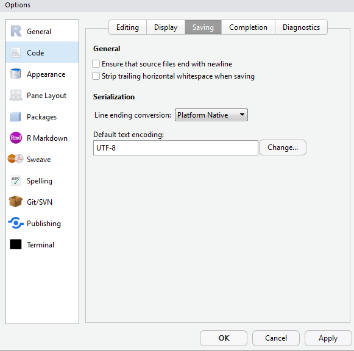
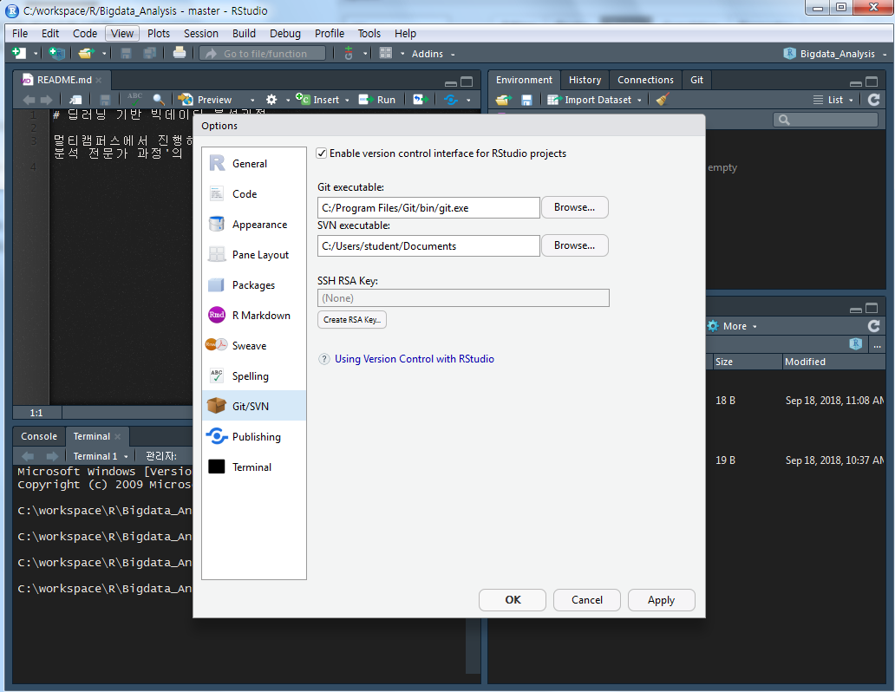
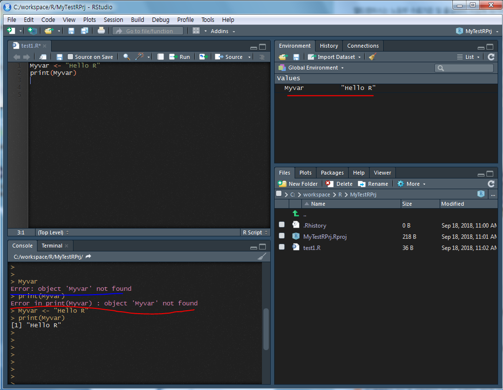

# 	딥러닝 기반 빅데이터 분석과정 1일차

이정구 강사님, MCT(Microsoft Certified Trainer)

thomas194511@gmail.com

(~10/23일까지)

책 : 데이터 과학 입문자를 위한 R(재리드 랜더 지음, 에이콘)


## 1. OT 및 R 소개, 설치

### (1) OT

- 10테라 정도 사용해야 빅데이터 분석이 가능
- 실제 사회 밖에서는 이러한 용량을 구할 수 없음
- R은 데이터 분석. 데이터 분석이 80% 라고 말할 수 있음


### (2) R 소개

- Open Source
- 데이터 분석
- 강력한 그래프 기능
- 데이터 핸들링
- 메모리


### (3) R 설치

#### 1) R 홈페이지 이동

- https://www.r-project.org/ 

- https://ftp.harukasan.org/CRAN/
- [Download R 3.5.1 for Windows](https://ftp.harukasan.org/CRAN/bin/windows/base/R-3.5.1-win.exe) (62 megabytes, 32/64 bit) 다운

#### 2) 설치

- 설치 시 관리자 권한으로 실행할 것 (마우스 오른쪽 클릭)
- 32bit는 잘안써서 설치해도 되고 안해도 됨. 기본 64bit로 설치
- Startup option은 No(default) 선택. 나중에 Rstudio를 쓰기 때문
- 이후 디폴트값 모두 선택

#### 3) R studio 설치

- https://www.rstudio.com/ 이동
- RStudio Desktop Open Source License 를 다운
- [RStudio 1.1.456 - Windows Vista/7/8/10](https://download1.rstudio.org/RStudio-1.1.456.exe) 다운
- 기본 설치!


#### 4) R Studio 환경설정

- tools - option 이동

  - code - saving 이동

    - unicode로 설정해야함
    - defaul text encoding을 UTF-8로 설정

    

  - 개인적으로는 General의 working directory를 C:\workspace\R 으로 설정함


### (4) Git 연동

- Git을 설치

  - R studio의 option-git/SVN에 연동

  

- github repository 생성

- new project - version control - repository 주소 쓰고 위치 지정하면 끝

- git 사용자 등록

  ```
  git config --global user.email "jshjsh04@gmail.com"
  
  git config --global user.name "jsh"
  ```

- git add . 하고 git commit -m '~' 하고 git push 하긔


## 2. R Studio로 R 사용해보기

### (1) 간단한 테스트




- R은 한줄 씩 Run이 된다. 그래서 1번 줄 부터 차례로 run을 해야 values가 제대로 인식된다.

  - 전체 블록 설정 후 ctrl+enter로 전체 실행 가능


### (2) R 패키지

- R이 인기가 있는 이유는 사용자 공여 패키지 덕이 크다.

- 패키지는 어떤 특정 문제에 대한 해법으로 작성된 코드들을 모아 둔 것

- 패키지 설치방법

  - GUI를 통해 설치

  - ctrl+7을 눌러 설치

  - 콘솔에서 install.packages("coefplot") 처럼 설치

  - git에서 다운은 devtools를 사용

    ```
    library(devtools)
    install_github(repo="jaredlander/coefplot")
    ```

- 패키지 사용 방법

  - library(coefplot)

- install.packages("ggplot2") 로 패키지 설치

- install.packages(c("패키지명1", "패키지명2", ..)) 으로 한번에 설치가능

- library(ggplot2)으로 패키지 가져오기

- 주의사항 : 패키지를 여러개 로드할 때, 가장 마지막 패키지가 연결되고 나머지는 해제가 됨. 그래서 다시 다른 패키지를 필요할 때마다 로드하던가 또는 ''패키지명.함수'' 로 호출한다.

- update.packages("패키지명") 으로 업데이트 가능

- remove.pcakges("패키지명") 으로 삭제 가능

- .libPaths() 으로 경로 확인 가능

- help(package="ggplot2") 처럼 도움말 요청 가능

- detach("package:ggplot2")으로 패키지 언로딩 가능


## 3. R의 기초

### (1) 연산자

#### 1) 할당연산자(변수 사용 예시)

```R
myTest <= "hihi"

x1 <- 1
x2 <- FALSE
x3 <- 'Hello R'
x4 <- 2 + 3i
```

- 특이사항
  - <- 대신 =를 사용할 수는 있으나 R은 기본적으로 통상적으로 <- 을 사용한다
  - 3 -> x 처럼 반대 방향도 사용가능하다
  - 가끔 assign 함수를 통해 할당한다. assign("j", 4)
  - ***a.test = 5 라고 선언한다면 a.test는 함수따위가 아니라 그냥 변수이름임!***
  - rm(x1)으로 변수 삭제가능
  - class(x1)으로 데이터 유형 확인
  - mode()로도 데이터 유형 확인 가능


#### 2) 조금 특이한 몫과 나머지 산술연산자

- 몫은 13 %/% 4  와 같이 %/%를 사용
- 나머지는 13 %% 4 와 같이 %%를 사용


#### 3)  비교 연산자 특징 몇가지

- R은 보통 조건 등을 잘 사용하지 않는다. 그냥 통계적 특징임. 그래서 == 같은 연산자는 생각보다 잘 안씀


#### 4) 논리 연산자

- &, &&, |, || 와 같이 일반적임
- & && 의 차이는 vector(백터) 사용에 따라 차이가 있음


### (2) 데이터 유형

- 딱 4개! 숫자형, 문자형, 논리형, 복소수형

#### 1) 숫자형 데이터

- numeric

  - 가장 많이 사용되는 숫자형. float, double과 상당히 유사.
  - 정수, 소수, 양수, 음수, 0 등을 다룰 수 있다.
  - is.numeric을 통해 true false 반환 가능

- integer

  - 정수형임. 거의 numeric을 쓰고 integer형은 잘 안씀

  - 끝에 L을 붙이면 정확한 정수가 변수에 할당 됨 (i <- 5L)

  - 예시

    ```R
    x <= 10L
    if(is.integer(x)){
        print("x is integer")
    }
    else {
        print("x is not integer")
    }
    
    ```


#### 2) 문자열 데이터

- ' ', " " 두개 차이가 없음. 같음
- character 형
  - 평소 쓰는 것
- factor 형
  - 벡터형을 쓰는 것임 나중에 자주 씀
- nchar() : 문자열 길이를  반환해줌


#### 3) 날짜

- R은 날짜에 대해 여러가지 데이터 유형이 있다.

- Date : 날짜를 저장

- POSIXct : 날짜와 시간 저장


#### 4) 논리형 복소수형

- 논리형 : true, false
- 복소수형(complex) : 실수와 허수로 이루어진 복소수


#### 5) 특수 형태의 데이터 유형

- NULL : 존재하지 않는 객체
- NA : Not Available로 측정치, 결과치가 없는 것
- NaN : Not available Number로 수학적으로 계산이 불가능한 수
  - 예 : sqrt(-3) 로 음수에 대한 제곱근은 구할 수 없음
- Inf : Infinite로 양의 무한대
- -Inf : 음의 무한대


### (3) ★ 벡터

#### 1) 벡터 연산

- 벡터는 같은 데이터 유형을 가진 요소들의 묶음

  - c를 선언하여 벡터 생성
  - 예를 들어 c(1, 3, 2, 1, 5)는 numeric 데이터 요소로 구성된 벡터
  - c("R", "EXCEL", "SAS") 은 문자열 요소로 구성된 
  - ★ 그냥 일반 1개의 변수에 값을 넣는 것 또한 벡터로 형성된다
    - a <- 1, b <- 'hi' ... 등 단수 변수는 모두 기본적으로 벡터임

- 벡터는 서로 다른 데이터 유형을 혼용해 사용할 수 없다. 선언을 하면 우선 저장은 되나 사용은 어려움. 만약에 사용한다면 대체로 character로 모두 변환된다.

  - ```r
    > vector3 <- c('apple', 'strawberry', FALSE, 10)
    > vector3[c(1,2)]
    [1] "apple"      "strawberry"
    > vector3[c(TRUE, FALSE, TRUE, FALSE)]
    [1] "apple" "FALSE"
    ```

- ★ 연속되는 값을 가진 벡터는 : 연산자를 사용해 쉽게 만들 수 있다.

  - ```ter
    > 1:10
     [1]  1  2  3  4  5  6  7  8  9 10
    > 10:1
     [1] 10  9  8  7  6  5  4  3  2  1
    > -2:3
    [1] -2 -1  0  1  2  3
    > 5:-7
     [1]  5  4  3  2  1  0 -1 -2 -3 -4 -5 -6 -7
    ```

- length(변수) 를 통해 벡터 길이를 구할 수 있다.

- 벡터와 벡터를 더할 수도 곱할수도 모든 연산(비교, 산술..) 가능 

  - 교재 88p 참고

- 벡터 개별 인자에 값 접근할 때는 대괄호 사용 (인덱싱)

  - x[1], x[4] ...
  - 연속하는 인자를 부를땐 x[1:4] 로 부를 수 있다.
  - 연속하지 않은 인자는 x[c(1,4)] 로 부른다.

- 벡터의 각 요소에 이름을 줄 수 있다.

  - 백터를 만들 때 이름을 주는 법

    - c(One = "a", Two = "y", Last = "r")
    - 여기선 One, Two, Last가 이름이다.

  -  백터를 만든 후 이름을 주는 법

    - ````R
      > w <- 1:3
      > names(w) <- c("a", "b", "c")
      > w
      a b c 
      1 2 3 
      > q <- c('a' = 1, 'b' = 2, 'c' = 3)
      > q
      a b c 
      1 2 3 
      ````

    - 여기서는 a, b, c가 이름이다.

- ★ 벡터에 있는 값을 뺄때는 - 를 이용한다.

  - ```R
    > vector3 <- c('apple', 'strawberry', FALSE, 10)
    > vector3[c(1,2)]
    [1] "apple"      "strawberry"
    > vector3[c(TRUE, FALSE, TRUE, FALSE)]
    [1] "apple" "FALSE"
    > vector3[c(-1)]
    [1] "strawberry" "FALSE"      "10"        
    > vector3[c(-2)]
    [1] "apple" "FALSE" "10"   
    > vector3[c(-3)]
    [1] "apple"      "strawberry" "10"        
    > vector3[c(-4)]
    [1] "apple"      "strawberry" "FALSE" 
    ```

- ★ seq()로 벡터 생성하기

  - ```R
    > vector4 <- seq(from=1, to=5, by=1)
    > vector4
    [1] 1 2 3 4 5
    > vector5 <- seq(from=1, to=10, by=2)
    > vector5
    [1] 1 3 5 7 9
    > vector6 <- seq(from=10, to=1, by= -1)
    > vector6
     [1] 10  9  8  7  6  5  4  3  2  1
    ```

- rep()로 벡터 생성하기

  - ```R
    # a는 10번, b는 5번
    > vector7 <- rep(c("a", "b"), times=c(10,5))
    > vector7
     [1] "a" "a" "a" "a" "a" "a" "a" "a" "a" "a" "b" "b" "b" "b" "b"
    ```

- all, any

  - 모든 요소들의 값이 True인지 확인하려면 all 함수를 사용한다.

  - any 함수는 그중 하나라도 TRUE인지 확인한다

  - ```R
    > x <- 10:1
    > y <- -4:5
    > any(x<y)
    [1] TRUE
    > all(x<y)
    [1] FALSE
    ```


#### 2) 팩터형 벡터

- 중요한 개념인듯 하나 우선 넘어감
- 교재 89p 참고


### (4) 결측값

#### 1) NA

- z <- c(1, 2, NA, 8, 3, NA, 3) 와 같이 NA 값 입력 가능
- is.na(z) 를 통해 NA값 확인 가능하다. f, f, t ,f, f, t, f 로 산출될 것임
- 평균을 구하는 mean(z)를 한다면 NA 로 결과가 산출된다.
- mean(z, na.rm = TRUE) 로 결측값을 제외한 나머지 값에 대한 평균값이 계산된다. 3.4이 산출됨


#### 2) NULL

- 아무것도 없음을 의미함. z <- c(1, NULL, 3) 을 사용하면  1, 3만 저장된다. 실제 길이도 2이다.
- is.null로 확인할 수 있다.


### (5) 파이프

- magrittr 패키지가 제공하는 파이프 기능. ' %>% '로 사용한다.

- ```R
  > library(magrittr)
  > 
  > myData <- c(1:4)
  > mean(myData)
  [1] 2.5
  > myData %>% mean # mean(myData)와 myData %>% mean은 결국 같다는 의미이다.
  [1] 2.5
  > 
  > my.function <- function(a) {
  +   print(a + 2)
  + }
  > my.function(3)
  [1] 5
  > x <- 1
  > x %>% my.function
  [1] 3
  ```

- 개인적으로는.. 굳이? 이렇게? 써야하나..싶은. 하여튼 새로운 패러다임으로 최근 광범위하게 사용되고 있음. 익숙해지면 코드 이해하기는 쉬울듯!


## 4. 기타 - 데이터 처리 과정 

1. 데이터 수집(IoT, ..)
2. 데이터저장
3. 데이터처리
4. 데이터분석(R, Python)
5. 데이터시각화(R, Python)

