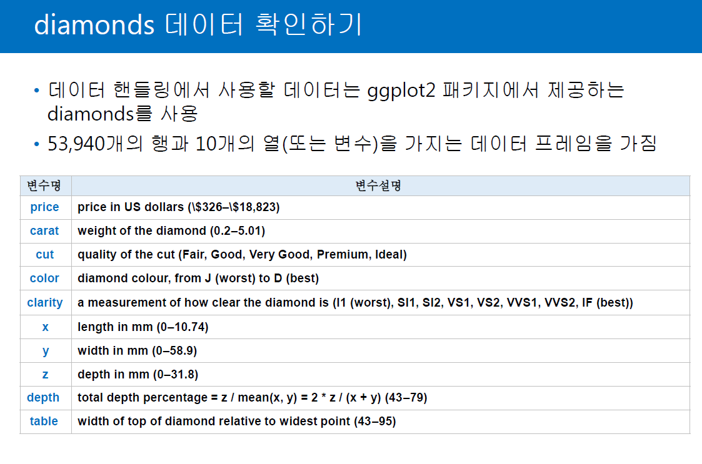

# 딥러닝 기반 빅데이터 분석과정 3일차

## 1. 복습

### (1) List

- 리스트 호출에 이해가 필요함

  - ```R
    > c <- list(a=list(val = c(1,2,3)),b=list(val=c(1,2,3,4)))
    > c
    $`a`
    $`a`$`val`
    [1] 1 2 3
    
    
    $b
    $b$`val`
    [1] 1 2 3 4
    
    
    > c$a
    $`val`
    [1] 1 2 3
    
    > c$a$val
    [1] 1 2 3
    > c[[1]]
    $`val`
    [1] 1 2 3
    
    > c[[1]][1]
    $`val`
    [1] 1 2 3
    
    > c[[1]][[1]]
    [1] 1 2 3
    ```

  - [[1]]에 대한 이해 필요


### (2) matrix

- matrix 만들어보긔

  - ```R
    > d <-matrix(c(1:9), nrow=3, byrow=T,dimnames = list(c('item1','item2','item3'),c("sort1","sort2","sort3")))
    > d
          sort1 sort2 sort3
    item1     1     2     3
    item2     4     5     6
    item3     7     8     9
    > d[1]
    [1] 1
    > d[1,1]
    [1] 1
    > d[2,1]
    [1] 4
    > d[,1]
    item1 item2 item3 
        1     4     7 
    > d[1,]
    sort1 sort2 sort3 
        1     2     3 
    > d[-1,]
          sort1 sort2 sort3
    item2     4     5     6
    item3     7     8     9
    > d[1:2, 2:3]
          sort2 sort3
    item1     2     3
    item2     5     6
    > d[c(1,3),]
          sort1 sort2 sort3
    item1     1     2     3
    item3     7     8     9
    > d[c(1,3), c(2,3)]
          sort2 sort3
    item1     2     3
    item3     8     9
    > d["item1",] # "," 위치 확인할 것
    sort1 sort2 sort3 
        1     2     3 
    > d[,"sort2"] # "," 위치 확인할 것
    item1 item2 item3 
        2     5     8 
    > dim(d)
    [1] 3 3
    ```


### (3) Array

- Matrix와 다른 것은 dim=c(3,4,2) 와 같이 여러 장을 만들 수 있음

  - ```R
    > array(1:12, dim =c(3,4))
         [,1] [,2] [,3] [,4]
    [1,]    1    4    7   10
    [2,]    2    5    8   11
    [3,]    3    6    9   12
    > array(1:12, dim =c(3,4,2))
    , , 1
    
         [,1] [,2] [,3] [,4]
    [1,]    1    4    7   10
    [2,]    2    5    8   11
    [3,]    3    6    9   12
    
    , , 2
    
         [,1] [,2] [,3] [,4]
    [1,]    1    4    7   10
    [2,]    2    5    8   11
    [3,]    3    6    9   12
    ```


### (4) Data Frame

- Data Frame만들어보긔

  - ```R
    > e <-data.frame(c(1,2,3,4), c(2,3,4,5))
    > e
      c.1..2..3..4. c.2..3..4..5.
    1             1             2
    2             2             3
    3             3             4
    4             4             5
    > f
      col1 col2
    1    1    2
    2    2    3
    3    3    4
    4    4    5
    > g <-data.frame(empNo=c('10', '20', '30'), empName=c('이순신','홍길동','권율'), empAddress=c('서울','뉴욕','런던'))
    > g
      empNo empName empAddress
    1    10  이순신       서울
    2    20  홍길동       뉴욕
    3    30    권율       런던
    > str(g)
    'data.frame':	3 obs. of  3 variables:
     $ empNo     : Factor w/ 3 levels "10","20","30": 1 2 3
     $ empName   : Factor w/ 3 levels "권율","이순신",..: 2 3 1
     $ empAddress: Factor w/ 3 levels "뉴욕","런던",..: 3 1 2
    > g$empNo
    [1] 10 20 30
    Levels: 10 20 30
    > f <-data.frame(col1=c(1,2,3,4), col2=c(2,3,4,5))
    > g$empName
    [1] 이순신 홍길동 권율  
    Levels: 권율 이순신 홍길동
    > g$empAddress
    [1] 서울 뉴욕 런던
    Levels: 뉴욕 런던 서울
    > g$empNo[1]
    [1] 10
    Levels: 10 20 30
    > g[,1]
    [1] 10 20 30
    Levels: 10 20 30
    > g[1,]
      empNo empName empAddress
    1    10  이순신       서울
    > g[c(1,2),c(2,3)]
      empName empAddress
    1  이순신       서울
    2  홍길동       뉴욕
    > g[,c('empName','empAddress')]
      empName empAddress
    1  이순신       서울
    2  홍길동       뉴욕
    3    권율       런던
    >
    > colnames(g)<-c("NO","NA", "ADD") # 이름 바꾸기!
    > g
      NO     NA  ADD
    1 10 이순신 서울
    2 20 홍길동 뉴욕
    3 30   권율 런던
    ```

  - data frame 의 요소로 list, factor 등을 당연히 넣을 수 있음

  - ```R
    > # List in Data Frame 
    > h<-data.frame(list(c(1:3),c(2:4),c(3:5)))
    > h
      X1.3 X2.4 X3.5
    1    1    2    3
    2    2    3    4
    3    3    4    5
    > colnames(h)<-c('col1','col2','col3')
    > h
      col1 col2 col3
    1    1    2    3
    2    2    3    4
    3    3    4    5
    > h$col4<-c(4:6)
    > h
      col1 col2 col3 col4
    1    1    2    3    4
    2    2    3    4    5
    3    3    4    5    6
    > i <- data.frame(factor(c('m','f','m'), levels=c('m','f')))
    > i
      factor.c..m....f....m....levels...c..m....f...
    1                                              m
    2                                              f
    3                                              m
    > str(i)
    'data.frame':	3 obs. of  1 variable:
     $ factor.c..m....f....m....levels...c..m....f...: Factor w/ 2 levels "m","f": 1 2 1
    ```


## 2. 샘플데이터 확인, 저장하기

### (1) 데이터 가져오기



- ```R
  > library(ggplot2)
  > class(diamonds)
  [1] "tbl_df"     "tbl"        "data.frame"
  > diamonds
  # A tibble: 53,940 x 10
     carat cut       color clarity depth table price     x     y     z
     <dbl> <ord>     <ord> <ord>   <dbl> <dbl> <int> <dbl> <dbl> <dbl>
   1 0.23  Ideal     E     SI2      61.5    55   326  3.95  3.98  2.43
   2 0.21  Premium   E     SI1      59.8    61   326  3.89  3.84  2.31
   3 0.23  Good      E     VS1      56.9    65   327  4.05  4.07  2.31
   4 0.290 Premium   I     VS2      62.4    58   334  4.2   4.23  2.63
   5 0.31  Good      J     SI2      63.3    58   335  4.34  4.35  2.75
   6 0.24  Very Good J     VVS2     62.8    57   336  3.94  3.96  2.48
   7 0.24  Very Good I     VVS1     62.3    57   336  3.95  3.98  2.47
   8 0.26  Very Good H     SI1      61.9    55   337  4.07  4.11  2.53
   9 0.22  Fair      E     VS2      65.1    61   337  3.87  3.78  2.49
  10 0.23  Very Good H     VS1      59.4    61   338  4     4.05  2.39
  # ... with 53,930 more rows
  > View(diamonds)
  > View(mtcars)
  ```


### (2) 데이터 활용하기

#### 1) 열 추출하기

- ```R
  > diamonds[2,]
  # A tibble: 1 x 10
    carat cut     color clarity depth table price     x     y     z
    <dbl> <ord>   <ord> <ord>   <dbl> <dbl> <int> <dbl> <dbl> <dbl>
  1  0.21 Premium E     SI1      59.8    61   326  3.89  3.84  2.31
  > diamonds[,2,drop=F]
  # A tibble: 53,940 x 1
     cut      
     <ord>    
   1 Ideal    
   2 Premium  
   3 Good     
   4 Premium  
   5 Good     
   6 Very Good
   7 Very Good
   8 Very Good
   9 Fair     
  10 Very Good
  # ... with 53,930 more rows
  > diamonds[,colnames(diamonds)]
  # A tibble: 53,940 x 10
     carat cut       color clarity depth table price     x     y     z
     <dbl> <ord>     <ord> <ord>   <dbl> <dbl> <int> <dbl> <dbl> <dbl>
   1 0.23  Ideal     E     SI2      61.5    55   326  3.95  3.98  2.43
   2 0.21  Premium   E     SI1      59.8    61   326  3.89  3.84  2.31
   3 0.23  Good      E     VS1      56.9    65   327  4.05  4.07  2.31
   4 0.290 Premium   I     VS2      62.4    58   334  4.2   4.23  2.63
   5 0.31  Good      J     SI2      63.3    58   335  4.34  4.35  2.75
   6 0.24  Very Good J     VVS2     62.8    57   336  3.94  3.96  2.48
   7 0.24  Very Good I     VVS1     62.3    57   336  3.95  3.98  2.47
   8 0.26  Very Good H     SI1      61.9    55   337  4.07  4.11  2.53
   9 0.22  Fair      E     VS2      65.1    61   337  3.87  3.78  2.49
  10 0.23  Very Good H     VS1      59.4    61   338  4     4.05  2.39
  # ... with 53,930 more rows
  > colnames(diamonds)
   [1] "carat"   "cut"     "color"   "clarity" "depth"   "table"   "price"   "x"       "y"       "z"      
  > diamonds[,grep("^c",colnames(diamonds))] # C로 시작하는 열 이름 가져오기
  # A tibble: 53,940 x 4
     carat cut       color clarity
     <dbl> <ord>     <ord> <ord>  
   1 0.23  Ideal     E     SI2    
   2 0.21  Premium   E     SI1    
   3 0.23  Good      E     VS1    
   4 0.290 Premium   I     VS2    
   5 0.31  Good      J     SI2    
   6 0.24  Very Good J     VVS2   
   7 0.24  Very Good I     VVS1   
   8 0.26  Very Good H     SI1    
   9 0.22  Fair      E     VS2    
  10 0.23  Very Good H     VS1    
  # ... with 53,930 more rows
  > diamonds[,grep("c",colnames(diamonds))] # C가포함된 열 이름 가져오기
  # A tibble: 53,940 x 5
     carat cut       color clarity price
     <dbl> <ord>     <ord> <ord>   <int>
   1 0.23  Ideal     E     SI2       326
   2 0.21  Premium   E     SI1       326
   3 0.23  Good      E     VS1       327
   4 0.290 Premium   I     VS2       334
   5 0.31  Good      J     SI2       335
   6 0.24  Very Good J     VVS2      336
   7 0.24  Very Good I     VVS1      336
   8 0.26  Very Good H     SI1       337
   9 0.22  Fair      E     VS2       337
  10 0.23  Very Good H     VS1       338
  # ... with 53,930 more rows
  > diamonds[,grep("e$",colnames(diamonds))]  # e로 끝나는 열 이름 가져오기
  # A tibble: 53,940 x 2
     table price
     <dbl> <int>
   1    55   326
   2    61   326
   3    65   327
   4    58   334
   5    58   335
   6    57   336
   7    57   336
   8    55   337
   9    61   337
  10    61   338
  # ... with 53,930 more rows
  > 
  > diamonds[,c("cut","price")]
  # A tibble: 53,940 x 2
     cut       price
     <ord>     <int>
   1 Ideal       326
   2 Premium     326
   3 Good        327
   4 Premium     334
   5 Good        335
   6 Very Good   336
   7 Very Good   336
   8 Very Good   337
   9 Fair        337
  10 Very Good   338
  # ... with 53,930 more rows
  > head(diamonds[,c("cut","price")],n=15)
  # A tibble: 15 x 2
     cut       price
     <ord>     <int>
   1 Ideal       326
   2 Premium     326
   3 Good        327
   4 Premium     334
   5 Good        335
   6 Very Good   336
   7 Very Good   336
   8 Very Good   337
   9 Fair        337
  10 Very Good   338
  11 Good        339
  12 Ideal       340
  13 Premium     342
  14 Ideal       344
  15 Premium     345
  > 
  
  
  ```


#### 2) 행 추출하기

- ```R
  > diamonds[diamonds$price >= 18000,]
  # A tibble: 312 x 10
     carat cut       color clarity depth table price     x     y     z
     <dbl> <ord>     <ord> <ord>   <dbl> <dbl> <int> <dbl> <dbl> <dbl>
   1  2.16 Ideal     G     SI2      62.5  54.2 18001  8.23  8.27  5.16
   2  2.09 Premium   F     SI2      61.7  59   18002  8.23  8.21  5.07
   3  2.18 Premium   G     SI2      61.9  60   18003  8.29  8.24  5.12
   4  2.06 Very Good G     SI2      62.3  59   18005  8.07  8.2   5.07
   5  2.25 Premium   D     SI2      60.4  59   18007  8.54  8.48  5.13
   6  1.76 Very Good G     VS1      62.8  55.4 18014  7.7   7.74  4.85
   7  2.05 Ideal     G     SI2      61.6  56   18017  8.11  8.16  5.01
   8  5.01 Fair      J     I1       65.5  59   18018 10.7  10.5   6.98
   9  2.51 Premium   J     VS2      62.2  58   18020  8.73  8.67  5.41
  10  2    Good      H     VS2      63.8  59   18023  7.88  8.01  5.07
  # ... with 302 more rows
  > diamonds[(diamonds$cut=="Fair")&(diamonds$price>=18000),]
  # A tibble: 9 x 10
    carat cut   color clarity depth table price     x     y     z
    <dbl> <ord> <ord> <ord>   <dbl> <dbl> <int> <dbl> <dbl> <dbl>
  1  5.01 Fair  J     I1       65.5    59 18018 10.7  10.5   6.98
  2  2.32 Fair  H     SI1      62      62 18026  8.47  8.31  5.2 
  3  3.01 Fair  I     SI2      65.8    56 18242  8.99  8.94  5.9 
  4  3.01 Fair  I     SI2      65.8    56 18242  8.99  8.94  5.9 
  5  2.51 Fair  H     SI2      64.7    57 18308  8.44  8.5   5.48
  6  2    Fair  G     VS2      67.6    58 18515  7.65  7.61  5.16
  7  4.5  Fair  J     I1       65.8    58 18531 10.2  10.2   6.72
  8  2.02 Fair  H     VS2      64.5    57 18565  8     7.95  5.14
  9  2.01 Fair  G     SI1      70.6    64 18574  7.43  6.64  4.69
  ```


#### 3) 새로운 변수 만들기

- ```R
  diamonds$xyz.sum = (diamonds$x + diamonds$y + diamonds$y)
  > head(diamonds)
    carat       cut color clarity depth table price    x    y    z xyz.sum
  1  0.23     Ideal     E     SI2  61.5    55   326 3.95 3.98 2.43   11.91
  2  0.21   Premium     E     SI1  59.8    61   326 3.89 3.84 2.31   11.57
  3  0.23      Good     E     VS1  56.9    65   327 4.05 4.07 2.31   12.19
  4  0.29   Premium     I     VS2  62.4    58   334 4.20 4.23 2.63   12.66
  5  0.31      Good     J     SI2  63.3    58   335 4.34 4.35 2.75   13.04
  6  0.24 Very Good     J    VVS2  62.8    57   336 3.94 3.96 2.48   11.86
  
  diamonds$xyz.sum = rowSums(diamonds[ , c(“x”, “y”, “z”)]
  diamonds$xyz.mean = (diamonds$x + diamonds$y + diamonds$y) / 3
  diamonds$xyz.mean = rowMeans(diamonds[ , c(“x”, “y”, “z”)]
  ```


#### 4) 데이터 수정하기

- `diamonds[diamonds$price >= 18000, “price”] = 18000`
- `diamonds[(diamonds$cut == “Fair”)&(diamonds$price), “x”] = NA`


#### 5) 행 삭제하기

- •diamonds[-c(10, 20, 30), ]
    •10번째, 20번째, 30번째의 행을 삭제
    •diamonds[-(100:200), ]
    •100~200번째의 행을 삭제
    •diamonds[-seq(from=1, to=length(diamonds), by=10), ]
    •첫 번째 행부터 시작해서 10행씩 떨어져 있는 행들을 삭제
- •diamonds$table = NULL
    •diamonds의 table 변수를 삭제
    •subset(diamonds, select=-c(2, 3))
    •subset(diamonds, select=-c(cut, color))
    •within(diamonds, rm=c(cut, color))
    •cut, color라는 두 개의 변수를 삭제


#### 6) 데이터 정렬

- •diamonds[order(diamonds$price), ]
  ​	•price를 기준으로 오름차순으로 정렬
  •diamonds[order(diamonds$price, decreasing=TRUE), ]
  ​	•price를 기준으로 내림차순으로 정렬
  • diamonds[order(diamonds$cut, diamonds$color), ]
  ​	•1) cut으로 먼저 오름차순으로 정렬하고,
  ​	•2) color로 오름차순으로 정렬
  • diamonds[order(diamonds$cut, diamonds$color, decreasing=TRUE), ]
  ​	•1) cut으로 내림차순으로 정렬
  ​	•2) color로 내림차순으로 정렬

- 부분적으로 정렬할 수 있다.

  - ```R
    > data2 <- data.frame(c(1,1,1,2,2,2), c(3,1,2,3,1,2))
    > colnames(data2) <- c("col1", "col2")
    > data2[order(data2$col1, -data2$col2, decreasing = T), ]
      col1 col2
    5    2    1
    6    2    2
    4    2    3
    2    1    1
    3    1    2
    1    1    3
    > data2[order(data2$col1, data2$col2, decreasing = T), ]
      col1 col2
    4    2    3
    6    2    2
    5    2    1
    1    1    3
    3    1    2
    2    1    1
    ```

  - -를 붙이면 해당 데이터는 정렬에서 역으로 실행된다.


#### 7)  번외 행과 열 잘 생각하기

```R
head(diamonds[, c("price")])
order(diamonds[, c("cut")])
diamonds[c("cut"),]
```

- 위와 같이 입력했을 때 나오는 값에 대해 잘 생각해보길
- c(행 값, 열값) 인 것을 잘 생각하면 됨


## 3. R 제어문

### (1) 조건

#### 1) if 문

- if(조건){실행문} else if(조건2){실행문2} else{실행문}


#### 2) switch 

- switch(x, 조건) 으로 사용한다.

  ```R
  > use.switch <- function(x) {
  +   switch(x,
  +          "a" = "first",
  +          "b" = "second",
  +          "c" = "third",
  +          "other"
  +          )
  + }
  > use.switch("a")
  [1] "first"
  > use.switch("b")
  [1] "second"
  > use.switch("c")
  [1] "third"
  > use.switch("d")
  [1] "other"
  ```


#### 3) ifelse

- 삼항연산자랑 비슷하다고 생각하면 된다

- ifelse(1==1, "yes", "no")

  - 1==1이 True라면 "yes"를 반환, False라면 "no" 반환

  - ```R
    > a <- c(1,1,0,1,0)
    > ifelse(a==1,"ok","no")
    [1] "ok" "ok" "no" "ok" "no"
    ```

#### 4) 복합테스트 (&,&&,|,||)

- &&, || 와 같이 더블로 쓰는 경우는 if 문에 주로 쓴다.

  - 더블형은 비교 대상에서 첫 번째 요소만 비교한다.

- $, | 와 같이 단일형은 ifelse에 사용하는 것이 좋다.

  - 단일형은 벡터의 개별 요소들을 요소 대 요소로 비교해 연산한다.

- 자바랑 같음

- ```R
  > a<-c(1,1,0,1)
  > b<-c(2,1,0,1)
  > ifelse(a==1 & b==1, "yes", "no")
  [1] "no"  "yes" "no"  "yes"
  > ifelse(a==1 && b==1, "yes", "no")
  [1] "no"
  ```


## 4. 루프문

- 거의 안쓴다. for문 while문 대신 그냥 백터화나 행렬 연산을 사용하기 때문
- for(i in 1:10) { } 이런 식으로 쓸 수 있음


## 5. 함수 작성

- ```R
  > msg <- "Hello World"
  > my.function <- function(msg){
  +   print(msg)
  + }
  > my.function(msg)
  [1] "Hello World"
  ```

### (1) 함수 인자 및 sprintf함수

#### 1) sprintf

- printf 와 같은 print문이다. 드디어 나옴

  ```R
  > sprintf("Hello %s", "Jay")
  [1] "Hello Jay"
  ```


#### 2) 함수인자

- ```R
  > hello.person <- function(first, last) {
  +   print(sprintf("Hello %s %s", first, last))
  + }
  > 
  > # 위치 사용
  > hello.person("Jay", "Tom")
  [1] "Hello Jay Tom"
  > 
  > # 이름으로
  > hello.person(first = "Jay", last = "Tom")
  [1] "Hello Jay Tom"
  > 
  > # 순서를 바꿔도 가능
  > hello.person(last = "Tom", first = "Jay")
  [1] "Hello Jay Tom"
  > 
  > # 하나의 인자만 넣어도 가능
  > hello.person(last = "Tom", "Jay")
  [1] "Hello Jay Tom"
  ```


#### 3) 디폴트인자

- 함수 선언시 인자의 디폴트 값을 설정해줄 수 있다.

  ```R
  > hello.person <- function(first, last="Elastine") {
  +   print(sprintf("Hello %s %s", first, last))
  + }
  > hello.person("jay")
  [1] "Hello jay Elastine"
  > hello.person("jay", "TOM")
  [1] "Hello jay TOM"
  ```


## 6. R 통계 그래프

```R
# Graph
a<-1:10
b<-log(a)
plot(a,b)

x <- c(1, 3, 5, 7, 9)
y <- c(2,2,4,7,1)
plot(x,y, type = "o", col="skyblue") # type은 여러종류가 있다. col은 색깔
plot(x,y, type = "o", col="skyblue", xlab = "x axis", ylab = "y axis") # xlab, ylab은 x축 y축 이름
plot(x,y, type = "o", col="skyblue", xlab = "x axis", ylab = "y axis", main = "test graph") # main은 타이틀

barplot(y)

# 라이브러리 사용하여 그래프 표현
library(ggplot2)
mtcars
plot(x=mtcars$wt, y=mtcars$mpg)
plot(x=mtcars$wt, y=mtcars$mpg, xlab = "weight", ylab = "milage", xlim = c(2.5,5), ylim = c(15,30), main = "weight vs milage")
# xlim, ylim으로 x축 y축 scale 조정가능
```


## 7. 기타

- 그래프 출력

  ```R
  x<-1:10
  y<-log(x)
  plot(x,y)
  ```

- rm(list = ls()) : 변수 모두 초기화