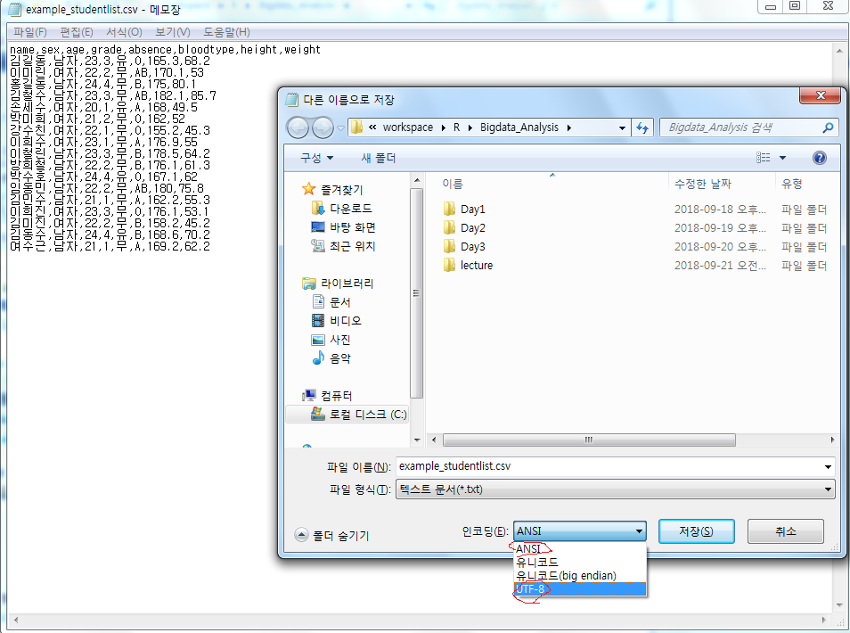

# 딥러닝 기반 빅데이터 분석과정 4일차

## 1. 복습 및 추가

### (1) diamonds

- ```R
  >library(ggplot2)
  # diamonds는 기본적으로 클래스이다.
  >df <- diamonds
  >str(df)
  Classes ‘tbl_df’, ‘tbl’ and 'data.frame':	53940 obs. of  10 variables:
   $ carat  : num  0.23 0.21 0.23 0.29 0.31 0.24 0.24 0.26 0.22 0.23 ...
  
  # 클래스를 데이터 프레임으로 바꾸기 위해서는 as.data.frame을 사용한다.
  >df2 <- as.data.frame(diamonds)
  >str(df2)
  'data.frame':	53940 obs. of  10 variables:
   $ carat  : num  0.23 0.21 0.23 0.29 0.31 0.24 0.24 0.26 0.22 0.23 ...
  
  # 데이터 프레임으로 바꿨으므로 평균 함수가 사용이 가능해진다.
  >mean(df2$price)
  >subset(df2, select = -c(cut,price))
  
  ```


### (2) subset

- ```R
  # subset(데이터, 조건) 을 사용해보자
  df3 <- subset(df2, select = c(cut,price), subset=(price > 18000))
  df3
  df4 <- subset(df2, select = c(cut,price), price > 18000)
  df4
  ```


### (3) encoding

- read.csv 처럼 파일을 열때 에러가 뜨는 경우가 있다.

  - ```R
    > df5 <- read.csv("example_studentlist.csv")
    Error in type.convert.default(data[[i]], as.is = as.is[i], dec = dec,  : invalid multibyte string at '<eb><82><a8>?<90>'
    ```

  - 보통 인코딩 문제인데.. 기본적으로는 원 파일 그대로 사용해주는 것이 좋다. 만약에 에러가 생긴다면 인코딩 유형을 바꿔보는 것이 좋다. ANSI 나 UTF-8로 수정해볼 것

  - R은 초기에 우리가 global option - code -saving 에서 UTF-8로 기본 지정해놨긴 했음.

  - 


### (4) 간단 퀴-즈

- 갑자기 해라고 하면 생각보다 막막할 수 있음. 그러니 잘 생각해보긔

- column 이름 바꿔보기, BMI column 추가 weight/height^2, height 165이상, weight 50이상 검색

  - ```R
    # column 이름 바꾸기
    colnames(df5)[6] <- "blood"
    colnames(df5)
    
    # BMI column 추가 weight/height^2
    df5$BMI <- ((df5$weight/df5$height)^2)
    df5
    
    # height 165이상, weight 50이상
    subset(df5, subset = (df5$height >= 165 && df5$weight >= 50))
    subset(df5, df5$height >= 165 && df5$weight >= 50)
    ```


## 2. R 통계 그래프(이어서)

### (1) 복습 겸 table, barplot 사용

- ```R
  # table 사용해보기
  > table(df5$blood)
  
   A AB  B  O 
   4  3  5  5 
  > table(df5$blood, df5$sex)
      
       남자 여자
    A     2    2
    AB    2    1
    B     4    1
    O     2    3
  > plot(table(df5$blood, df5$sex))
  ```

- ```R
  # 간단 복습 
  x <- c(21,22,23,24,25,26, 98)
  y <- c(21, 31:35, 30)
  plot(x, y, type = "l", col="skyblue")
  barplot(x, main="테스트", xlab="기온", ylab="횟수", names.arg = c("1","2","3","4","5","6","7"), col="red")
  
  df1 <- read.csv("example_studentlist.csv")
  barplot(table(df1$bloodtype), xlab = "BloodType", ylab = "count", border = "green", density = 10, col="blue")
  
  ```


### (2) ggplot2 데이터 가져와서 사용해보기

#### 1) Titanic(margin.table)

- 

  ```R
  library(ggplot2)
  
  a <- Titanic 
  str(a) # Titanic은 Table 형식으로 되어있다. Matrix으로 이루어져있을 것임
  
  margin.table(a, 1) # a(Titanic)라는 데이터의 1열을 table 형식으로 보여준다. 
  margin.table(a, 2) # a(Titanic)라는 데이터의 2열을 table 형식으로 보여준다. 
  margin.table(a, 3) # a(Titanic)라는 데이터의 3열을 table 형식으로 보여준다. 
  margin.table(a, 4) # a(Titanic)라는 데이터의 4열을 table 형식으로 보여준다. 
  margin.table(a)
  
  barplot(margin.table(a,1), xlab = "class", ylab = "count", border = "red", density = 10)
  
  barplot(margin.table(a,1), xlab = "Class", col=c("red","green"))
  #, legend("topleft", c("Not survived", "Survied"), fill = c("red", "green"))
  ```


#### 2) airquality(hist), text, breaks

- hist는 Histogram(세로막대그래프)를 보여준다.

  ```R
  > str(airquality)
  'data.frame':	153 obs. of  6 variables:
   $ Ozone  : int  41 36 12 18 NA 28 23 19 8 NA ...
   $ Solar.R: int  190 118 149 313 NA NA 299 99 19 194 ...
   $ Wind   : num  7.4 8 12.6 11.5 14.3 14.9 8.6 13.8 20.1 8.6 ...
   $ Temp   : int  67 72 74 62 56 66 65 59 61 69 ...
   $ Month  : int  5 5 5 5 5 5 5 5 5 5 ...
   $ Day    : int  1 2 3 4 5 6 7 8 9 10 ...
  > Temp <- airquality$Temp
  > hist(Temp)
  > h <- hist(Temp, xlab="temperature", xlim = c(50,100))
  > h # h 그래프에 대한 상세 내역을 보여준다. 예를 들어서 'counts'의 8은 'breaks'의 55~60사이의 건수를 나타내주는 것임
  
  $`breaks`
   [1]  55  60  65  70  75  80  85  90  95 100
  
  $counts # 예를 들어서 8은 55~60사이의 건수를 나타내주는 것임
  [1]  8 10 15 19 33 34 20 12  2
  
  $density
  [1] 0.010457516 0.013071895 0.019607843 0.024836601 0.043137255 0.044444444 0.026143791 0.015686275
  [9] 0.002614379
  
  $mids
  [1] 57.5 62.5 67.5 72.5 77.5 82.5 87.5 92.5 97.5
  
  $xname
  [1] "Temp"
  
  $equidist
  [1] TRUE
  
  attr(,"class")
  [1] "histogram"
  
  
  > # text는 h2 그래프에 데이터 레이블을 추가한다. h2$mids는 중간값을 말하며 즉, 중간값 위치에, counts 값을 넣는다는 것 
  > # 그리고 counts 값은 h2$counts에서 따온다고 labels에 명시한다 . 좀 더 위치 조정을 위해 adj를 사용 
  > h2 <- hist(Temp, ylim = c(0,40))
  > text(h2$mids, h2$counts, labels = h2$counts, adj = c(0.5, -0.5)) 
  > 
  > # breaks는 히스토그램을 그리기 위해 데이터를 어떻게 나눌지를 지정하는 데 사용한다.
  > # 기본값은 Sturge로, n일 때 막대의 너비를 ⌈log2(n)+1⌉로 정한다.
  > # breaks에 데이터를 나눌 구분 값들을 저장한 벡터,
  > # 데이터를 나눌 구분 값들을 계산하는 함수 등을 대신 지정할 수 있다.
  > 
  > hist(Temp, breaks = 4)
  > hist(Temp, breaks = 10)
  > hist(Temp, xlim=c(50,100), breaks=c(55,60,70,80,100), col="red")
  > 
  > 
  > diamonds
  # A tibble: 53,940 x 10
     carat cut       color clarity depth table price     x     y     z
     <dbl> <ord>     <ord> <ord>   <dbl> <dbl> <int> <dbl> <dbl> <dbl>
   1 0.23  Ideal     E     SI2      61.5    55   326  3.95  3.98  2.43
   2 0.21  Premium   E     SI1      59.8    61   326  3.89  3.84  2.31
   3 0.23  Good      E     VS1      56.9    65   327  4.05  4.07  2.31
   4 0.290 Premium   I     VS2      62.4    58   334  4.2   4.23  2.63
   5 0.31  Good      J     SI2      63.3    58   335  4.34  4.35  2.75
   6 0.24  Very Good J     VVS2     62.8    57   336  3.94  3.96  2.48
   7 0.24  Very Good I     VVS1     62.3    57   336  3.95  3.98  2.47
   8 0.26  Very Good H     SI1      61.9    55   337  4.07  4.11  2.53
   9 0.22  Fair      E     VS2      65.1    61   337  3.87  3.78  2.49
  10 0.23  Very Good H     VS1      59.4    61   338  4     4.05  2.39
  # ... with 53,930 more rows
  > ggplot(data=diamonds, aes(x=diamonds$carat, y=diamonds$price))+geom_point()
  > h3 <- boxplot(airquality$Ozone,col="green", horizontal = TRUE)
  > h3
  $`stats`
        [,1]
  [1,]   1.0
  [2,]  18.0
  [3,]  31.5
  [4,]  63.5
  [5,] 122.0
  attr(,"class")
          1 
  "integer" 
  
  $n
  [1] 116
  
  $conf
           [,1]
  [1,] 24.82518
  [2,] 38.17482
  
  $out
  [1] 135 168
  
  $group
  [1] 1 1
  
  $names
  [1] "1"
  ```


### (3) ★★ 문제 : 연령대 별로 암에 대한 도수분포표를 출력하시오(table, cut)

- 도수분포표를 만들기 위해서는 대표 변수를 구간별로 나누는 것부터 시작한다!
- cut은 breaks를 인수로 받는다. 아래 주석을 잘 참고하시오

```R
> # 연령대 별로 암에 대한 도수분포표를 출력하시오
> cancer <- read.csv("example_cancer.csv")
> 
> df10 <- table(cut(cancer$age, breaks = (1:11)*10)) #seq로 구간을 잘라줘도 된다고는 하는데 아마 안되는 듯.
>  	# cut은 구간을 잘라주는 역할을 하지만, seq는 값을 생성하는 함수임
>   # breaks는 자료 범위의 구간을 지정해주는 것
>   # cut은 구간을 잘라주는 것, breaks를 인자로 갖는다. 즉 seq와 비슷한 성격
> df10

  (10,20]   (20,30]   (30,40]   (40,50]   (50,60]   (60,70]   (70,80]   (80,90]  (90,100] (100,110] 
        3        77       482      1917      4558      5679      4598       962        33         1 
> str(df10)
 'table' int [1:10(1d)] 3 77 482 1917 4558 5679 4598 962 33 1
 - attr(*, "dimnames")=List of 1
  ..$ : chr [1:10] "(10,20]" "(20,30]" "(30,40]" "(40,50]" ...
> rownames(df10) <- c("10세", "20세", "30세","40세", "50세", "60세","70세", "80세", "90세", "100세")
> 
> df11 <- as.data.frame(df10)
> df11
    Var1 Freq
1   10세    3
2   20세   77
3   30세  482
4   40세 1917
5   50세 4558
6   60세 5679
7   70세 4598
8   80세  962
9   90세   33
10 100세    1
> plot(df11$Var1, df11$Freq, type="o")
```


### (4) 패키지를 사용한 그래프

#### 1) ggplot2 - 막대 및 점 그래프

- R의 기본 그래픽도 상당히 좋지만 ggplot2은 거의 압도하는 중. 기본 그래픽을 사용하면 30행에 걸친 그래프를 ggplot2로 한 줄로 만들 수 있음

- ggplot 함수에 + 연산자를 사용하여 레이어(layer)를 추가한다.

  - 레이어는 geom_point, geom_line, geom_histogram 등 함수로 만든다.

  - 이 함수들이 가지는 인자중 가장 중요한 것은 aes이다.

  - aes는 데이터에 있는 변수들을 좌표축이나 기타 다른 에스테틱(aesthetic)으로 맵핑하는 것.

  - aes는 ggplot 또는 layer 어디에든 넣어도 상관이 없다. aes 함수 자체가 따로 연산되기 때문!

  - 기본 예

    - ```R
      ## ggplot2과 geom으로 그래프 생성 
      # aes는 어디에 넣어도 된다. 이름 자체에 할당이 되어 있기 때문이다. 아래 4가지 모두 같은 결과값을 낸다.
      ggplot(data = diamonds[diamonds$carat<2.5,], aes(x=carat, y=price)) + geom_point(aes(color = color))
      ggplot(data = diamonds[diamonds$carat<2.5,]) + geom_point(aes(x=carat, y=price, color = color))
      ggplot(data = diamonds[diamonds$carat<2.5,], aes(color = color)) + geom_point(aes(x=carat, y=price))
      ggplot(data = diamonds[diamonds$carat<2.5,], aes(x=carat, y=price, color = color)) + geom_point()
      
      # 이 역시 같은 결과를 낸다.
      ggplot(data = diamonds, aes(x=carat)) + geom_histogram()
      ggplot(data = diamonds) + geom_histogram(aes(x = carat))
      ```

    - 

    - 

  - histogram의 색을 변경시킬 수 있다. 단, 이것은 aes로 사용되지 않는데, 전체 그래프를 해당 색으로 채우고 싶기 때문이다. (각각의 데이터 값이 아닌 전체 데이터)

    - 그러므로 aes 함수의 밖에서 fill = "grey50" 이라고 지정한다.
    - `ggplot(data = diamonds) + geom_histogram(aes(x = carat), fill = "grey50")`

  - ★★geom_point의 color=color를 잘 이해할 필요가 있다. color = cut 으로 해도 된다. 즉 색깔을 나누는 기준이 color라는 인자인 것. 그 결과는 아래와 같다

    - ggplot(data = diamonds[diamonds$carat<2.5,], aes(x=carat, y=price)) + geom_point(aes(color = cut))
    - 

#### 2) ggplot2 - 세부 그래프(facet_wrap, facet_grid) 표현

- 각 항목에 따른 그래프를 세부적으로 분류해준다. 점, histogram 모두 가능
  - facet_wrap 과 grid는 인자는 세분화하여 보여주는 범위라고 생각하면 된다.

```R
ggplot(data = diamonds[diamonds$carat<2.5,], aes(x=carat, y=price)) + geom_point(aes(color = cut)) + facet_wrap(~cut)

ggplot(data = diamonds[diamonds$carat<2.5,], aes(x=carat, y=price)) + geom_point(aes(color = color)) + facet_grid(cut~clarity)
```


- facet_wrap(~cut)에 해당하는 그림은 아래와 같다


- facet_grid(cut~clarity)에 해당하는 그림은 아래와 같다

  - cut은 Fair부터 Ideal을 나타내고, Claritysms I1 ~ IF를 보여준다.

  


## ★ 문제

## 도착횟수 6000 횟수가 넘는 공항 찾기, 6000횟수가 넘는 공항들의 전체합 구하고 막대 그래프 출력
```R
## 문제. 도착횟수 6000 횟수가 넘는 항공사 찾기, 6000횟수가 넘는 공항들의 전체합 구하고 막대 그래프 출력
install.packages("hflights")
library(hflights)

# 내 답
b <- table(hflights$Dest)
b
p <- subset(b, b>6000)
barplot(p)

# 강사님 답
TotalCount <- table(hflights$Dest)
TotalCount
TotalCount2 <- TotalCount[TotalCount >= 6000]
TotalCount2
addmargins(TotalCount2, 1)
TotalCount2
barplot(TotalCount2)
```


- 내 답에 치명적인 어려움이 있는데, 공항의 전체 합을 구할 수가 없다는 것. 
  - 아래 처럼 여러가지 시도를 했으나 안됨. 여쭤봐야할듯.

```R
t <- unlist(p[[1]]) + unlist(p[[2]]) + unlist(p[[3]])
unlist(t)
p$test2 <- unlist(t)

또는

q <- p[[1]] + p[[2]] + p[[3]] + p[[4]] + p[[5]]
q
class(q)
q <- as.numeric(p[[1]])
q
p$test <- q
p
p[1]
p
p$sum <- p[[1]] + p[[2]] + p[[3]] + p[[4]] + p[[5]]


```

