# 딥러닝 기반 빅데이터 분석과정 6일차

## 1. sqldf 사용해보기

- ```R
  # sqldf 사용해보기
  install.packages("sqldf")
  library(sqldf)
  ?Orange
  
  sqldf('SELECT * FROM Orange')
  class(df)
  ```

- 


## 2. MySQL 설치

### (1) MySQL 파일 설치

#### 1) 기본 설치

- 이동 : https://dev.mysql.com/downloads/mysql/ 

  - 5.6.41버전 설치

  - 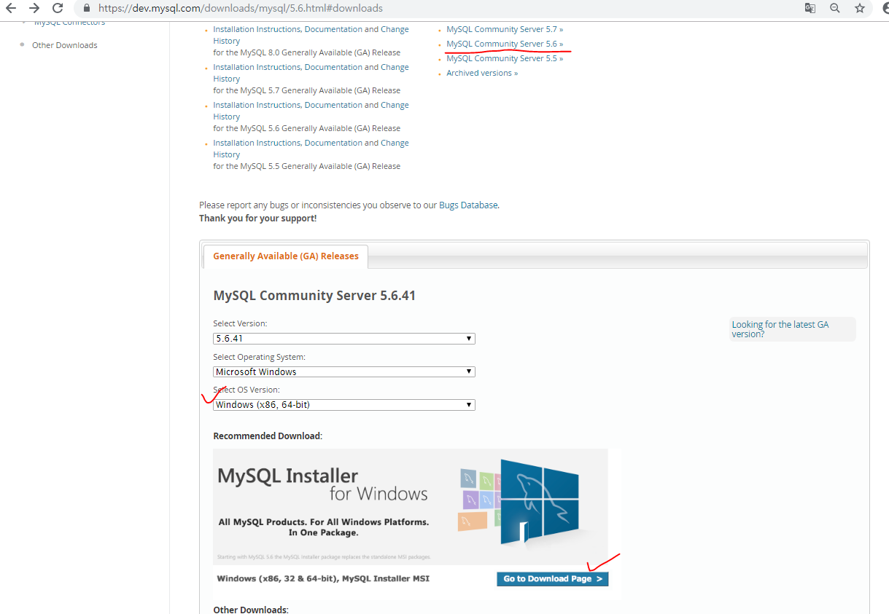

    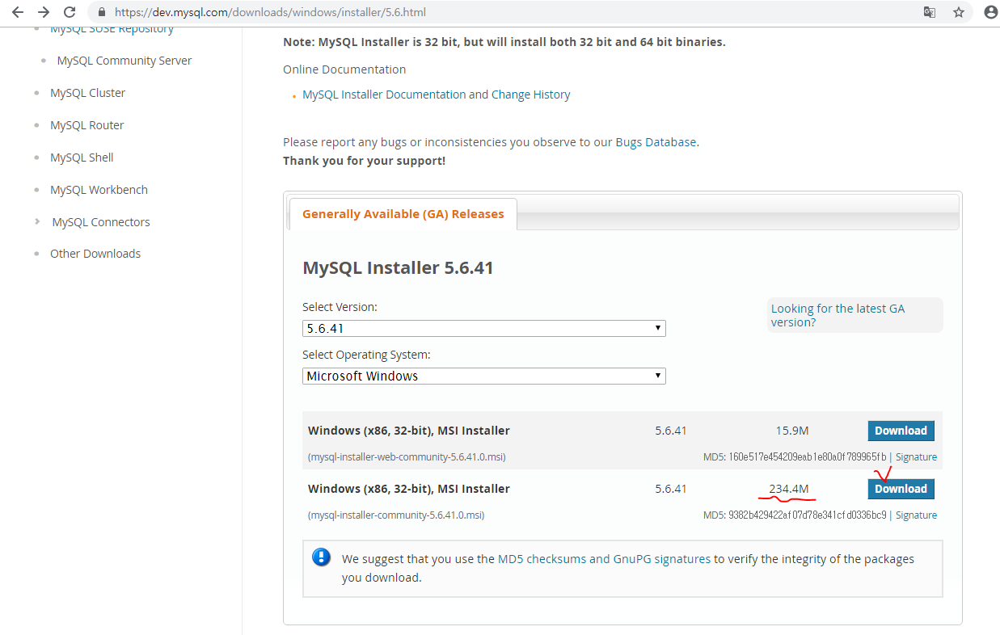

- 설치시 framework 설치하라는 경고메시지 뜬다면 해당 프레임워크 설치
  - 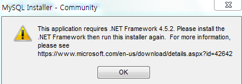
  - NET Framework 4.5.2 별도 설치
- mysql 설치
  - setup type은 디폴트인 developer default 설치하거나 custom
  - custom 시 아래 사진과 같이 설치
    - 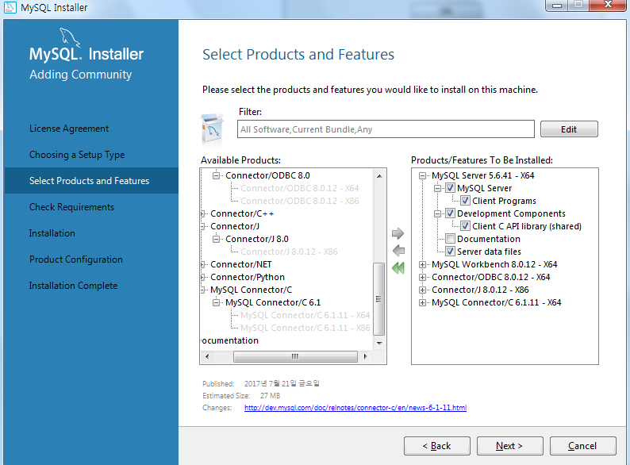
    - 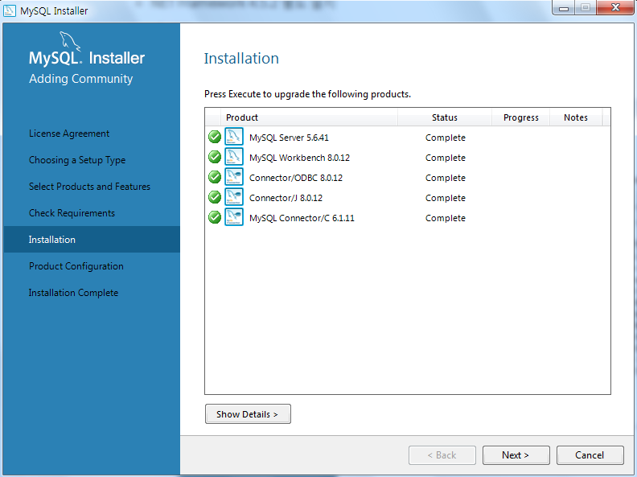
  - 만약에 설치가 안되면 visual studio c++ 2015 설치
  - 이후 비밀번호 설정만 간단히 하고 다 기본설정
  - 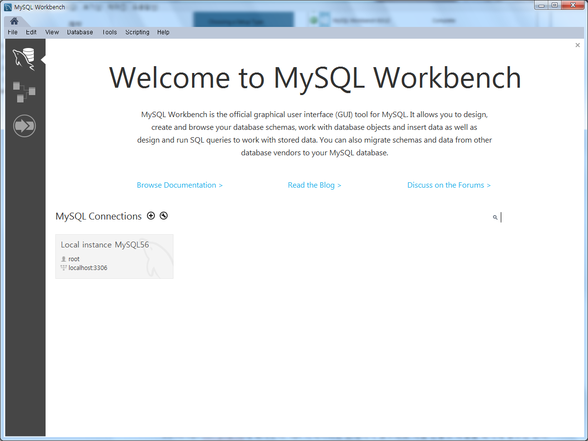
  - cmd 창에서 ipconfig로 IPv4 주소 확인하면 그 주소로 지금 접속하는 것임 (즉, 내 컴퓨터를 서버로해서 접속) -> 70.12.115.68


#### 2) 설치 후 설정 및 간단 사용

- 새로운 계정을 생성한다.
  - 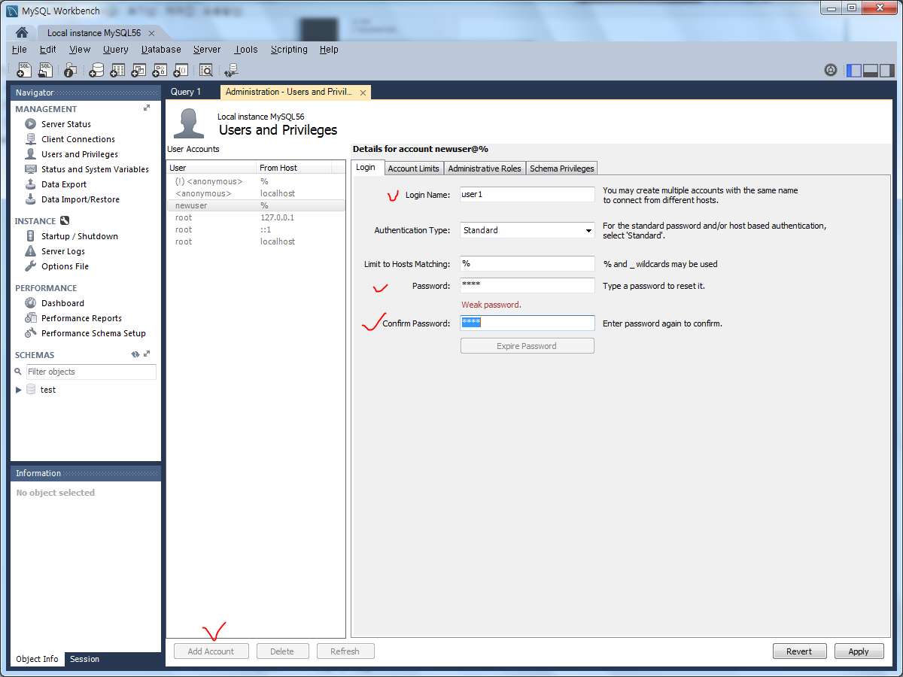
  - 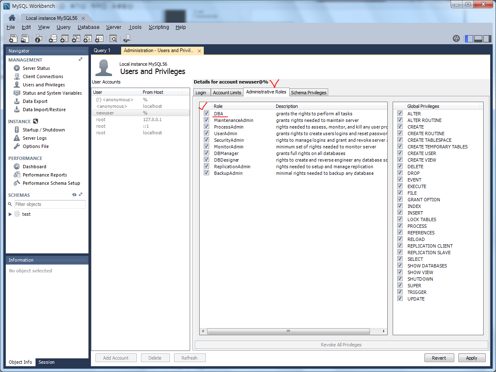
  - newuser가 새로 생성된 것을 확인한 후 재실행한다.
- 새로 만든 계정으로 다른 주소 컴퓨터에 접속해보자 (나는 client, 다른 컴퓨터는 server)
  - 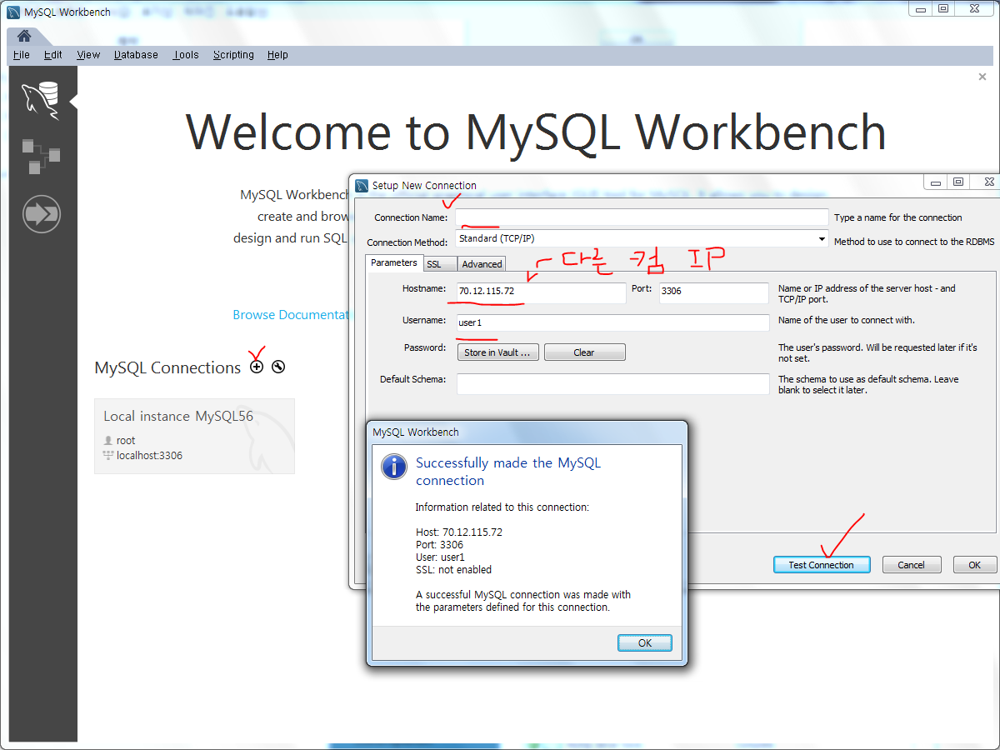
  - 다른 컴퓨터가 서버로 작동하고 있는 IP 주소를 넣는다. (나는 68, 다른 컴퓨터는 72)
  - 새로 만들었던 user1 아이디와 비밀번호를 입력한다.
  - Test connection이 잘 작동된 것을 확인한 후, Connection Name(닉네임)을 설정하고 연결한다.

- local instance는 나의 컴퓨터 서버, 새로 생긴 connection은 다른 컴퓨터 서버
  - 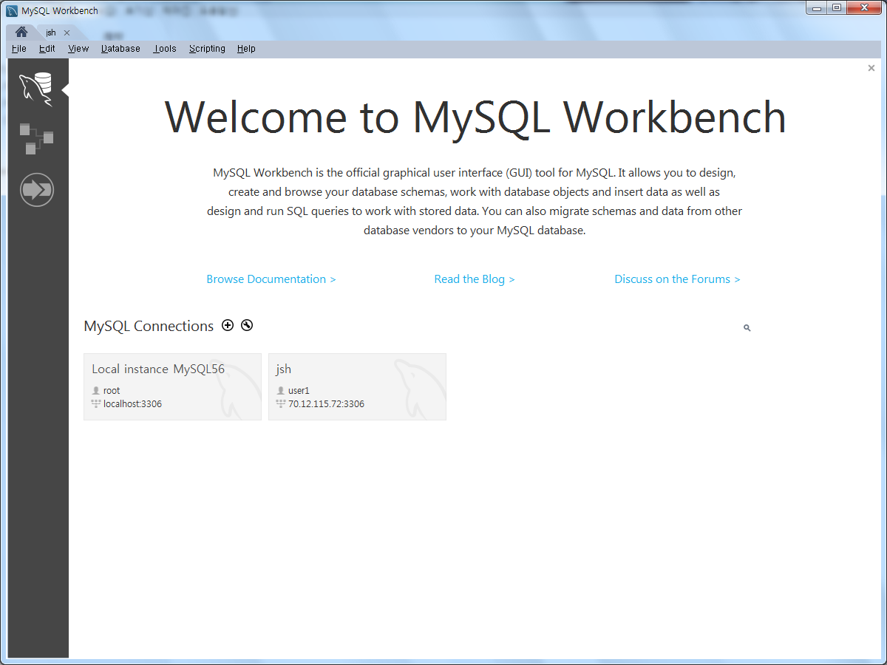


#### 3) 환경 변수 설정

- 환경 변수는 cmd에서 mysql.exe 를 디렉토리 찾아서 사용하는 것이 아닌 어디서든 사용할 수 있게 하는 것
  - MYSQL_HOME 환경변수 추가 : C:\Program Files\MySQL\MySQL Server 5.6(5.6버전인 경우)
    - 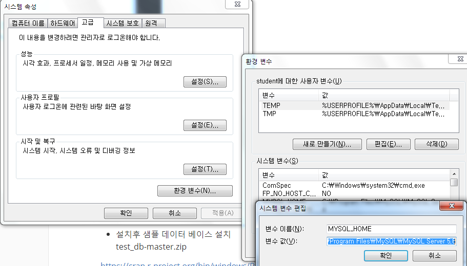
  - PATH 경로에는 ;%MYSQL_HOME%\bin 추가
    - 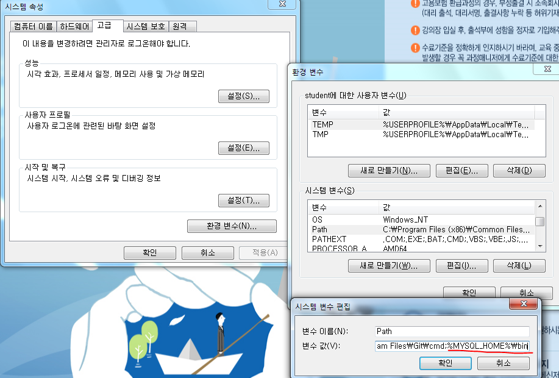


- 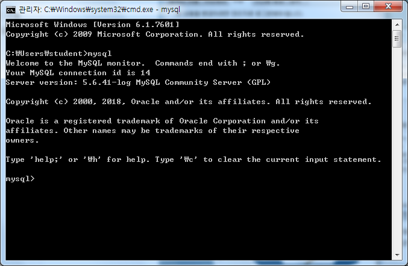
  - 만약에 계정관련 오류가 뜬다면 계정접속을 한다.
    - mysql -u root -p
    - 내가 만든 계정 비밀번호(1234)


#### 4) 샘플 데이터 베이스 설치

- 강사님이 주신 파일 압출 풀기(test_db-master.zip)

- cmd 위치 바로가는 좋은 팁. 해당 폴더 빈 공간에 shift + 오른쪽 클릭하면 '여기서 명령창 열기' 실행
  - mysql -u root -p < employees.sql 입력
  - 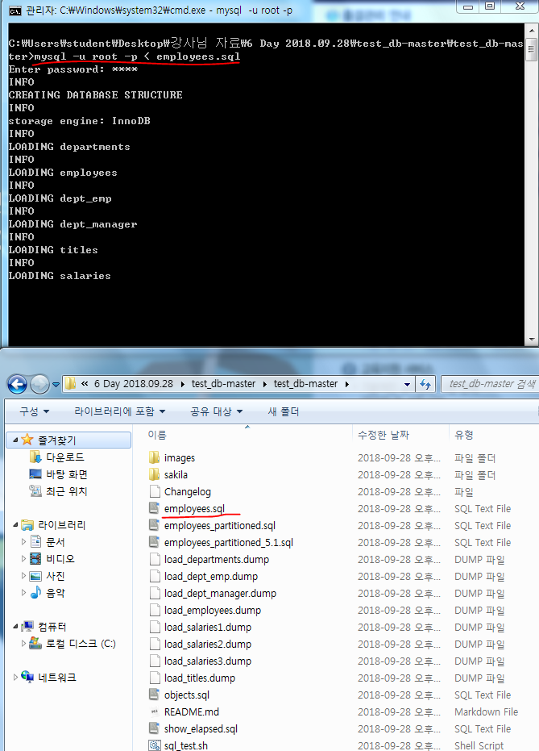
  - 확인
    - 


#### 5) Rtools35 다운 (sql을 R로 불러오기 위한 파일)

- 아래 사진처럼 체크박스만 모두 체크하고 나머지는 기본 설정
  - 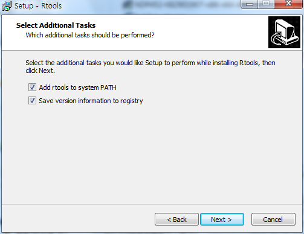


#### 6) libmysql.lib 복사

- RMySQL 컴파일 시 libmysql.lib 파일을 찾는 위치는 MySQL 설치 시의 기본 파일 위치와 다르다.
  - 이를 해결하기 위해 파일 C:\Program Files\MySQL\MySQL Server 5.6\lib\libmysql.lib를 C:\Program Files\MySQL\MySQL Server 5.6\lib\opt\libmysql.lib에 복사한다. 
  - opt 디렉터리는 존재하지 않으므로 직접 만들고 파일을 복사해 넣으면 된다.
  - opt라는 폴더를 만들고 그냥 복붙 끝!


#### 7) RStuio에서 설정 및 사용해보기

- ```R
  install.packages("RMySQL", type = "source")
  library(RMySQL)
  ```

- database에 연결하는 구문은 아래와 같다.

  - ```R
    RMySQL::dbConnect(
      drv,      # 데이터베이스 드라이버(RPgSQL, ROracle, MySQL 등)
      user,     # 사용자 이름
      password, # 비밀번호
      dbname,   # 데이터베이스 이름
      host      # 호스트
    )
    
    RMySQL::dbListTables(
      conn # 데이터베이스 접속
    )
    
    RMySQL::dbGetQuery(
      conn, # 데이터베이스 접속
      statement # 수행할 질의
    )
    ```

  - ```R
    install.packages("RMySQL", type = "source")
    library(RMySQL)
    
    con <- dbConnect(MySQL(), user = "user1", password="1234", dbname="employees", host="70.12.115.72")
    > dbListTables(con)
    [1] "current_dept_emp"     "departments"          "dept_emp"             "dept_emp_latest_date"
    [5] "dept_manager"         "employees"            "salaries"             "titles"     
    
    > dbGetQuery(con, "select * from salaries")
            emp_no salary  from_date    to_date
    1        10001  60117 1986-06-26 1987-06-26
    2        10001  62102 1987-06-26 1988-06-25
    3        10001  66074 1988-06-25 1989-06-25
    4        10001  66596 1989-06-25 1990-06-25
    5        10001  66961 1990-06-25 1991-06-25
    ```

  - 자기 자신을 접속할 때에는 localhost, 127.0.0.1 둘 중 하나를 사용한다.

    - 

    ```R
    # 자기 자신을 접속할 때에는 localhost, 127.0.0.1 둘 중 하나를 사용
    
    con2 <- dbConnect(MySQL(), user = "root", password="1234", dbname="employees", host="127.0.0.1")
    > dbListTables(con2)
    [1] "current_dept_emp"     "departments"          "dept_emp"             "dept_emp_latest_date"
    [5] "dept_manager"         "employees"            "salaries"             "titles"  
    
    > dbGetQuery(con2, "Select * from salaries")
            emp_no salary  from_date    to_date
    1        10001  60117 1986-06-26 1987-06-26
    2        10001  62102 1987-06-26 1988-06-25
    3        10001  66074 1988-06-25 1989-06-25
    4        10001  66596 1989-06-25 1990-06-25
    5        10001  66961 1990-06-25 1991-06-25
    
    ```

- data.frame으로 당연히 치환가능하다. (기본형이 data.frame이다.)

  - ```R
    > df <- dbGetQuery(con2, "Select * from salaries")
    > class(df)
    [1] "data.frame"
    > str(df)
    'data.frame':	2844047 obs. of  4 variables:
     $ emp_no   : int  10001 10001 10001 10001 10001 10001 10001 10001 10001 10001 ...
     $ salary   : int  60117 62102 66074 66596 66961 71046 74333 75286 75994 76884 ...
     $ from_date: chr  "1986-06-26" "1987-06-26" "1988-06-25" "1989-06-25" ...
     $ to_date  : chr  "1987-06-26" "1988-06-25" "1989-06-25" "1990-06-25" ...
    ```

- data.table으로 치환가능하다.

  - ```R
    > library(data.table)
    > df <- dbGetQuery(con2, "Select * from employees")
    > df2 <- data.table(df)
    > class(df2)
    [1] "data.table" "data.frame"
    > df2[emp_no > 10003,,]
            emp_no birth_date first_name last_name gender  hire_date
         1:  10004 1954-05-01  Chirstian   Koblick      M 1986-12-01
         2:  10005 1955-01-21    Kyoichi  Maliniak      M 1989-09-12
         3:  10006 1953-04-20     Anneke   Preusig      F 1989-06-02
         4:  10007 1957-05-23    Tzvetan Zielinski      F 1989-02-10
         5:  10008 1958-02-19     Saniya  Kalloufi      M 1994-09-15
        ---                                                         
    300017: 499995 1958-09-24     Dekang  Lichtner      F 1993-01-12
    300018: 499996 1953-03-07       Zito      Baaz      M 1990-09-27
    300019: 499997 1961-08-03    Berhard    Lenart      M 1986-04-21
    300020: 499998 1956-09-05   Patricia   Breugel      M 1993-10-13
    300021: 499999 1958-05-01     Sachin   Tsukuda      M 1997-11-30
    ```


## 3. dplyr 패키지 다루기

### (1) 소개

- plyr 패키지와 치열한 경쟁을 하는 dplyr는 많은 인기와 함께 데이터 먼징 작업의 사실상의 표준 방법이다.
- 동사 개념의 함수 호출로 사용되며, SQL과 비슷하다.
  - 열을 선택하는 select, 행을 필터링하는 filter, 데이터를 그룹화하는 group_by, 기존 열에 새로운 행을 추가하는 mutate 등
- 만약 plyr와 dplyr를 동시에 사용하는 경우 plyr 패키지를 먼저 로딩하고 그다음 dplyr 패키지를 로딩하는 것이 중요하다. 같은 이름을 사용하는 함수는 마지막에 로딩된 패키지의 함수가 우선적으로 사용됨
  - 이를 피하려면 plyr::summarize, dplyr::summarise 와 같이 더블 콜론을 사용한다.
- dplyr는 magrittr 패키지를 통해 %>% 연산자로 사용할 수 있다.

#### 1) 기본 함수 및 연산자 정리

- ```
  * 데이터 전처리(Preprocessing) - dplyr 패키지
  library -> magrittr 필요
  
  filter()	행 추출
  select()	열(변수) 추출
  arrange()	정렬
  mutate()	변수 추가
  summarise()	통계치 산출
  group_by()	집단별로 나누기
  left_join()	데이터 합치기(열)
  bind_rows()	데이터 합치기(행)
  
  * 논리 연산자
  <	작다
  <=	작거나 같다
  >	크다
  >=	크거나 같다
  ==	같다
  !=	같지 않다
  │	또는
  &	그리고
  %in%	매칭 확인
  
  
  * 산술 연산자
  +	더하기
  -	빼기
  *	곱하기
  /	나누기
  ^ , **	제곱
  %/%	나눗셈의 몫
  %%	나눗셈의 나머지
  ```


#### 2) 사용해보기

- 사용할 데이터를 불러온다.

  - 

  ```R
  install.packages("dplyr")
  library(magrittr)
  library(dplyr)
  data <- read.csv("example_exam.csv")
  > data
     id class math english science
  1   1     1   50      98      50
  2   2     1   60      97      60
  3   3     1   45      86      78
  4   4     1   30      98      58
  5   5     2   25      80      65
  6   6     2   50      89      98
  7   7     2   80      90      45
  8   8     2   90      78      25
  9   9     3   20      98      15
  10 10     3   50      98      45
  11 11     3   65      65      65
  12 12     3   45      85      32
  13 13     4   46      98      65
  14 14     4   48      87      12
  15 15     4   75      56      78
  16 16     4   58      98      65
  17 17     5   65      68      98
  18 18     5   80      78      90
  19 19     5   89      68      87
  20 20     5   78      83      58
  > str(data)
  'data.frame':	20 obs. of  5 variables:
   $ id     : int  1 2 3 4 5 6 7 8 9 10 ...
   $ class  : int  1 1 1 1 2 2 2 2 3 3 ...
   $ math   : int  50 60 45 30 25 50 80 90 20 50 ...
   $ english: int  98 97 86 98 80 89 90 78 98 98 ...
   $ science: int  50 60 78 58 65 98 45 25 15 45 ...
  ```

- dplyr의 filter를 사용해보자

  - ```R
    > # filter 사용해보기
    > data %>% filter(class == 1)
      id class math english science
    1  1     1   50      98      50
    2  2     1   60      97      60
    3  3     1   45      86      78
    4  4     1   30      98      58
    > filter(data, class == 1)
      id class math english science
    1  1     1   50      98      50
    2  2     1   60      97      60
    3  3     1   45      86      78
    4  4     1   30      98      58
    > data %>% filter(class == 2)
      id class math english science
    1  5     2   25      80      65
    2  6     2   50      89      98
    3  7     2   80      90      45
    4  8     2   90      78      25
    > filter(data, class == 2)
      id class math english science
    1  5     2   25      80      65
    2  6     2   50      89      98
    3  7     2   80      90      45
    4  8     2   90      78      25
    > data %>% filter(class != 1)
       id class math english science
    1   5     2   25      80      65
    2   6     2   50      89      98
    3   7     2   80      90      45
    4   8     2   90      78      25
    5   9     3   20      98      15
    6  10     3   50      98      45
    7  11     3   65      65      65
    8  12     3   45      85      32
    9  13     4   46      98      65
    10 14     4   48      87      12
    11 15     4   75      56      78
    12 16     4   58      98      65
    13 17     5   65      68      98
    14 18     5   80      78      90
    15 19     5   89      68      87
    16 20     5   78      83      58
    > filter(data, class != 1)
       id class math english science
    1   5     2   25      80      65
    2   6     2   50      89      98
    3   7     2   80      90      45
    4   8     2   90      78      25
    5   9     3   20      98      15
    6  10     3   50      98      45
    7  11     3   65      65      65
    8  12     3   45      85      32
    9  13     4   46      98      65
    10 14     4   48      87      12
    11 15     4   75      56      78
    12 16     4   58      98      65
    13 17     5   65      68      98
    14 18     5   80      78      90
    15 19     5   89      68      87
    16 20     5   78      83      58
    > # &(and), |(or)
    > data %>% filter(class == 1 & math >= 50)
      id class math english science
    1  1     1   50      98      50
    2  2     1   60      97      60
    > data %>% filter(english < 90 | science < 50)
       id class math english science
    1   3     1   45      86      78
    2   5     2   25      80      65
    3   6     2   50      89      98
    4   7     2   80      90      45
    5   8     2   90      78      25
    6   9     3   20      98      15
    7  10     3   50      98      45
    8  11     3   65      65      65
    9  12     3   45      85      32
    10 14     4   48      87      12
    11 15     4   75      56      78
    12 17     5   65      68      98
    13 18     5   80      78      90
    14 19     5   89      68      87
    15 20     5   78      83      58
    > # %in%
    > data %>% filter(class %in% c(1,3,5)) # class 값이 1, 3, 5 인 값을 가져옴
       id class math english science
    1   1     1   50      98      50
    2   2     1   60      97      60
    3   3     1   45      86      78
    4   4     1   30      98      58
    5   9     3   20      98      15
    6  10     3   50      98      45
    7  11     3   65      65      65
    8  12     3   45      85      32
    9  17     5   65      68      98
    10 18     5   80      78      90
    11 19     5   89      68      87
    12 20     5   78      83      58
    > # 변수에 넣기
    > r <- data %>% filter(math > 50)
    > r
       id class math english science
    1   2     1   60      97      60
    2   7     2   80      90      45
    3   8     2   90      78      25
    4  11     3   65      65      65
    5  15     4   75      56      78
    6  16     4   58      98      65
    7  17     5   65      68      98
    8  18     5   80      78      90
    9  19     5   89      68      87
    10 20     5   78      83      58
    > str(r)
    'data.frame':	10 obs. of  5 variables:
     $ id     : int  2 7 8 11 15 16 17 18 19 20
     $ class  : int  1 2 2 3 4 4 5 5 5 5
     $ math   : int  60 80 90 65 75 58 65 80 89 78
     $ english: int  97 90 78 65 56 98 68 78 68 83
     $ science: int  60 45 25 65 78 65 98 90 87 58
    > data1 <- data %>% filter(class == 1)
    > mean(data1$math)
    [1] 46.25
    ```


### (2)  ggplot2의 mpg 데이터를 사용한 dplyr 문제

```R
# mtcars 사용
'''
mtcars : Motor Trend Car Road Test의 약자로 1974년 미국의
Motor Trend의 잡지로 부터 추출된 자료임
각기 종류가 다른 32대의 자동차(1973-74년)를 대상으로 
조사된 자료로서 연비와 다른 10개의 독립변수로 이루어짐

mpg(Miles/gallon) - 연비
cyl(Number of cylinders) - 실린더수
disp(Displacement) - 배기량
hp(Gross horsepower)  - 마력
drat(Rear axle ratio) - 후방 차축 비율
wt(Weight(lb/1000)) - 차체 몸무게
qsec(1/4 mile time) - 400m까지 걸리는 시간(드래그 레이스 타임)
vs(V/S)
am(Transmission(0 = automatic, 1 = manual)) - 미션종류
carb(Number of carburetors) - 기화기 수

'''
mtcars
library(ggplot2)
mpg

# mpg와 dplyr 사용 문제
'''
1. 자동차 배기량에 따라 고속도로 연비가 다른지 알아보려고 합니다. 
displ(배기량)이 4 이하인 자동차와 5 이상인 자동차 중 어떤 자동차의 hwy(고속도로 연비)가 평균적으로 높은 것은?

2. 자동차 제조 회사에 따라 도시 연비가 다른지 알아보려고 합니다. 
"audi"와 "toyota" 중 어느 manufacturer(자동차 제조 회사)의 cty(도시 연비)가 평균적으로 높은 것은?

3. "chevrolet", "ford", "honda" 자동차의 고속도로 연비 평균을 알아보려고 합니다. 
이 회사들의 자동차를 추출한 뒤 hwy 전체 평균은?

'''
> # 문제 1
> mpg2 <- mpg
> displ_4 <- mpg2 %>% filter(displ <= 4)
> mean(displ_4$hwy)
[1] 25.96319
> displ_5 <- mpg2 %>% filter(displ >= 5)
> mean(displ_5$hwy)
[1] 18.07895
> # 문제 2
> manu_audi <- mpg2 %>% filter(manufacturer == "audi")
> manu_audi
# A tibble: 18 x 11
   manufacturer model      displ  year   cyl trans      drv     cty   hwy fl    class  
   <chr>        <chr>      <dbl> <int> <int> <chr>      <chr> <int> <int> <chr> <chr>  
 1 audi         a4           1.8  1999     4 auto(l5)   f        18    29 p     compact
 2 audi         a4           1.8  1999     4 manual(m5) f        21    29 p     compact
 3 audi         a4           2    2008     4 manual(m6) f        20    31 p     compact
 4 audi         a4           2    2008     4 auto(av)   f        21    30 p     compact
 5 audi         a4           2.8  1999     6 auto(l5)   f        16    26 p     compact
 6 audi         a4           2.8  1999     6 manual(m5) f        18    26 p     compact
 7 audi         a4           3.1  2008     6 auto(av)   f        18    27 p     compact
 8 audi         a4 quattro   1.8  1999     4 manual(m5) 4        18    26 p     compact
 9 audi         a4 quattro   1.8  1999     4 auto(l5)   4        16    25 p     compact
10 audi         a4 quattro   2    2008     4 manual(m6) 4        20    28 p     compact
11 audi         a4 quattro   2    2008     4 auto(s6)   4        19    27 p     compact
12 audi         a4 quattro   2.8  1999     6 auto(l5)   4        15    25 p     compact
13 audi         a4 quattro   2.8  1999     6 manual(m5) 4        17    25 p     compact
14 audi         a4 quattro   3.1  2008     6 auto(s6)   4        17    25 p     compact
15 audi         a4 quattro   3.1  2008     6 manual(m6) 4        15    25 p     compact
16 audi         a6 quattro   2.8  1999     6 auto(l5)   4        15    24 p     midsize
17 audi         a6 quattro   3.1  2008     6 auto(s6)   4        17    25 p     midsize
18 audi         a6 quattro   4.2  2008     8 auto(s6)   4        16    23 p     midsize
> mean(manu_audi$cty)
[1] 17.61111
> manu_toyota <- mpg2 %>% filter(manufacturer == "toyota")
> manu_toyota
# A tibble: 34 x 11
   manufacturer model       displ  year   cyl trans      drv     cty   hwy fl    class  
   <chr>        <chr>       <dbl> <int> <int> <chr>      <chr> <int> <int> <chr> <chr>  
 1 toyota       4runner 4wd   2.7  1999     4 manual(m5) 4        15    20 r     suv    
 2 toyota       4runner 4wd   2.7  1999     4 auto(l4)   4        16    20 r     suv    
 3 toyota       4runner 4wd   3.4  1999     6 auto(l4)   4        15    19 r     suv    
 4 toyota       4runner 4wd   3.4  1999     6 manual(m5) 4        15    17 r     suv    
 5 toyota       4runner 4wd   4    2008     6 auto(l5)   4        16    20 r     suv    
 6 toyota       4runner 4wd   4.7  2008     8 auto(l5)   4        14    17 r     suv    
 7 toyota       camry         2.2  1999     4 manual(m5) f        21    29 r     midsize
 8 toyota       camry         2.2  1999     4 auto(l4)   f        21    27 r     midsize
 9 toyota       camry         2.4  2008     4 manual(m5) f        21    31 r     midsize
10 toyota       camry         2.4  2008     4 auto(l5)   f        21    31 r     midsize
# ... with 24 more rows
> mean(manu_toyota$cty)
[1] 18.52941
> # 문제 3
> manu_CFH <- mpg2 %>% filter(manufacturer == "chevrolet" | manufacturer == "ford" | manufacturer == "honda" )
> #manu_CFH <- mpg2 %>% filter(manufacturer %in% c('chevrolet', 'ford', 'honda'))
> manu_CFH $ manufacturer
 [1] "chevrolet" "chevrolet" "chevrolet" "chevrolet" "chevrolet" "chevrolet" "chevrolet" "chevrolet"
 [9] "chevrolet" "chevrolet" "chevrolet" "chevrolet" "chevrolet" "chevrolet" "chevrolet" "chevrolet"
[17] "chevrolet" "chevrolet" "chevrolet" "ford"      "ford"      "ford"      "ford"      "ford"     
[25] "ford"      "ford"      "ford"      "ford"      "ford"      "ford"      "ford"      "ford"     
[33] "ford"      "ford"      "ford"      "ford"      "ford"      "ford"      "ford"      "ford"     
[41] "ford"      "ford"      "ford"      "ford"      "honda"     "honda"     "honda"     "honda"    
[49] "honda"     "honda"     "honda"     "honda"     "honda"    
> mean(manu_CFH$hwy)
[1] 22.50943
```


### (3) select, arrange, mutate 사용해보기

#### 1) select

- 특정 열이름만 추출하기

  - ```R
    > # dplyr - select 사용해보기
    > data %>% select(english, math, class) %>% head(3)
      english math class
    1      98   50     1
    2      97   60     1
    3      86   45     1
    > 
    > data %>% select(-english) %>% head(3)
      id class math science
    1  1     1   50      50
    2  2     1   60      60
    3  3     1   45      78
    > 
    > data %>% filter(class == 1) %>% select(-math) %>% head(3)
      id class english science
    1  1     1      98      50
    2  2     1      97      60
    3  3     1      86      78
    ```


#### 2) arrange

- 정렬기능

  - ```R
    > # 정렬 arrange 사용해보기
    > data %>% arrange(math) %>% head(5)
      id class math english science
    1  9     3   20      98      15
    2  5     2   25      80      65
    3  4     1   30      98      58
    4  3     1   45      86      78
    5 12     3   45      85      32
    > data %>% arrange(desc(math)) %>% head(5)
      id class math english science
    1  8     2   90      78      25
    2 19     5   89      68      87
    3  7     2   80      90      45
    4 18     5   80      78      90
    5 20     5   78      83      58
    > data %>% arrange(desc(math), english) %>% head(5)
      id class math english science
    1  8     2   90      78      25
    2 19     5   89      68      87
    3 18     5   80      78      90
    4  7     2   80      90      45
    5 20     5   78      83      58
    > 
    > mpg2 %>% filter(manufacturer == 'audi') %>% arrange(desc(hwy)) %>% select(manufacturer, hwy) %>% head(5)
    # A tibble: 5 x 2
      manufacturer   hwy
      <chr>        <int>
    1 audi            31
    2 audi            30
    3 audi            29
    4 audi            29
    5 audi            28
    ```


#### 3) mutate

- 새로운 column 열을 추가한다.

  - ```R
    > # 열추가 mutate 사용해보기
    > data %>% mutate(total = math + english + science) %>% head(5)
      id class math english science total
    1  1     1   50      98      50   198
    2  2     1   60      97      60   217
    3  3     1   45      86      78   209
    4  4     1   30      98      58   186
    5  5     2   25      80      65   170
    ```


