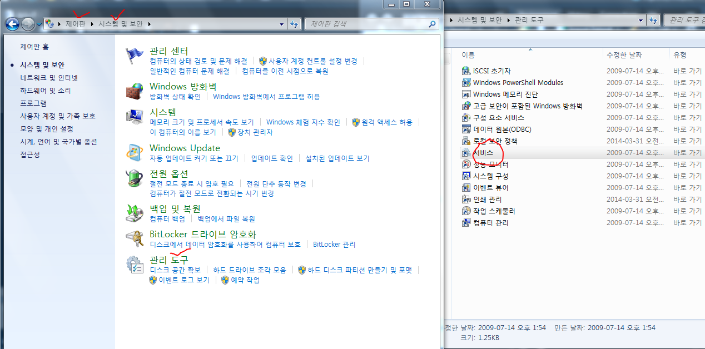
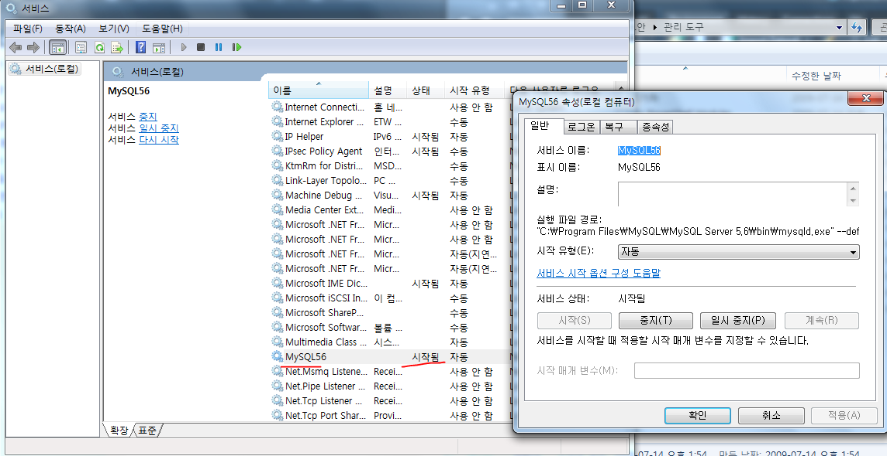
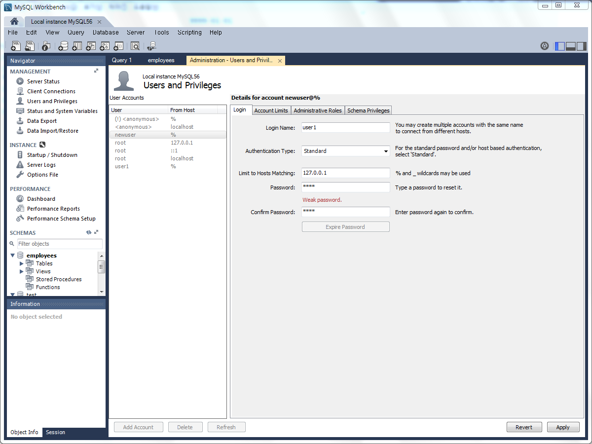
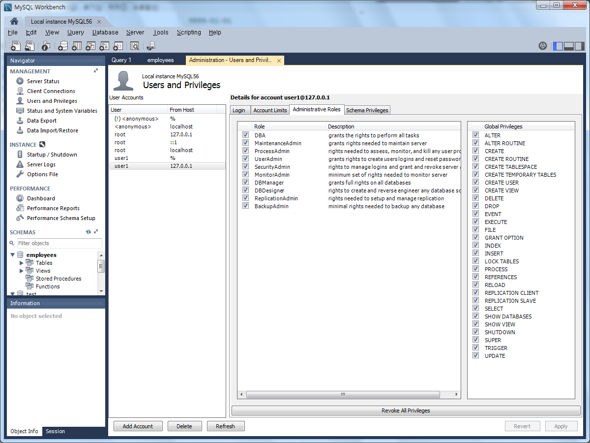
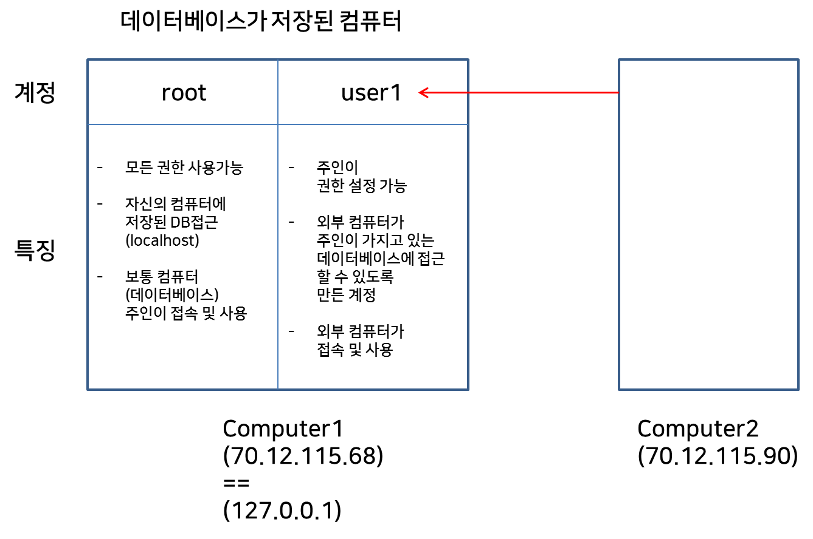

# 딥러닝 기반 빅데이터 분석과정 9일차

## 1. MYSQL을 사용하여 데이터 분석

### (1) MYSQL 서비스 사용 중인지 확인

- '제어판 - 시스템 및 보안 - 관리도구 - 서비스' 에서 확인
  - 
  - 


### (2) 외부접속 및 내부접속

- 외부접속과 내부접속 설명은 아래와 같다

  - ```
    외부접속
    70.12.115.68(ip address)
    www.test.co.kr(domain address, 가칭*)
    내부접속
    M150118(computer name)
    localhost(local name)
    127.0.0.1(local ip address)
    ```


### (3) R에서 데이터베이스 읽기

#### 1) root 계정으로 데이터베이스 읽기

- R에서 데이터를 읽는 구문은 아래와 같다

  - ```R
    > library(RMySQL)
    > con <- dbConnect(
    +   MySQL(), # 데이터베이스 드라이버
    +   user = "root", # 사용자 이름
    +   password = "1234", # 비밀번호
    +   dbname = "employees", # 데이터베이스 이름
    +   host = "127.0.0.1" # 호스트
    + )
    > dbListTables(con)
    [1] "current_dept_emp"     "departments"          "dept_emp"             "dept_emp_latest_date"
    [5] "dept_manager"         "employees"            "salaries"             "titles"              
    > df <- dbGetQuery(con, "select * from employees")
    > df2 <- dbGetQuery(con, "select * from dept_emp")
    > df3 <- dbGetQuery(con, "select * from departments")
    > df4 <- dbGetQuery(con, "select * from salaries")
    > colnames(df)
    [1] "emp_no"     "birth_date" "first_name" "last_name"  "gender"     "hire_date" 
    > colnames(df2)
    [1] "emp_no"    "dept_no"   "from_date" "to_date"  
    > colnames(df3)
    [1] "dept_no"   "dept_name"
    > colnames(df4)
    [1] "emp_no"    "salary"    "from_date" "to_date"  
    > str(df)
    'data.frame':	300024 obs. of  6 variables:
     $ emp_no    : int  10001 10002 10003 10004 10005 10006 10007 10008 10009 10010 ...
     $ birth_date: chr  "1953-09-02" "1964-06-02" "1959-12-03" "1954-05-01" ...
     $ first_name: chr  "Georgi" "Bezalel" "Parto" "Chirstian" ...
     $ last_name : chr  "Facello" "Simmel" "Bamford" "Koblick" ...
     $ gender    : chr  "M" "F" "M" "M" ...
     $ hire_date : chr  "1986-06-26" "1985-11-21" "1986-08-28" "1986-12-01" ...
    > str(df2)
    'data.frame':	331603 obs. of  4 variables:
     $ emp_no   : int  10001 10002 10003 10004 10005 10006 10007 10008 10009 10010 ...
     $ dept_no  : chr  "d005" "d007" "d004" "d004" ...
     $ from_date: chr  "1986-06-26" "1996-08-03" "1995-12-03" "1986-12-01" ...
     $ to_date  : chr  "9999-01-01" "9999-01-01" "9999-01-01" "9999-01-01" ...
    ```

#### 2) user1 계정으로 데이터베이스 읽기★

- ```R
  con2 <- dbConnect(
    MySQL(), # 데이터베이스 드라이버
    user = "user1", # 사용자 이름
    password = "1234", # 비밀번호
    dbname = "employees", # 데이터베이스 이름
    host = "127.0.0.1" # 호스트
  )
  ```

- user1이 127.0.0.1에 접속이 가능하려면 (즉, 내부 데이터베이스에 접속) MySQL에서 등록을 해줘야한다.

  - 

    

    - user accounts를 보면 user1은 % 외에 127.0.0.1 에 대한 접근 권한이 없다.
    - 이를 위해 새로 Add Acccount를 통해 권한을 추가해준다.
    - DBA를 선택하여 모든 권한을 넣어준다.

  - 여기서 개념을 이해해야한다. user1이라는 아이디와 비번을 데이터베이스 주인이 만드는 것이다. 다른 컴퓨터에서 나의 컴퓨터 데이터베이스에 접근하려면 아이디와 비번을 새로 만들어서 신청하는 것이 아닌, 데이터베이스 주인이 만들었던 user1이라는 아이디와 1234라는 비번을 입력해서 접근이 가능하다

  - user1에게 권한을 준 것은 DBA 체크이다. 2번째 그림에 보듯이 ALTER, DELETE 등 거의 모든 권한이 부여되어 있다.

  - user1에 %가 있는 것은 외부에서 접근을 '허용'하겠다는 의미이다. %가 없다면 외부에서 이 user1이라는 계정으로 접속할 수 없다.

  - user1에 127.0.0.1 의 접근을 준 것은 user1에게 데이터베이스 주인의 컴퓨터에 있는 내부 데이터베이스에 접근을 허용하겠다는 의미이다.

  - 127.0.0.1 == localhost == ::1 이다.

    - IPv4에서 127.0.0.1이고 IPv6에서 ::1을 localhost로 정의한다.

  - 

### (4) 데이터 분석하기

#### 1) JOIN 사용하기

- ```R
  > # 데이터 분석
  > library(dplyr)
  > library(magrittr)
  > df %>% select(emp_no, gender) %>% filter(gender == "M") %>%head(10)
     emp_no gender
  1   10001      M
  2   10003      M
  3   10004      M
  4   10005      M
  5   10008      M
  6   10012      M
  7   10013      M
  8   10014      M
  9   10015      M
  10  10016      M
  > # 기본키, 외래키 기준으로 join하기
  > colnames(df)
  [1] "emp_no"     "birth_date" "first_name" "last_name"  "gender"     "hire_date" 
  > colnames(df2)
  [1] "emp_no"    "dept_no"   "from_date" "to_date"  
  > left_join(df, df2, by = "emp_no") %>% head(10)
     emp_no birth_date first_name last_name gender  hire_date dept_no  from_date    to_date
  1   10001 1953-09-02     Georgi   Facello      M 1986-06-26    d005 1986-06-26 9999-01-01
  2   10002 1964-06-02    Bezalel    Simmel      F 1985-11-21    d007 1996-08-03 9999-01-01
  3   10003 1959-12-03      Parto   Bamford      M 1986-08-28    d004 1995-12-03 9999-01-01
  4   10004 1954-05-01  Chirstian   Koblick      M 1986-12-01    d004 1986-12-01 9999-01-01
  5   10005 1955-01-21    Kyoichi  Maliniak      M 1989-09-12    d003 1989-09-12 9999-01-01
  6   10006 1953-04-20     Anneke   Preusig      F 1989-06-02    d005 1990-08-05 9999-01-01
  7   10007 1957-05-23    Tzvetan Zielinski      F 1989-02-10    d008 1989-02-10 9999-01-01
  8   10008 1958-02-19     Saniya  Kalloufi      M 1994-09-15    d005 1998-03-11 2000-07-31
  9   10009 1952-04-19     Sumant      Peac      F 1985-02-18    d006 1985-02-18 9999-01-01
  10  10010 1963-06-01  Duangkaew  Piveteau      F 1989-08-24    d004 1996-11-24 2000-06-26
  > right_join(df, df2, by="emp_no") %>% head(10)
     emp_no birth_date first_name last_name gender  hire_date dept_no  from_date    to_date
  1   10001 1953-09-02     Georgi   Facello      M 1986-06-26    d005 1986-06-26 9999-01-01
  2   10002 1964-06-02    Bezalel    Simmel      F 1985-11-21    d007 1996-08-03 9999-01-01
  3   10003 1959-12-03      Parto   Bamford      M 1986-08-28    d004 1995-12-03 9999-01-01
  4   10004 1954-05-01  Chirstian   Koblick      M 1986-12-01    d004 1986-12-01 9999-01-01
  5   10005 1955-01-21    Kyoichi  Maliniak      M 1989-09-12    d003 1989-09-12 9999-01-01
  6   10006 1953-04-20     Anneke   Preusig      F 1989-06-02    d005 1990-08-05 9999-01-01
  7   10007 1957-05-23    Tzvetan Zielinski      F 1989-02-10    d008 1989-02-10 9999-01-01
  8   10008 1958-02-19     Saniya  Kalloufi      M 1994-09-15    d005 1998-03-11 2000-07-31
  9   10009 1952-04-19     Sumant      Peac      F 1985-02-18    d006 1985-02-18 9999-01-01
  10  10010 1963-06-01  Duangkaew  Piveteau      F 1989-08-24    d004 1996-11-24 2000-06-26
  > inner_join(df, df2, by="emp_no") %>% head(10)
     emp_no birth_date first_name last_name gender  hire_date dept_no  from_date    to_date
  1   10001 1953-09-02     Georgi   Facello      M 1986-06-26    d005 1986-06-26 9999-01-01
  2   10002 1964-06-02    Bezalel    Simmel      F 1985-11-21    d007 1996-08-03 9999-01-01
  3   10003 1959-12-03      Parto   Bamford      M 1986-08-28    d004 1995-12-03 9999-01-01
  4   10004 1954-05-01  Chirstian   Koblick      M 1986-12-01    d004 1986-12-01 9999-01-01
  5   10005 1955-01-21    Kyoichi  Maliniak      M 1989-09-12    d003 1989-09-12 9999-01-01
  6   10006 1953-04-20     Anneke   Preusig      F 1989-06-02    d005 1990-08-05 9999-01-01
  7   10007 1957-05-23    Tzvetan Zielinski      F 1989-02-10    d008 1989-02-10 9999-01-01
  8   10008 1958-02-19     Saniya  Kalloufi      M 1994-09-15    d005 1998-03-11 2000-07-31
  9   10009 1952-04-19     Sumant      Peac      F 1985-02-18    d006 1985-02-18 9999-01-01
  10  10010 1963-06-01  Duangkaew  Piveteau      F 1989-08-24    d004 1996-11-24 2000-06-26
  
  ```


#### 2) Merge 사용하기

- ```R
  > # merge
  > merge(df, df2, by=NULL) %>% head(10) # 일치 없이 모든 데이터 합병 => 너무 데이터가 커서 안됨
  Error: cannot allocate vector of size 370.6 Gb
  > merge(df, df2, by = "emp_no") %>% head(10) # 기본. emp_no 기준으로 합병
     emp_no birth_date first_name last_name gender  hire_date dept_no  from_date    to_date
  1   10001 1953-09-02     Georgi   Facello      M 1986-06-26    d005 1986-06-26 9999-01-01
  2   10002 1964-06-02    Bezalel    Simmel      F 1985-11-21    d007 1996-08-03 9999-01-01
  3   10003 1959-12-03      Parto   Bamford      M 1986-08-28    d004 1995-12-03 9999-01-01
  4   10004 1954-05-01  Chirstian   Koblick      M 1986-12-01    d004 1986-12-01 9999-01-01
  5   10005 1955-01-21    Kyoichi  Maliniak      M 1989-09-12    d003 1989-09-12 9999-01-01
  6   10006 1953-04-20     Anneke   Preusig      F 1989-06-02    d005 1990-08-05 9999-01-01
  7   10007 1957-05-23    Tzvetan Zielinski      F 1989-02-10    d008 1989-02-10 9999-01-01
  8   10008 1958-02-19     Saniya  Kalloufi      M 1994-09-15    d005 1998-03-11 2000-07-31
  9   10009 1952-04-19     Sumant      Peac      F 1985-02-18    d006 1985-02-18 9999-01-01
  10  10010 1963-06-01  Duangkaew  Piveteau      F 1989-08-24    d004 1996-11-24 2000-06-26
  > merge(df, df2, by = "emp_no", all.x = TRUE) %>% head(10) # emp_no 기준으로 찾되 df는 모두 반영. df의 null값도 넣겠다는 의미
     emp_no birth_date first_name last_name gender  hire_date dept_no  from_date    to_date
  1   10001 1953-09-02     Georgi   Facello      M 1986-06-26    d005 1986-06-26 9999-01-01
  2   10002 1964-06-02    Bezalel    Simmel      F 1985-11-21    d007 1996-08-03 9999-01-01
  3   10003 1959-12-03      Parto   Bamford      M 1986-08-28    d004 1995-12-03 9999-01-01
  4   10004 1954-05-01  Chirstian   Koblick      M 1986-12-01    d004 1986-12-01 9999-01-01
  5   10005 1955-01-21    Kyoichi  Maliniak      M 1989-09-12    d003 1989-09-12 9999-01-01
  6   10006 1953-04-20     Anneke   Preusig      F 1989-06-02    d005 1990-08-05 9999-01-01
  7   10007 1957-05-23    Tzvetan Zielinski      F 1989-02-10    d008 1989-02-10 9999-01-01
  8   10008 1958-02-19     Saniya  Kalloufi      M 1994-09-15    d005 1998-03-11 2000-07-31
  9   10009 1952-04-19     Sumant      Peac      F 1985-02-18    d006 1985-02-18 9999-01-01
  10  10010 1963-06-01  Duangkaew  Piveteau      F 1989-08-24    d004 1996-11-24 2000-06-26
  > merge(df, df2, by = "emp_no", all.y = TRUE) %>% head(10)
     emp_no birth_date first_name last_name gender  hire_date dept_no  from_date    to_date
  1   10001 1953-09-02     Georgi   Facello      M 1986-06-26    d005 1986-06-26 9999-01-01
  2   10002 1964-06-02    Bezalel    Simmel      F 1985-11-21    d007 1996-08-03 9999-01-01
  3   10003 1959-12-03      Parto   Bamford      M 1986-08-28    d004 1995-12-03 9999-01-01
  4   10004 1954-05-01  Chirstian   Koblick      M 1986-12-01    d004 1986-12-01 9999-01-01
  5   10005 1955-01-21    Kyoichi  Maliniak      M 1989-09-12    d003 1989-09-12 9999-01-01
  6   10006 1953-04-20     Anneke   Preusig      F 1989-06-02    d005 1990-08-05 9999-01-01
  7   10007 1957-05-23    Tzvetan Zielinski      F 1989-02-10    d008 1989-02-10 9999-01-01
  8   10008 1958-02-19     Saniya  Kalloufi      M 1994-09-15    d005 1998-03-11 2000-07-31
  9   10009 1952-04-19     Sumant      Peac      F 1985-02-18    d006 1985-02-18 9999-01-01
  10  10010 1963-06-01  Duangkaew  Piveteau      F 1989-08-24    d004 1996-11-24 2000-06-26
  > merge(df, df2, by.x = "emp_no", by.y = "emp_no") %>% head(10)
     emp_no birth_date first_name last_name gender  hire_date dept_no  from_date    to_date
  1   10001 1953-09-02     Georgi   Facello      M 1986-06-26    d005 1986-06-26 9999-01-01
  2   10002 1964-06-02    Bezalel    Simmel      F 1985-11-21    d007 1996-08-03 9999-01-01
  3   10003 1959-12-03      Parto   Bamford      M 1986-08-28    d004 1995-12-03 9999-01-01
  4   10004 1954-05-01  Chirstian   Koblick      M 1986-12-01    d004 1986-12-01 9999-01-01
  5   10005 1955-01-21    Kyoichi  Maliniak      M 1989-09-12    d003 1989-09-12 9999-01-01
  6   10006 1953-04-20     Anneke   Preusig      F 1989-06-02    d005 1990-08-05 9999-01-01
  7   10007 1957-05-23    Tzvetan Zielinski      F 1989-02-10    d008 1989-02-10 9999-01-01
  8   10008 1958-02-19     Saniya  Kalloufi      M 1994-09-15    d005 1998-03-11 2000-07-31
  9   10009 1952-04-19     Sumant      Peac      F 1985-02-18    d006 1985-02-18 9999-01-01
  10  10010 1963-06-01  Duangkaew  Piveteau      F 1989-08-24    d004 1996-11-24 2000-06-26
  ```


## 2. purrr 패키지를 사용한 순회

### (1) map

- map은 apply 특히 lapply 함수와 기능이 동일하다. 단지 여기에 파이프 기능을 사용할 수 있게 한다.
  - 이말인 즉슨 base 함수인 lapply를 사용하던 map을 사용하던 큰 차이는 없다
  - 다만 map이 좀 더 프로그래밍 시간을 줄이고 계산이 쉬워진다.

#### 1) map 기본

- ```R
  > # purrr
  > library(purrr)
  > theList <- list(
  +   a = matrix(1:9, 3),
  +   b = 1:5,
  +   c = matrix(1:4, 2),
  +   d = 2
  + )
  > # map. lapply와 비슷하다. 여기에 파이프 기능을 사용할 수 있게 됨
  > theList$a
       [,1] [,2] [,3]
  [1,]    1    4    7
  [2,]    2    5    8
  [3,]    3    6    9
  > lapply(theList, sum)
  $`a`
  [1] 45
  
  $b
  [1] 15
  
  $c
  [1] 10
  
  $d
  [1] 2
  
  > map(theList, sum)
  $`a`
  [1] 45
  
  $b
  [1] 15
  
  $c
  [1] 10
  
  $d
  [1] 2
  ```

- 함수를 적용하여 사용할 수도 있다.

  - ```R
    > myFunc <- function(a) {
    +   return(a + 1)
    + }
    > # 아래 3개 식은 동일하다.
    > map(theList, myFunc)
    $`a`
         [,1] [,2] [,3]
    [1,]    2    5    8
    [2,]    3    6    9
    [3,]    4    7   10
    
    $b
    [1] 2 3 4 5 6
    
    $c
         [,1] [,2]
    [1,]    2    4
    [2,]    3    5
    
    $d
    [1] 3
    
    > theList %>% map(myFunc)
    $`a`
         [,1] [,2] [,3]
    [1,]    2    5    8
    [2,]    3    6    9
    [3,]    4    7   10
    
    $b
    [1] 2 3 4 5 6
    
    $c
         [,1] [,2]
    [1,]    2    4
    [2,]    3    5
    
    $d
    [1] 3
    
    > map(theList, function(a){a+1})
    $`a`
         [,1] [,2] [,3]
    [1,]    2    5    8
    [2,]    3    6    9
    [3,]    4    7   10
    
    $b
    [1] 2 3 4 5 6
    
    $c
         [,1] [,2]
    [1,]    2    4
    [2,]    3    5
    
    $d
    [1] 3
    
    ```

  - myfunc는 theList를 인자로 받아서 theList의 모든 값에 1을 더한다.

- 무명함수를 사용하여 함수를 사용할 수도 있다.

  - ```R
    > # 무명함수 사용하기
    > theList %>% map(function(x) sum(x, na.rm = TRUE))
    $`a`
    [1] 45
    
    $b
    [1] 15
    
    $c
    [1] 10
    
    $d
    [1] 2
                      
    > theList %>% map(sum, na.rm = TRUE) # 위와 같음 
    ```

  - 실제로 자주 쓰는 패턴이라고 한다.


#### 2) map 반환값

- map은 기본적으로 list를 반환한다. 만약 반환값을 다르게 받고 싶다면 아래와 같다

- |  함수   | 반환값의 유형 |
  | :-----: | :-----------: |
  |   map   |    리스트     |
  | map_int |     정수      |
  | map_dbl |     실수      |
  | map_chr |    문자열     |
  | map_lgl |    논리형     |
  | map_df  | 데이터프레임  |

- map_int와 map_dbl를 살펴보자

  - ```R
    > # map_int
    > theList %>% map_int(NROW)
    a b c d 
    3 5 2 1 
    > # map_dbl
    > theList %>% map_dbl(mean)
      a   b   c   d 
    5.0 3.0 2.5 2.0 
    ```

- map_chr

  - ```R
    > theList %>% map_chr(class)
            a         b         c         d 
     "matrix" "integer"  "matrix" "numeric" 
    > theList %>% map(class)
    $`a`
    [1] "matrix"
    
    $b
    [1] "integer"
    
    $c
    [1] "matrix"
    
    $d
    [1] "numeric"
    ```

- map_lgl

  - ```R
    > # map_lgl
    > theList %>% map_lgl(function(x) NROW(x) < 3)
        a     b     c     d 
    FALSE FALSE  TRUE  TRUE 
    ```

- 그외 map_df, map_if은 책 참고(253p)


#### 3) 여러 입력값에 대한 map 사용(map2, pmap)

- 2개 이상의 인자를 취해서 각각 리스트를 반환할 수 있다

  - 이는 mapply 함수와 비슷하다

- map2 는 2개의 인자를 받을 수 있고, pmap은 인자 갯수 제한이 없다.

  - ```R
    > # map2, pmap
    > firstList <- list(A = matrix(1:16, 4), B = matrix(1:16, 2), c = 1:5)
    > secondList <- list(A = matrix(1:16, 4), B = matrix(1:16, 8), c = 15:1)
    > firstList
    $`A`
         [,1] [,2] [,3] [,4]
    [1,]    1    5    9   13
    [2,]    2    6   10   14
    [3,]    3    7   11   15
    [4,]    4    8   12   16
    
    $B
         [,1] [,2] [,3] [,4] [,5] [,6] [,7] [,8]
    [1,]    1    3    5    7    9   11   13   15
    [2,]    2    4    6    8   10   12   14   16
    
    $c
    [1] 1 2 3 4 5
    
    > secondList
    $`A`
         [,1] [,2] [,3] [,4]
    [1,]    1    5    9   13
    [2,]    2    6   10   14
    [3,]    3    7   11   15
    [4,]    4    8   12   16
    
    $B
         [,1] [,2]
    [1,]    1    9
    [2,]    2   10
    [3,]    3   11
    [4,]    4   12
    [5,]    5   13
    [6,]    6   14
    [7,]    7   15
    [8,]    8   16
    
    $c
     [1] 15 14 13 12 11 10  9  8  7  6  5  4  3  2  1
    
    > simpleFunc <- function(x, y) {
    +   NROW(x) + NROW(y)
    + }
    > map2(firstList, secondList, simpleFunc)
    $`A`
    [1] 8
    
    $B
    [1] 10
    
    $c
    [1] 20
    
    > pmap(list(firstList, secondList), simpleFunc)
    $`A`
    [1] 8
    
    $B
    [1] 10
    
    $c
    [1] 20
    
    > pmap_int(list(firstList, secondList), simpleFunc)
     A  B  c 
     8 10 20 
    ```


## 3. dplyr와 mysql를 사용한 문제

```R
> '''
+ # dplyr
+ 1. 부서중 Development부서의 인원을 출력하시오.
+ 2. employees 부서별 인원을 출력하시오. ★★★
+ 3. employees중에서 월급이 가능 높은 상위 5명을 출력하시오.
+ 4. 부서별로 인원을 출력하고 가장 인원이 많은 부서를 출력하시오.
+ '''
Error: unexpected string constant in:
"4. 부서별로 인원을 출력하고 가장 인원이 많은 부서를 출력하시오.
'"
> library(RMySQL)
> library(dplyr)
> library(magrittr)
> con <- dbConnect(
+   MySQL(), # 데이터베이스 드라이버
+   user = "root", # 사용자 이름
+   password = "1234", # 비밀번호
+   dbname = "employees", # 데이터베이스 이름
+   host = "127.0.0.1" # 호스트
+ )
> dbListTables(con)
[1] "current_dept_emp"     "departments"          "dept_emp"             "dept_emp_latest_date"
[5] "dept_manager"         "employees"            "salaries"             "titles"              
> df <- dbGetQuery(con, "select * from employees")
> df2 <- dbGetQuery(con, "select * from dept_emp")
> df3 <- dbGetQuery(con, "select * from departments")
> df4 <- dbGetQuery(con, "select * from salaries")
> # 문제 1
> colnames(df3)
[1] "dept_no"   "dept_name"
> df3 %>% filter(dept_name == "Development")  # departments에서 devlopment의 dept_no를 찾는다.
  dept_no   dept_name
1    d005 Development
> df2 %>% filter(dept_no == "d005") %>% head(5)# dept_emp에서 인원을 출력한다.
  emp_no dept_no  from_date    to_date
1  10001    d005 1986-06-26 9999-01-01
2  10006    d005 1990-08-05 9999-01-01
3  10008    d005 1998-03-11 2000-07-31
4  10012    d005 1992-12-18 9999-01-01
5  10014    d005 1993-12-29 9999-01-01
> df2 %>% filter(dept_no == "d005") %>% group_by(dept_no) %>% count(dept_no) # 인원 요약도 가능
# A tibble: 1 x 2
# Groups:   dept_no [1]
  dept_no     n
  <chr>   <int>
1 d005    85707
> # 문제 2 ★★★
> df3$dept_no
[1] "d009" "d005" "d002" "d003" "d001" "d004" "d006" "d008" "d007"
> df2 %>% group_by(dept_no) %>% count(dept_no) # group_by로 분류하고 그 분류를 기준으로 갯수를 센다.
# A tibble: 9 x 2
# Groups:   dept_no [9]
  dept_no     n
  <chr>   <int>
1 d001    20211
2 d002    17346
3 d003    17786
4 d004    73485
5 d005    85707
6 d006    20117
7 d007    52245
8 d008    21126
9 d009    23580
> head(df3)
  dept_no        dept_name
1    d009 Customer Service
2    d005      Development
3    d002          Finance
4    d003  Human Resources
5    d001        Marketing
6    d004       Production
> # 가독성을 위해 dept_name을 join
> temp = df2 %>% group_by(dept_no) %>% count(dept_no)
> temp
# A tibble: 9 x 2
# Groups:   dept_no [9]
  dept_no     n
  <chr>   <int>
1 d001    20211
2 d002    17346
3 d003    17786
4 d004    73485
5 d005    85707
6 d006    20117
7 d007    52245
8 d008    21126
9 d009    23580
> temp2 = left_join(temp, df3, by="dept_no")
> colnames(temp2)[2] = c("emp_count") # select 를 사용해도 좋다!
> temp2
# A tibble: 9 x 3
# Groups:   dept_no [?]
  dept_no emp_count dept_name         
  <chr>       <int> <chr>             
1 d001        20211 Marketing         
2 d002        17346 Finance           
3 d003        17786 Human Resources   
4 d004        73485 Production        
5 d005        85707 Development       
6 d006        20117 Quality Management
7 d007        52245 Sales             
8 d008        21126 Research          
9 d009        23580 Customer Service  
> # 문제 3
> df4 %>% arrange(desc(salary)) %>% head(5)
  emp_no salary  from_date    to_date
1  43624 158220 2002-03-22 9999-01-01
2  43624 157821 2001-03-22 2002-03-22
3 254466 156286 2001-08-04 9999-01-01
4  47978 155709 2002-07-14 9999-01-01
5 253939 155513 2002-04-11 9999-01-01
> # 문제 4
> df2 %>% group_by(dept_no) %>% count(dept_no) %>% arrange(desc(n))
# A tibble: 9 x 2
# Groups:   dept_no [9]
  dept_no     n
  <chr>   <int>
1 d005    85707
2 d004    73485
3 d007    52245
4 d009    23580
5 d008    21126
6 d001    20211
7 d006    20117
8 d003    17786
9 d002    17346
> temp2 %>% arrange(desc(emp_count))
# A tibble: 9 x 3
# Groups:   dept_no [9]
  dept_no emp_count dept_name         
  <chr>       <int> <chr>             
1 d005        85707 Development       
2 d004        73485 Production        
3 d007        52245 Sales             
4 d009        23580 Customer Service  
5 d008        21126 Research          
6 d001        20211 Marketing         
7 d006        20117 Quality Management
8 d003        17786 Human Resources   
9 d002        17346 Finance    
```


## 4.  문자열 처리와 정규표현식(좀 중요한데 예제와 설명이 적음. 책 285p 참고해서 다시 살펴볼 것) 


```R
# 문자열처리
library(stringr)
data <- c("i", "am", "a", "data scientist")
str_length(data) # stringr
nchar(data) # base
length(data)

data2 <- "I am a data scientist"
str_sub(data2, 1, 4)
str_sub(data2, 6, 8)
substr(data2, 1, 4)
substr(data2, 6, 8)

paste(c("i am a", " data scientist"))
paste("i", "am", "a", "data", "scientist")
paste0(c("i am a", " data scientist"))
paste0("i", "am", "a", "data", "scientist")

str_split(data2, " ")
str_split(data2, " ", 1)
str_split(data2, " ", 2)
str_split(data2, " ", 3)
str_split(data2, " ", 4)

data5 <- "010-1212-3434"
str_split(data5, "-", 3)
data5 <- str_split_fixed(data5, "-", 3)
data5
data5[1,1]
data6 <- c("서울특별시 강남구 1111 2222", "서울턱별시 강서구 1111, 2222")
str_split_fixed(data6, " ", 4)

# 정규표현식을 활용한 문자열 처리
data7 <- c("apple", "b0anana", "strawberry")
str_detect(data7, "n")
str_detect(data7, '[a-z]')
str_detect(data7, '^[a-z]{2}') # '^'처음부터 a-z 가 '{2}' 2자리나와야한다. 

str_extract(data7, '^[a-z]{2}')

grep("\\d", data7, value=TRUE) # 숫자가 들어간 요소에 대해서만 추출

phones <- c("010 2879 2020", "032-123-4242", "031 232 1919", "02 1818 2323", "010 1111 2223")
phonePattern <- "([0-9]{3})[-.]([0-9]{3})[-.]([0-9]{4})"
str_extract(phones, phonePattern)

data8 <- c("apple", "b0anana", "strawberry")
str_replace(data8, "[ae]", "-")
str_replace_all(data8, "[ae]", "-")


```

## 5. ★★★★★ 엑셀파일, bind, 문자열처리 등을 총 이용하는 아파트문제(꿀잼)

- 문제 :

제공되는 파일들
아파트(매매)_실거래가_201801 ~ 9.xls를 import하여 2018년 1월 ~ 9월까지의 서울특별시에 해당하는 구별 매매가 평균을 구하시오.

참고) xls를 파일을 개별적으로 read하지 말고 
loop식을 이용하여 합꺼번에 read하도록 한다.

출력 예)
year_month	city	price
201801		강남구 	2000000


- 나의 답(좋은 함수가 많으므로 꼭 살펴보긔. 특히 # 주석 잘 살펴볼 것

  - ```R
    > library(readxl)
    > # skip의 중요성!
    > a <- read_excel('apt_data/아파트(매매)_실거래가_201801.xlsx', skip = 16)
    > read_excel('apt_data/아파트(매매)_실거래가_201802.xlsx', skip = 16)
    # A tibble: 43,478 x 12
       시군구  번지  본번  부번  단지명  `전용면적(㎡)` 계약년월 계약일 `거래금액(만원)` 층    건축년도 도로명
       <chr>   <chr> <chr> <chr> <chr>   <chr>          <chr>    <chr>  <chr>            <chr> <chr>    <chr> 
     1 강원도 강릉~ 202   0202  0000  송정한신~ 59.8           201802   11~20  12,500           13    1997     경강로25~
     2 강원도 강릉~ 289   0289  0000  신도브래뉴~ 59.99          201802   1~10   16,200           3     2005     경강로25~
     3 강원도 강릉~ 289   0289  0000  신도브래뉴~ 84.99          201802   1~10   27,200           9     2005     경강로25~
     4 강원도 강릉~ 289   0289  0000  신도브래뉴~ 59.99          201802   11~20  18,500           12    2005     경강로25~
     5 강원도 강릉~ 289   0289  0000  신도브래뉴~ 84.99          201802   21~28  27,000           11    2005     경강로25~
     6 강원도 강릉~ 1982  1982  0000  강릉교동롯데~ 135.1727       201802   1~10   32,000           3     2009     화부산로9~
     7 강원도 강릉~ 1982  1982  0000  강릉교동롯데~ 163.9852       201802   21~28  44,500           12    2009     화부산로9~
     8 강원도 강릉~ 1983  1983  0000  강릉교동롯데~ 84.9855        201802   11~20  30,200           14    2009     화부산로1~
     9 강원도 강릉~ 1983  1983  0000  강릉교동롯데~ 135.1008       201802   21~28  37,400           15    2009     화부산로1~
    10 강원도 강릉~ 1750  1750  0000  교동1주공~ 84.84          201802   1~10   21,000           8     1999     가작로
    # ... with 43,468 more rows
    > theFiles <- dir("apt_data/")
    > i <- 0
    > for(a in theFiles) {
    +   print(a)
    + }
    [1] "아파트(매매)_실거래가_201801.xlsx"
    [1] "아파트(매매)_실거래가_201802.xlsx"
    [1] "아파트(매매)_실거래가_201803.xlsx"
    [1] "아파트(매매)_실거래가_201804.xlsx"
    [1] "아파트(매매)_실거래가_201805.xlsx"
    [1] "아파트(매매)_실거래가_201806.xlsx"
    [1] "아파트(매매)_실거래가_201807.xlsx"
    [1] "아파트(매매)_실거래가_201808.xlsx"
    [1] "아파트(매매)_실거래가_201809.xlsx"
    > # 책 259p 참조
    > for(a in theFiles) {
    +   # nameToUse <- str_sub(string = a, start = 1, end = 19) # ★★★  파일명을 만들기 위해서 사용하는 구문이다.
    +   i <- i + 1
    +   nameToUse <- paste0("APT", i)
    +   temp <- read_excel(paste0("apt_data/",a), skip = 16)
    +   assign(x = nameToUse, value = temp) # assign은 변수를 만들어서 값을 넣는 것인데, loop문에서 이렇게 주로 쓰인다.
    +   print(nameToUse)
    + }
    [1] "APT1"
    [1] "APT2"
    [1] "APT3"
    [1] "APT4"
    [1] "APT5"
    [1] "APT6"
    [1] "APT7"
    [1] "APT8"
    [1] "APT9"
    > str(APT1) # 계약년월이 다르다.
    Classes ‘tbl_df’, ‘tbl’ and 'data.frame':	50617 obs. of  12 variables:
     $ 시군구        : chr  "강원도 강릉시 견소동" "강원도 강릉시 견소동" "강원도 강릉시 견소동" "강원도 강릉시 견소동" ...
     $ 번지          : chr  "202" "289" "289" "289" ...
     $ 본번          : chr  "0202" "0289" "0289" "0289" ...
     $ 부번          : chr  "0000" "0000" "0000" "0000" ...
     $ 단지명        : chr  "송정한신" "신도브래뉴" "신도브래뉴" "신도브래뉴" ...
     $ 전용면적(㎡)  : chr  "84.945" "59.99" "84.99" "59.99" ...
     $ 계약년월      : chr  "201801" "201801" "201801" "201801" ...
     $ 계약일        : chr  "1~10" "1~10" "1~10" "1~10" ...
     $ 거래금액(만원): chr  "17,500" "17,900" "27,300" "17,900" ...
     $ 층            : chr  "10" "12" "9" "12" ...
     $ 건축년도      : chr  "1997" "2005" "2005" "2005" ...
     $ 도로명        : chr  "경강로2539번길" "경강로2539번길" "경강로2539번길" "경강로2539번길" ...
    > str(APT9) # 계약년월이 다르다.
    Classes ‘tbl_df’, ‘tbl’ and 'data.frame':	21709 obs. of  12 variables:
     $ 시군구        : chr  "강원도 강릉시 견소동" "강원도 강릉시 견소동" "강원도 강릉시 견소동" "강원도 강릉시 견소동" ...
     $ 번지          : chr  "202" "202" "202" "202" ...
     $ 본번          : chr  "0202" "0202" "0202" "0202" ...
     $ 부번          : chr  "0000" "0000" "0000" "0000" ...
     $ 단지명        : chr  "송정한신" "송정한신" "송정한신" "송정한신" ...
     $ 전용면적(㎡)  : chr  "84.945" "39.08" "59.8" "84.945" ...
     $ 계약년월      : chr  "201809" "201809" "201809" "201809" ...
     $ 계약일        : chr  "1~10" "11~20" "11~20" "21~30" ...
     $ 거래금액(만원): chr  "17,600" "10,750" "11,900" "13,000" ...
     $ 층            : chr  "10" "12" "2" "13" ...
     $ 건축년도      : chr  "1997" "1997" "1997" "1997" ...
     $ 도로명        : chr  "경강로2539번길" "경강로2539번길" "경강로2539번길" "경강로2539번길" ...
    > #APT1 ~ APT9 를 합치는 것은 rbind 를 사용한다.
    > b <- data.frame(A = c("a","b","c"), B = c(1, 2, 3))
    > c <- data.frame(A = c("d","e","f"), B = c(4, 5, 6))
    > b
      A B
    1 a 1
    2 b 2
    3 c 3
    > c
      A B
    1 d 4
    2 e 5
    3 f 6
    > rbind(b, c)
      A B
    1 a 1
    2 b 2
    3 c 3
    4 d 4
    5 e 5
    6 f 6
    > str(APT1)
    Classes ‘tbl_df’, ‘tbl’ and 'data.frame':	50617 obs. of  12 variables:
     $ 시군구        : chr  "강원도 강릉시 견소동" "강원도 강릉시 견소동" "강원도 강릉시 견소동" "강원도 강릉시 견소동" ...
     $ 번지          : chr  "202" "289" "289" "289" ...
     $ 본번          : chr  "0202" "0289" "0289" "0289" ...
     $ 부번          : chr  "0000" "0000" "0000" "0000" ...
     $ 단지명        : chr  "송정한신" "신도브래뉴" "신도브래뉴" "신도브래뉴" ...
     $ 전용면적(㎡)  : chr  "84.945" "59.99" "84.99" "59.99" ...
     $ 계약년월      : chr  "201801" "201801" "201801" "201801" ...
     $ 계약일        : chr  "1~10" "1~10" "1~10" "1~10" ...
     $ 거래금액(만원): chr  "17,500" "17,900" "27,300" "17,900" ...
     $ 층            : chr  "10" "12" "9" "12" ...
     $ 건축년도      : chr  "1997" "2005" "2005" "2005" ...
     $ 도로명        : chr  "경강로2539번길" "경강로2539번길" "경강로2539번길" "경강로2539번길" ...
    > str(APT2)
    Classes ‘tbl_df’, ‘tbl’ and 'data.frame':	43478 obs. of  12 variables:
     $ 시군구        : chr  "강원도 강릉시 견소동" "강원도 강릉시 견소동" "강원도 강릉시 견소동" "강원도 강릉시 견소동" ...
     $ 번지          : chr  "202" "289" "289" "289" ...
     $ 본번          : chr  "0202" "0289" "0289" "0289" ...
     $ 부번          : chr  "0000" "0000" "0000" "0000" ...
     $ 단지명        : chr  "송정한신" "신도브래뉴" "신도브래뉴" "신도브래뉴" ...
     $ 전용면적(㎡)  : chr  "59.8" "59.99" "84.99" "59.99" ...
     $ 계약년월      : chr  "201802" "201802" "201802" "201802" ...
     $ 계약일        : chr  "11~20" "1~10" "1~10" "11~20" ...
     $ 거래금액(만원): chr  "12,500" "16,200" "27,200" "18,500" ...
     $ 층            : chr  "13" "3" "9" "12" ...
     $ 건축년도      : chr  "1997" "2005" "2005" "2005" ...
     $ 도로명        : chr  "경강로2539번길" "경강로2539번길" "경강로2539번길" "경강로2539번길" ...
    > tmp2 <- rbind(APT1, APT2)
    > str(tmp2)
    Classes ‘tbl_df’, ‘tbl’ and 'data.frame':	94095 obs. of  12 variables:
     $ 시군구        : chr  "강원도 강릉시 견소동" "강원도 강릉시 견소동" "강원도 강릉시 견소동" "강원도 강릉시 견소동" ...
     $ 번지          : chr  "202" "289" "289" "289" ...
     $ 본번          : chr  "0202" "0289" "0289" "0289" ...
     $ 부번          : chr  "0000" "0000" "0000" "0000" ...
     $ 단지명        : chr  "송정한신" "신도브래뉴" "신도브래뉴" "신도브래뉴" ...
     $ 전용면적(㎡)  : chr  "84.945" "59.99" "84.99" "59.99" ...
     $ 계약년월      : chr  "201801" "201801" "201801" "201801" ...
     $ 계약일        : chr  "1~10" "1~10" "1~10" "1~10" ...
     $ 거래금액(만원): chr  "17,500" "17,900" "27,300" "17,900" ...
     $ 층            : chr  "10" "12" "9" "12" ...
     $ 건축년도      : chr  "1997" "2005" "2005" "2005" ...
     $ 도로명        : chr  "경강로2539번길" "경강로2539번길" "경강로2539번길" "경강로2539번길" ...
    > APTList <- list(APT1, APT2)
    > # ★★★ APT1, APT2...객체를 사용하기 위해서는 "APT1", "APT2"..와 같은 문자열을 사용할 수 없다.
    > # 이렇듯 문자열을 객체(실제변수)로 바꿔주는 것이 eval(parse()) 이다. 책 262p
    > eval(parse(text = "APT1"))
    # A tibble: 50,617 x 12
       시군구  번지  본번  부번  단지명  `전용면적(㎡)` 계약년월 계약일 `거래금액(만원)` 층    건축년도 도로명
       <chr>   <chr> <chr> <chr> <chr>   <chr>          <chr>    <chr>  <chr>            <chr> <chr>    <chr> 
     1 강원도 강릉~ 202   0202  0000  송정한신~ 84.945         201801   1~10   17,500           10    1997     경강로25~
     2 강원도 강릉~ 289   0289  0000  신도브래뉴~ 59.99          201801   1~10   17,900           12    2005     경강로25~
     3 강원도 강릉~ 289   0289  0000  신도브래뉴~ 84.99          201801   1~10   27,300           9     2005     경강로25~
     4 강원도 강릉~ 289   0289  0000  신도브래뉴~ 59.99          201801   1~10   17,900           12    2005     경강로25~
     5 강원도 강릉~ 289   0289  0000  신도브래뉴~ 59.99          201801   1~10   18,800           15    2005     경강로25~
     6 강원도 강릉~ 289   0289  0000  신도브래뉴~ 84.99          201801   11~20  27,800           15    2005     경강로25~
     7 강원도 강릉~ 289   0289  0000  신도브래뉴~ 59.99          201801   21~31  19,500           11    2005     경강로25~
     8 강원도 강릉~ 289   0289  0000  신도브래뉴~ 59.99          201801   21~31  17,000           3     2005     경강로25~
     9 강원도 강릉~ 289   0289  0000  신도브래뉴~ 84.99          201801   21~31  28,000           9     2005     경강로25~
    10 강원도 강릉~ 1982  1982  0000  강릉교동롯데~ 164.0098       201801   21~31  41,000           8     2009     화부산로9~
    # ... with 50,607 more rows
    > APT <- APT1
    > for(i in 2:9) {
    +   dataName <- paste0("APT", i)
    +   print(dataName)
    +   APT <- rbind(APT, eval(parse(text = dataName)))
    + }
    [1] "APT2"
    [1] "APT3"
    [1] "APT4"
    [1] "APT5"
    [1] "APT6"
    [1] "APT7"
    [1] "APT8"
    [1] "APT9"
    > # 최종적으로 합쳐진 APT
    > str(APT)
    Classes ‘tbl_df’, ‘tbl’ and 'data.frame':	365427 obs. of  12 variables:
     $ 시군구        : chr  "강원도 강릉시 견소동" "강원도 강릉시 견소동" "강원도 강릉시 견소동" "강원도 강릉시 견소동" ...
     $ 번지          : chr  "202" "289" "289" "289" ...
     $ 본번          : chr  "0202" "0289" "0289" "0289" ...
     $ 부번          : chr  "0000" "0000" "0000" "0000" ...
     $ 단지명        : chr  "송정한신" "신도브래뉴" "신도브래뉴" "신도브래뉴" ...
     $ 전용면적(㎡)  : chr  "84.945" "59.99" "84.99" "59.99" ...
     $ 계약년월      : chr  "201801" "201801" "201801" "201801" ...
     $ 계약일        : chr  "1~10" "1~10" "1~10" "1~10" ...
     $ 거래금액(만원): chr  "17,500" "17,900" "27,300" "17,900" ...
     $ 층            : chr  "10" "12" "9" "12" ...
     $ 건축년도      : chr  "1997" "2005" "2005" "2005" ...
     $ 도로명        : chr  "경강로2539번길" "경강로2539번길" "경강로2539번길" "경강로2539번길" ...
    > tmpApt <- APT
    > library(dplyr)
    > library(magrittr)
    > # 원활한 로드를 위해 colname 바꿔주기
    > names(tmpApt)[1] <- "city"
    > names(tmpApt)[9] <- "transaction"
    > names(tmpApt)
     [1] "city"         "번지"         "본번"         "부번"         "단지명"       "전용면적(㎡)"
     [7] "계약년월"     "계약일"       "transaction"  "층"           "건축년도"     "도로명"      
    > head(tmpApt)
    # A tibble: 6 x 12
      city       번지  본번  부번  단지명   `전용면적(㎡)` 계약년월 계약일 transaction 층    건축년도 도로명  
      <chr>      <chr> <chr> <chr> <chr>    <chr>          <chr>    <chr>  <chr>       <chr> <chr>    <chr>   
    1 강원도 강릉시 견~ 202   0202  0000  송정한신 84.945         201801   1~10   17,500      10    1997     경강로2539~
    2 강원도 강릉시 견~ 289   0289  0000  신도브래뉴~ 59.99          201801   1~10   17,900      12    2005     경강로2539~
    3 강원도 강릉시 견~ 289   0289  0000  신도브래뉴~ 84.99          201801   1~10   27,300      9     2005     경강로2539~
    4 강원도 강릉시 견~ 289   0289  0000  신도브래뉴~ 59.99          201801   1~10   17,900      12    2005     경강로2539~
    5 강원도 강릉시 견~ 289   0289  0000  신도브래뉴~ 59.99          201801   1~10   18,800      15    2005     경강로2539~
    6 강원도 강릉시 견~ 289   0289  0000  신도브래뉴~ 84.99          201801   11~20  27,800      15    2005     경강로2539~
    > # transaction은 지금 integer가 아니라 character이다. 게다가 ","가 있어서 바로 integer 변환이 안된다.
    > class(tmpApt$transaction)
    [1] "character"
    > # 우선 ","를 제거해준다.
    > tmpApt$transaction <- str_replace(string=tmpApt$transaction, pattern=",", replacement="")
    > tmpApt$transaction <- as.integer(tmpApt$transaction)
    > # 서울특별시에 해당하는 구 모두 표현할 때
    > tmpApt %>% select(city, transaction) %>% filter(str_sub(string = city, start = 1, end = 5) == "서울특별시") %>% group_by(city) %>% summarise(avgAmount = mean(transaction))
    # A tibble: 313 x 2
       city                       avgAmount
       <chr>                          <dbl>
     1 서울특별시 강남구 개포동     140361.
     2 서울특별시 강남구 논현동     113066.
     3 서울특별시 강남구 대치동     182890.
     4 서울특별시 강남구 도곡동     158921.
     5 서울특별시 강남구 삼성동     162094.
     6 서울특별시 강남구 세곡동      96993.
     7 서울특별시 강남구 수서동     103665.
     8 서울특별시 강남구 신사동     115405 
     9 서울특별시 강남구 압구정동   258963.
    10 서울특별시 강남구 역삼동     102603.
    # ... with 303 more rows
    
    >> # 서울특별시 전체를 요약하고자 할때
    >   # str_split_fixed를 통해 city를 좀더 세분화한다.
    > tmpApt2 <- cbind(tmpApt, str_split_fixed(tmpApt$city, " ", 3))
    > head(tmpApt2)
                      city 번지 본번 부번     단지명 전용면적(㎡) 계약년월 계약일 transaction 층 건축년도
    1 강원도 강릉시 견소동  202 0202 0000   송정한신       84.945   201801   1~10       17500 10     1997
    2 강원도 강릉시 견소동  289 0289 0000 신도브래뉴        59.99   201801   1~10       17900 12     2005
    3 강원도 강릉시 견소동  289 0289 0000 신도브래뉴        84.99   201801   1~10       27300  9     2005
    4 강원도 강릉시 견소동  289 0289 0000 신도브래뉴        59.99   201801   1~10       17900 12     2005
    5 강원도 강릉시 견소동  289 0289 0000 신도브래뉴        59.99   201801   1~10       18800 15     2005
    6 강원도 강릉시 견소동  289 0289 0000 신도브래뉴        84.99   201801  11~20       27800 15     2005
              도로명      1      2      3
    1 경강로2539번길 강원도 강릉시 견소동
    2 경강로2539번길 강원도 강릉시 견소동
    3 경강로2539번길 강원도 강릉시 견소동
    4 경강로2539번길 강원도 강릉시 견소동
    5 경강로2539번길 강원도 강릉시 견소동
    6 경강로2539번길 강원도 강릉시 견소동
    > names(tmpApt2)
     [1] "city"         "번지"         "본번"         "부번"         "단지명"       "전용면적(㎡)"
     [7] "계약년월"     "계약일"       "transaction"  "층"           "건축년도"     "도로명"      
    [13] "1"            "2"            "3"           
    > names(tmpApt2)[13] <- "city1"
    > str(tmpApt2)
    'data.frame':	365427 obs. of  15 variables:
     $ city        : chr  "강원도 강릉시 견소동" "강원도 강릉시 견소동" "강원도 강릉시 견소동" "강원도 강릉시 견소동" ...
     $ 번지        : chr  "202" "289" "289" "289" ...
     $ 본번        : chr  "0202" "0289" "0289" "0289" ...
     $ 부번        : chr  "0000" "0000" "0000" "0000" ...
     $ 단지명      : chr  "송정한신" "신도브래뉴" "신도브래뉴" "신도브래뉴" ...
     $ 전용면적(㎡): chr  "84.945" "59.99" "84.99" "59.99" ...
     $ 계약년월    : chr  "201801" "201801" "201801" "201801" ...
     $ 계약일      : chr  "1~10" "1~10" "1~10" "1~10" ...
     $ transaction : int  17500 17900 27300 17900 18800 27800 19500 17000 28000 41000 ...
     $ 층          : chr  "10" "12" "9" "12" ...
     $ 건축년도    : chr  "1997" "2005" "2005" "2005" ...
     $ 도로명      : chr  "경강로2539번길" "경강로2539번길" "경강로2539번길" "경강로2539번길" ...
     $ city1       : Factor w/ 17 levels "강원도","경기도",..: 1 1 1 1 1 1 1 1 1 1 ...
     $ 2           : Factor w/ 246 levels "가평군","강남구",..: 4 4 4 4 4 4 4 4 4 4 ...
     $ 3           : Factor w/ 2897 levels "","가경동","가곡동",..: 113 113 113 113 113 113 113 113 113 246 ...
    > tmpApt2 %>% select(city1, transaction) %>% filter(city1 == "서울특별시") %>% group_by(city1) %>% summarise(avgAmount = mean(transaction))
    # A tibble: 1 x 2
      city1      avgAmount
      <fct>          <dbl>
    1 서울특별시    64120.
    ```


- 강사님 답

  - ```R
    library(dplyr)
    library(magrittr)
    library(readxl)
    
    df <- data.frame()
    for(i in 1:9){
      file <- paste0("C:\\MyRWorkshop\\LJS_TEST1\\아파트(매매)_실거래가_20180",i,".xlsx")
      print(file)
      data1 <- read_excel(file, skip = 16)
      rbind(data, data1) #paste0 공백 없애주기
    }
    
    df <- read_excel("아파트(매매)_실거래가_201806.xlsx",
                     skip = 16) #skip 16번째까지 skip
    library(readxl)
    library(stringr)
    library(dplyr)
    
    
    df <- read_excel("아파트(매매)_실거래가_201806.xlsx",
                     skip = 16)
    
    colnames(df)
    df2 <- data.frame(df$계약년월,
                      df$계약일,
                      df$시군구, 
                      df$`거래금액(만원)`)
    
    colnames(df2) <- c('year_month',
                       'date',
                       'address',
                       'price')
    df3 <- filter(df2, grepl('서울',address))
    View(df3)
    address2 <- str_split_fixed(df3[,3], " ", 4)
    View(address2)
    address2[,2]
    df4 <- data.frame(df3$year_month,
                      address2[,2],
                      df3$price)
    df4
    colnames(df4)
    str(df4)
    
    df4 %>% group_by(df3.year_month, 
                     address2...2.) %>% 
      summarise(mean(df3.price))
    ```

  - 

